https://www.youtube.com/watch?v=LxrLROitgn8

The **Query Loop** builder is available for all [layout elements](/builder/styling/layout/), Accordion, and Slider elements.

It can also be enabled for the Accordion (Nestable), Tabs (Nestable), and Slider (Nestable).

It lets you query your database (according to your query parameters) and renders the query results you want to show inside the loop (dynamic data).

You can query post types, taxonomy terms, and users. Some typical use cases are:

- **Posts**: Latest posts, related posts (works for any registered & public post type)
- **Terms**: Post categories & tags, product categories, etc.
- **Users**: List blog authors, community members, and team members

## Important {#important}

Bricks Query Loop automatically generates `!--brx-loop-xxxxx-->` HTML comments on the frontend. These comments are essential for features like AJAX Pagination, Query Filters, Load More, and Infinite Scroll to function correctly.

:::note
**Do not remove these comments**, as doing so may cause these features to stop working.
:::

Some **performance optimization plugins** may remove all HTML comments by default. If you are using such a plugin, ensure that Bricks-generated comments are preserved to avoid breaking dynamic query functionality.

## How to create a query loop {#custom-loop}

Add a "Container" element to the canvas. Enable the **Use Query Loop** setting to turn your container into a loop (repeater) item.


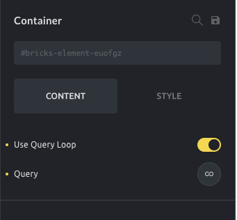

<figcaption>

Container element: new query loop control

</figcaption>


Once you've enabled the **Use Query Loop** setting, you'll see a **Query** control (loop/infinity icon).

Open the query control to set the query parameters for retrieving the content from your database.

This container now serves as your repeater item. All elements inside this container are repeated as often as there are query results.

## Query control {#query-control}

The **Query** control supports three different object types: `posts`, `terms`, and `users`.

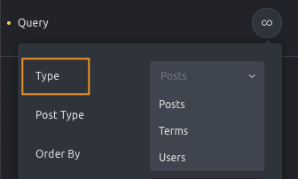

- **Posts** enable a [WP_Query](https://developer.wordpress.org/reference/classes/wp_query/) type of query. This is the default query type and should be used when you want to display a loop of posts, pages, media files, or custom post types.
- **Terms** enable the [WP_Term_Query](https://developer.wordpress.org/reference/classes/wp_term_query/). This should be used when you want to loop through the different terms of a taxonomy. Useful to list all the product categories that contain products.
- **Users** enable the [WP_User_Query](https://developer.wordpress.org/reference/classes/WP_User_Query/). This should be used when you want to loop through a set of site users. Useful to list the blog authors or a list of team members (as long as they are inserted as site users).

The query controls adapt according to the selected query type.

## Query editor (PHP) {#query-editor}

Bricks 1.9.1 introduces a new `Query editor` control that lets you write your own queries in PHP for maximum flexibility and querying capabilities.

The query editor appears after enabling the "Query editor (PHP)" control.

:::note
Note: You must enable code execution in [Bricks settings](/getting-started/misc/settings/) to access this feature.
:::


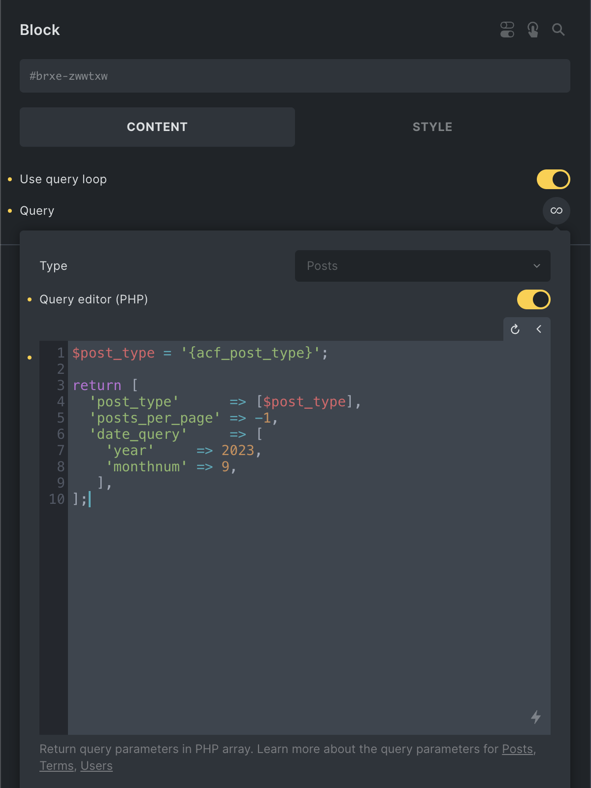

<figcaption>

Custom query using dynamic data (ACF) for the post type, returning all posts for September 2023.

</figcaption>


You have to **return a PHP array** containing the [WordPress query arguments](https://developer.wordpress.org/reference/classes/wp_query/#parameters) you'd like to use for your query.

As shown in the screenshot above, the query editor supports dynamic data.

## Posts query {#posts-query}

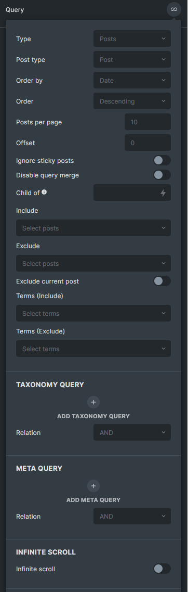

**Post type**: Select one or multiple post types (default: posts)

**Order by**: Order the results by post ID, author, title, published or modified date, comment count, relevance, menu order, or random (default: published date). (Support multiple values `@since 1.11.1`)

**Order**: Ascending or Descending (default). (Support multiple values `@since 1.11.1`)

**Posts Per Page**: The number of posts to show per page (default: WordPress settings → Reading → Blog pages show at most)

**Offset**: The number of posts to skip.

**Ignore Sticky Posts**: Turn this on if do not want to move sticky posts to the start of the set.

**Disable Query Merge**: Turn this on if do not want the query to be auto-merged by Bricks in archive pages, search pages, etc. Usually, you will turn this on for the Query loops in the footer, header, or non-main query. This is the GUI for the [bricks/posts/merge_query](/developer/hooks/filters/filter-bricks-posts-merge_query/) filter.

**Child Of**: Set the parent ID to return all its children only. (`post_parent` in WP_Query)

**Include/Exclude**: If you want to include or exclude one or multiple posts from the query. You can use [dynamic tag](#use-dynamic-tag-on-post-query-include-control) on this control too (`@since 1.12`)

**Exclude Current Post**: If enabled it will exclude the current post from the loop (useful to build a "related posts" section)

**Terms Include/Exclude**: Include or Exclude posts that have one or multiple terms.

**Taxonomy Query**: Add one or multiple taxonomy queries to filter the posts.

**Tax Query Relation**: Define if the taxonomy queries should be inclusive (OR) or exclusive (AND).

**Meta Query**: Add one or multiple meta queries to filter the posts based on the custom fields.

**Relation**: Define if the meta queries should be inclusive (OR) or exclusive (AND).

**Random seed TTL**: Duration in minutes for which the random seed exists. Set to prevent duplicate post results (only needed & available when using a random order query loop).  Set "0" to turn this feature off.

If you set the TTL to 10 minutes, the query result remains the same for the next 10 minutes. This ensures that no duplicate posts are displayed on different pages or when the infinite scroll is active. (`@since 1.7.1`)

**Is main query (Archive, Search)**: When creating an archive or search template, choose one of the loops as the main query. This will prevent a 404 error from occurring when visitors navigate to different pages. Turn on to designate the main query. Remember to set the correct query on your pagination element as well.

However, do not turn on this option for multiple queries on the same page, as only the first one will be set as the archive main query. `(@since 1.8)`

### Enhanced Ordering Options {#enhanced-ordering-options}

Starting with version 1.11.1, the **Order By** and **Order** settings in Bricks Query Loop have been improved to support multiple ordering criteria. This allows you to define complex ordering rules directly within Bricks, eliminating the need for a custom PHP filter that was previously required.

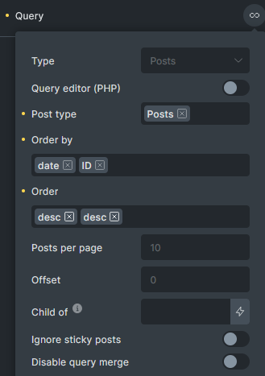

This update is particularly useful in scenarios where you want to order query results by more than one criterion. For example, you can now order by **name** in descending order and then by **ID** in descending order. Bricks will process these criteria sequentially, applying each in the order specified to deliver the desired result.

**Example Scenarios:**

- **Multi-Criteria Ordering**: Suppose you have a directory listing and want to display results by popularity first (custom field) and then by date added. With this update, you can set the query to order first by the popularity meta field in descending order and then by date added in ascending order, ensuring that the most popular and newest items appear at the top.
- **Custom Order Clauses with Meta Queries**: Bricks now supports more complex ordering directly aligned with meta query conditions. For instance, if you’re working with a meta query to order posts by **performance date** and **time**, you can define this directly in the order clause. Code example in [this article](/developer/hooks/filters/filter-bricks-posts-query_vars/#orderby-with-multiple-fields).

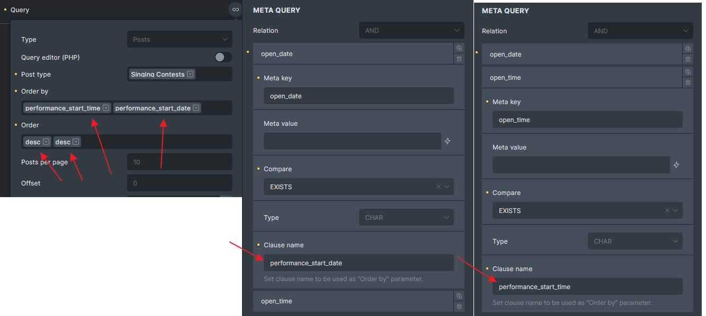

### Best Practice for Pagination & Order By {#best-practice-for-pagination-and-order-by}

When using multiple ordering criteria, it’s recommended to always include **ID** as the second ordering criterion to avoid duplicate results across paginated pages. For example, if you’re displaying 5 posts per page and have 15 posts with the same **price**, simply ordering by **price** may cause posts to appear on multiple pages. To avoid this, set the query to order by **price** in ascending or descending order, followed by **ID** in ascending or descending order. This ensures consistent results and resolves potential duplication issues in pagination.

### Example 1: Latest Posts

In this example, we'll list the latest four posts (each item shows the featured image, post title, and excerpt) using the Query Loop Builder.


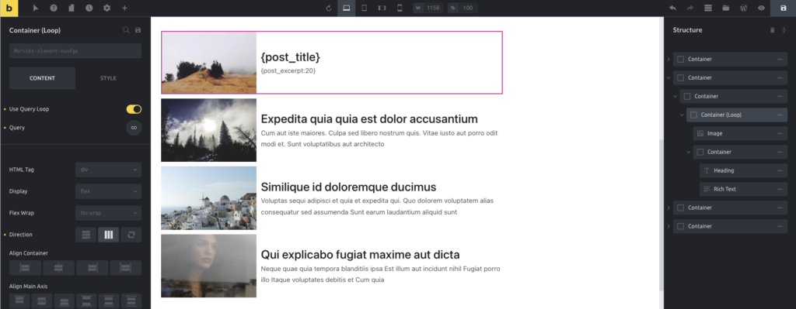

<figcaption>

Display the latest posts using a custom query loop

</figcaption>


We start by adding a container to the canvas. This container holds our loop and serves as the blueprint for each query item.

Next, we enable the "**Use Query Loop**" setting to turn our simple container into a query loop.

We add an image element inside our container and set it to "Featured Image" using the Dynamic Data dropdown.

Add another container with a Heading and Text element in the same container.

For the Heading element, we add the `{post_title}` tag.

For the Text element, we add `{post_excerpt}` tag.

You could use the Post Title element or the Post Excerpt element instead if you like.

By default, the query control shows the latest posts. But because we want to restrict the number of posts shown, we need to edit the Query setting and set the Posts Per Page control to 4 to restrict the output to four rows.

## Media query {#media-query}

Bricks 1.5 introduces the possibility to query for media files (the attachment post type). You'll now find the `Media` (attachment) post type in the Posts query type.

After selecting `Media` in the post type control, you'll get a new control to define the mime type. By default, Bricks automatically queries for images, but you may define other mime types (separated by a comma, e.g., *image/jpeg,image/png,image/gif*).

To query for the images attached to a post, you may use the **Child of** control to specify the post ID. To do it dynamically, you may use dynamic data to fetch the current post id: `{post_id}`.

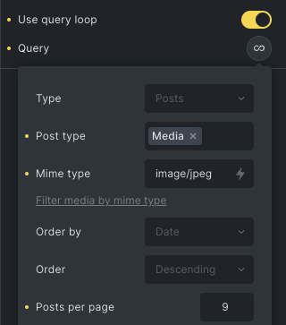

### Example 2: Media gallery

The media query opens the possibility of building a custom media gallery using the Query Loop builder. To start, you need to add a Container element, insert a Block element inside it, and finally, an image element inside of the Block.

In the container, you'll set the flex-wrap to `wrap` and the direction to horizontal (row). In the Block, you must activate the Query Loop and set the Media post type and the number of images you'll want to get (posts per page). In the Block layout, you must set the width and the height (e.g. 300px).

In the Image, you'll set the dynamic data as `{post_id}` - note that the query returns the attachment posts (media files), so the image ID is the post ID. To complete the layout, set the image object-fit to `cover` and the height to 300px.


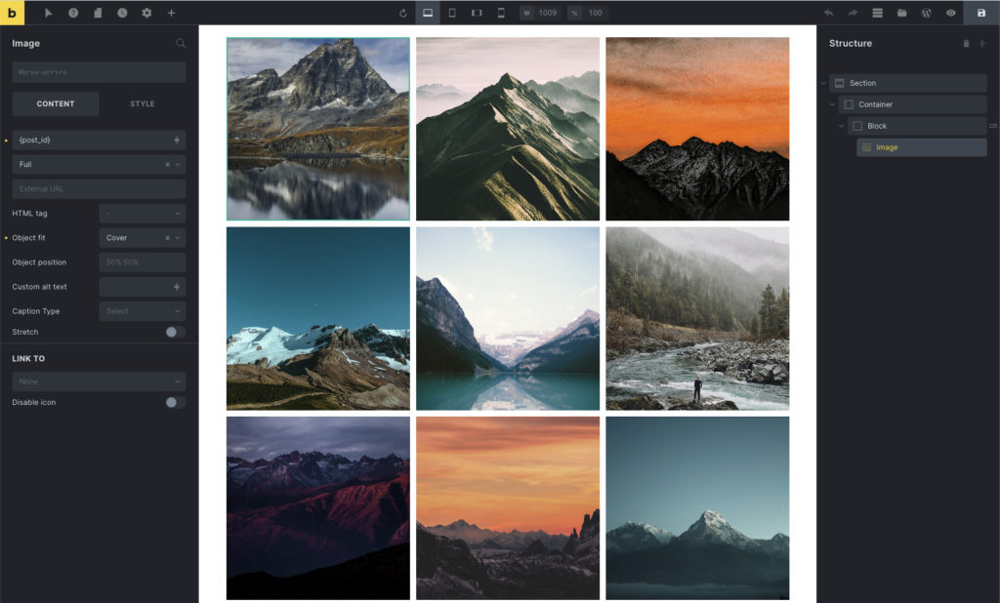

<figcaption>

The final result of a media gallery using the Query Loop builder

</figcaption>


## WooCommerce Products Query {#woocommerce}

Since 1.10, Bricks introduced new settings for WooCommerce products query. Once selected Products post type, you will be able to see the WooCommerce section. (Only available if WooCommerce is activated)

### Example 1: WooCommerce Featured Products {#example-woocommerce-featured-products}

To show latest 10 featured products on your homepage, just set a query loop with below settings.

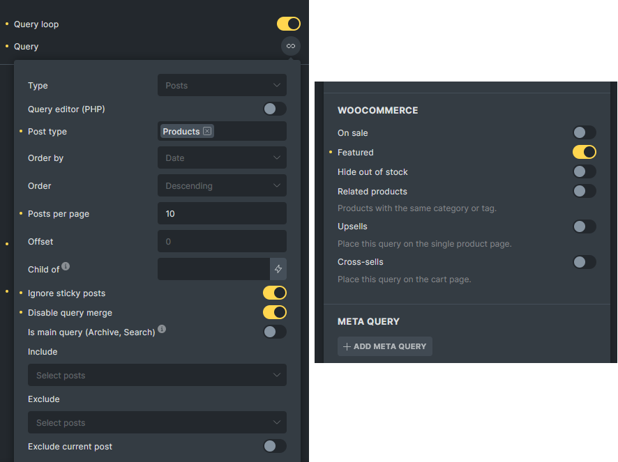

### Example 2: WooCommerce Related Products {#example-woocommerce-related-products}

To show 4 related products on your single product template.

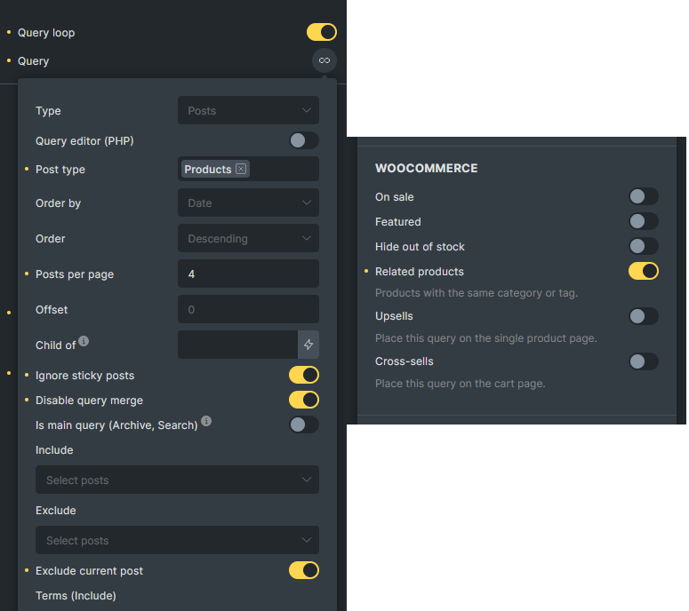

### Example 3: WooCommerce Upsells Products {#example-woocommerce-upsells-products}

To show 3 upsells product in  a single product template.

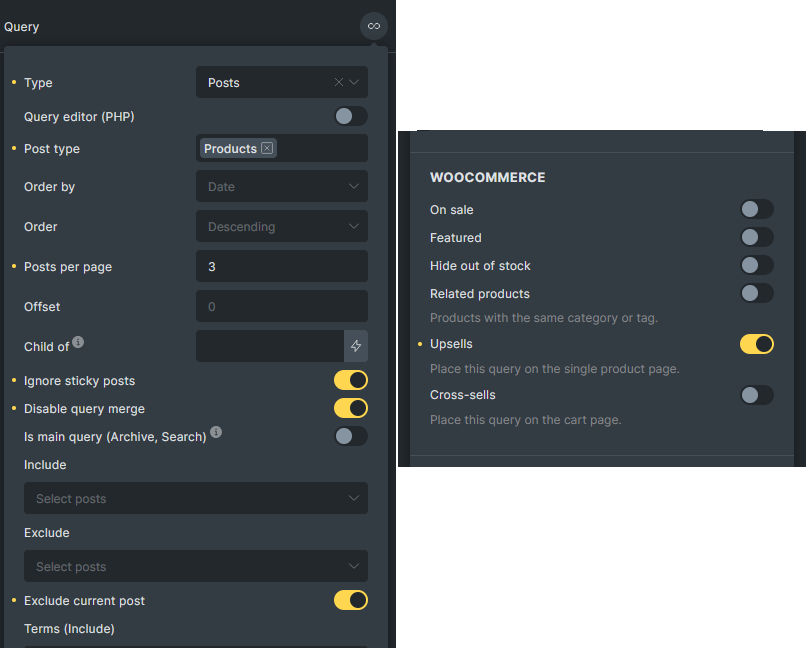

## Terms query {#terms-query}

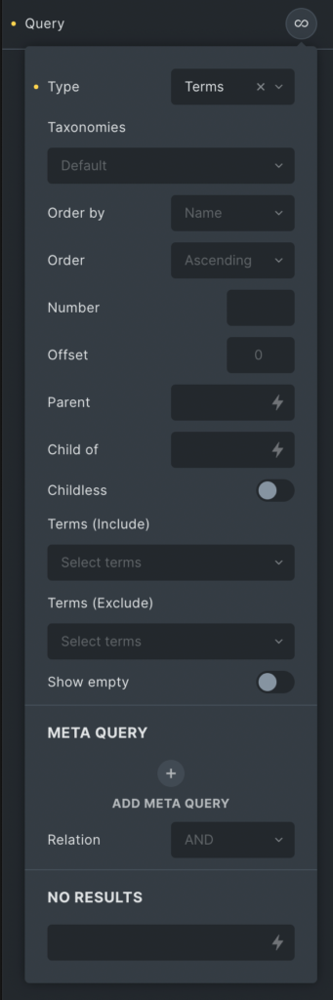

**Taxonomies**: Select one or multiple taxonomies to query (default: none).

**Order by**: Order the results by term ID, term name, term parent, count, or include list.

**Order**: Ascending (default) or Descending.

**Number**: The number of terms to show per page. WordPress default is all, but Bricks defaults to the number defined in the WordPress settings → Reading → Blog pages show at most. Use 0 to display all the results.

**Offset**: The number of terms to skip.

**Parent**: Parent term ID to retrieve direct-child terms. Set this to 0 to fetch only the terms that have children. Ex.: Given this structure, entering 55 would get only the T-shirts.

**Child of**: Term ID to retrieve child terms of.  Ex.: Given [this](https://academy.bricksbuilder.io/wp-content/uploads/2022/07/sample-terms-structure.png) structure, entering 55 would get T-shirts and Tees.

**Childless**: (bool) True to limit results to terms with no children. This parameter has no effect on non-hierarchical taxonomies. Default false.

**Disable Query Merge**: Turn this on if do not want the query to be auto-merged by Bricks. (@since 1.7.1)

**Terms Include/Exclude**: Include or Exclude terms from the query

**Show empty**: Whether to show terms not assigned to any posts.

**Meta Query**: Add one or multiple meta queries to filter the posts based on the custom fields.

**Relation**: Define if the meta queries should be inclusive (OR) or exclusive (AND).

**No Results**: Text to be shown when there are no matching results.

<span id="current-post-term"></span>

**Current post term**: Enable to get the terms assigned to the current post only. `(@since 1.8.4)` Only use in single post context. Only visible if "Type" is set to "Term". This is the same logic as the example in [bricks/terms/query_vars](/developer/hooks/filters/filter-bricks-terms-query_vars/#get-terms-assigned-to-a-post)

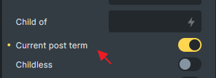

### Example 3: Product categories {#example-2}

In this example, we'll build a dynamic list of product categories (product category image + a link to the category archive).

The example is based on the WooCommerce plugin and the sample products. We'll need one container to hold the container loop. Inside the container loop, we've added a Basic Text element that contains the Dynamic Data `{term_name}` tag.


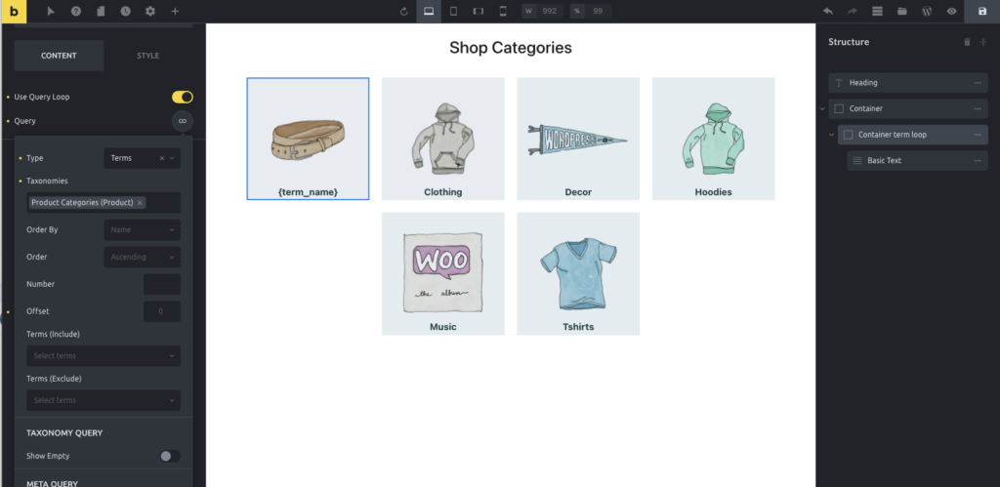

<figcaption>

Display the product categories with a link

</figcaption>


After setting the Query to loop through "terms" and selecting the Taxonomy "Product Categories", you'll get in the canvas as many containers as the existing categories. Inside the loop, you'll be able to use several dynamic data tags to fetch the term's data, such as the term ID, the term name, the term archive URL, the term description, and any term meta.

In this example, we set the loop container background image as the product category thumbnail, using the Dynamic Data dropdown and selecting the Product Category Image tag:


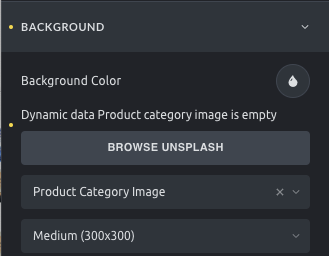

<figcaption>

Set the container background image

</figcaption>


We also set the loop container as a link to the product category archive page (using the Term Archive URL dynamic data tag). You'll need to set the HTML tag to "a (link)" and the link type to Dynamic Data, which will enable the Dynamic Data dropdown:

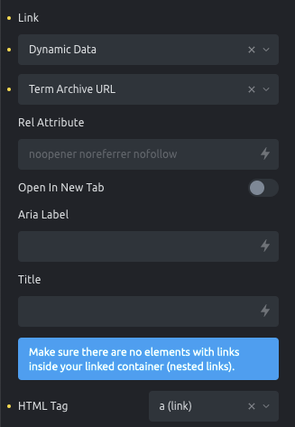

## Users query {#users-query}

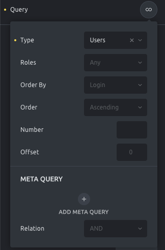

**Roles**: Select one or multiple user roles to query (default: any)

**Order by**: Order the results by user ID, name, username, nicename, login, email, registered date, post count, or include list.

**Order**: Ascending (default) or Descending.

**Number**: The number of users to show per page. WordPress defaults to all, but Bricks defaults to the number defined in the WordPress settings > Reading > Blog pages show at most. Use -1 to display all the results.

**Offset**: The number of users to skip.

**Current post author:** Enable to query the current post author (@since 1.9.1)

**Disable Query Merge**: Turn this on if do not want the query to be auto-merged by Bricks. (@since 1.7.1)

**Meta Query**: Add one or multiple meta queries to filter the posts based on the custom fields.

**Relation**: Define if the meta queries should be inclusive (OR) or exclusive (AND).

**No Results**: Text to be shown when there are no matching results.

### Example 4: The blog authors {#example-3}

In this example, we want to build a section to list all the blog authors.

The blog authors are website users with the role of author. As in the other examples, we've used a container to loop through the users. In that container, we've set a query of user type, setting roles to "Author" to pull only the website's authors.

We've added an Image and a Basic Text element inside the query loop container.

The image we've set to display an ACF Dynamic Data field containing the profile image.

In the Basic Text, we've used the Dynamic Data `{wp_user_display_name}` tag.


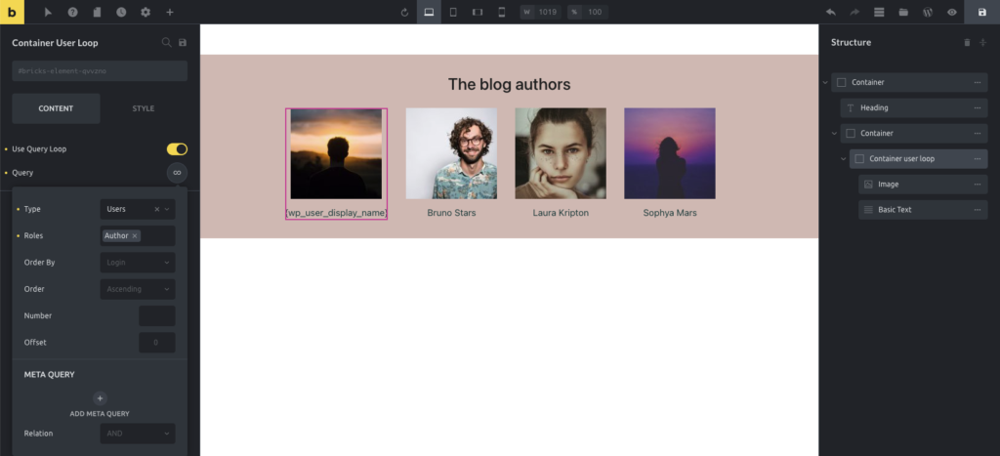

<figcaption>

Display the blog authors

</figcaption>


## The Pagination element {#pagination}

The perfect companion to the custom query loop builder. You'll find the Pagination element under the **WordPress** group of the elements panel.

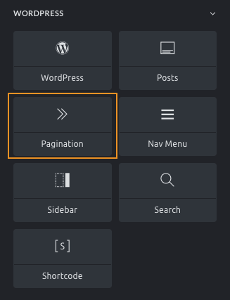

Having pagination as a separate element offers you the most flexibility to build any layout.

After adding the Pagination element to the canvas, you'll need to link this pagination element to one of the elements that run a query. To do so, please select the element in the **Related Query** control by editing the Pagination element:

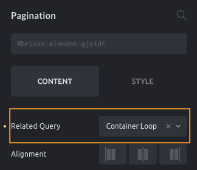

Tip: to make it easier to recognize elements, give descriptive element names to the containers that have a query enabled.

## Load more (button) {#load-more}

Besides the infinite scroll, which automatically loads more results as you scroll down the page, you can also give any element (typically the Button) a "Load more" functionality by adding a "Load more" click [interaction](/builder/features/interactions/) to it like this:

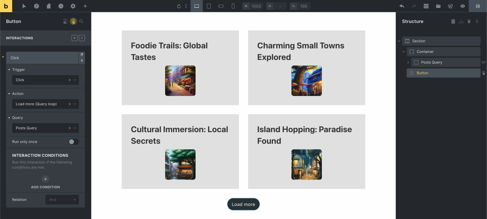

## Query loop in Accordions & Sliders {#query-accordions-or-sliders}

The Accordion & Slider elements also allow to pull data dynamically through the Query Loop to feed the element parts.

You'll find a Query Loop control in the Accordion element to configure a query. The query results create as many accordion items as the query results.

You'll be able to configure the accordion title, subtitle, and content of the "master" accordion item, and this will be used as a template for the dynamic accordion items:


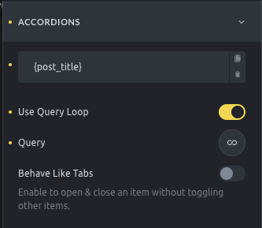

<figcaption>

Use the query loop in the accordion element

</figcaption>


The same happens in the Slider element. If the Query Loop is enabled, you'll have access to a Query control and a slide item, which will behave as the template for all the slides.


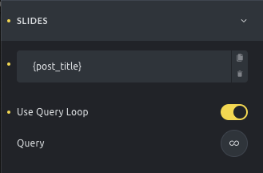

<figcaption>

Use the query loop in the slider element.

</figcaption>


## Include/Exclude Controls: Dynamic data tag support {#include-exclude-dynamic-data}

Starting at version 1.12, Bricks supports dynamic data tags in the "Include" and "Exclude" query loop controls.

This allows you to include or exclude posts dynamically using field values, such as those retrieved from ACF or Meta Box relationship fields.

- **Include**: Adds IDs to the `post__in` parameter.
- **Exclude**: Adds IDs to the `post__not_in` parameter.

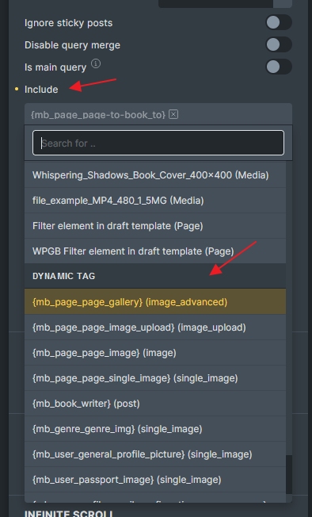

This enhancement enables you to use dynamic data to retrieve post IDs from custom fields (e.g., ACF or Meta Box), while still combining additional query parameters like **meta queries** or **taxonomy queries**.

#### Supported Field Types

- **ACF: ** Relationship, Post Object, Gallery
- **Meta Box:** Relationship, Post, Image Advanced, Image, Image Upload, Single Image
- **JetEngine:** Relationship, Post, Gallery, Media (`@since 2.2`)

:::note
Important: When using dynamic data in the Include field, ensure the selected Post Type matches the field values. For example, if you are using a Gallery field, set the Post Type to Media to ensure the dynamic value aligns correctly.
:::

### Example 1: Retrieve ACF Relationship Posts by Post Type and Order by Post IDs {#filter-acf-relationship-by-post-type}

Imagine you have an ACF Relationship field that connects to multiple post types. On a specific query, you only want to retrieve the related posts limited to the "Book" post type and have them displayed in the same order as defined in the relationship field.

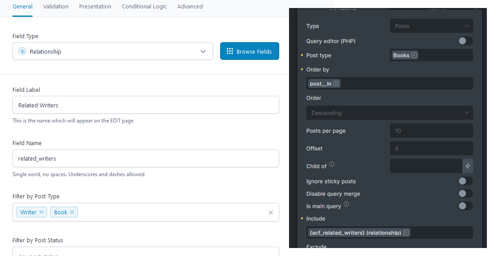


### Example 2: Use Meta Box Image Advanced Field for a Nestable Slider Query Loop {#query-loop-for-metabox-image-field}

Previously, retrieving images saved in the **Meta Box Image Advanced** field required using a PHP filter to pass the image IDs into the `post__in` parameter. Now, you can achieve this directly within the Query Loop UI.

Simply choose your dynamic field, set the **Post Type** to **Media** and, if needed, add an additional **Mime Type** filter to ensure only the correct image types are included.

:::note
Note: Inside the loop, use dynamic tags like `{post_id}` for the image source and `{post_title}` to retrieve the image title. Avoid using `{featured_image}`, as this is not applicable in this context.
:::

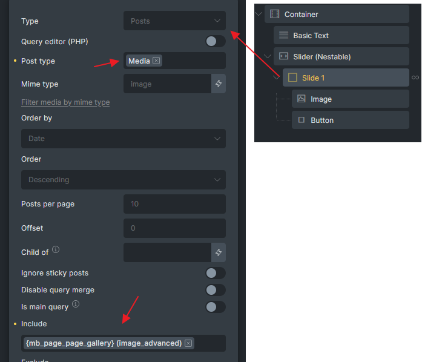

### Example 3: Query ACF Gallery with Random Order {#query-acf-gallery-with-random-order}

To display images from an **ACF Gallery** field in a random order, set the Post Type to **Media**. (Add an additional Mime Type filter if necessary to ensure only specific file types are included.) Select **Random (rand)** to randomize the order of the images in the gallery.

:::note
Note: Inside the loop, use dynamic tags like `{post_id}` for the image source and `{post_title}` to retrieve the image title. Avoid using `{featured_image}`, as this is not applicable in this context.
:::

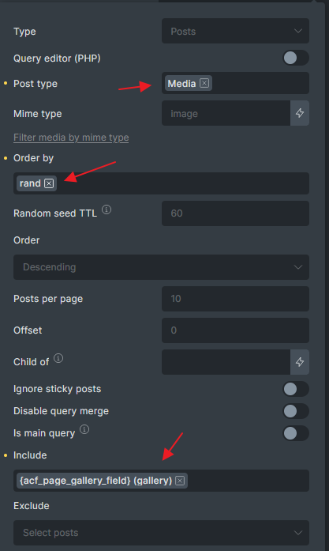

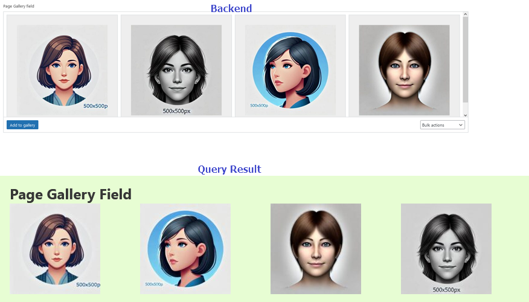

## Query Type: Array {#array}

The **Array** query loop type lets you loop through any PHP or JSON array. (`@since 2.2`)

This is especially useful for:

- Rendering API response arrays. ([API query](/builder/dynamic-content/query-data-from-apis/) loop)
- Combining data from multiple sources (e.g. posts + custom arrays).
- Displaying values returned by custom functions in loop format.

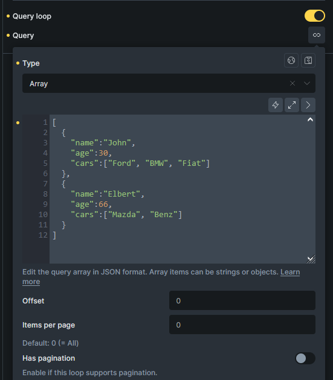


Once configured, the loop behaves like any other Bricks query: you can style each item using the builder, use dynamic tags to access values, and even enable pagination features.

*Supported features: AJAX/non-AJAX pagination, Load More, Infinite Scroll*

#### Use Case 1: Looping Nested Arrays from API Responses

If your API response contains nested arrays (e.g. `cars: ['BMW', 'Mazda']`), you can easily loop through them by using a **nested array loop** and setting the correct path in the Array Editor.

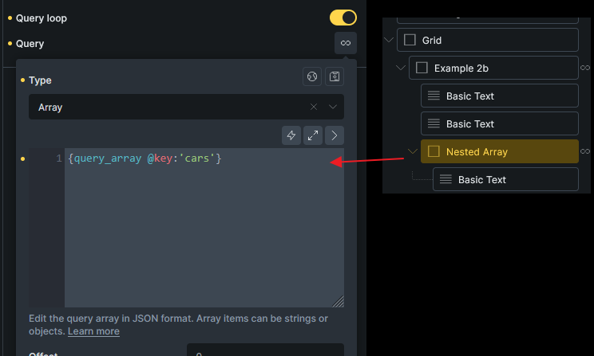


#### Use Case 2: Looping Custom PHP Arrays

If you have a custom PHP function that returns an array, you can use it in the loop using a dynamic tag like `{echo:my_custom_array()}`.

```php
// Ensure that my_custom_array is whitelisted via the bricks/code/echo_function_names hook
function my_custom_array() {
  return [
    ['name' => 'John', 'age' => 30],
    ['name' => 'Jane', 'age' => 25],
  ];
}
```

### Dynamic Data Tag: `{query_array:raw}`

`{query_array:raw}` - Output the current array value (array items are a simple list of strings).

`{query_array:raw @key:'age'}` - Output a specific key from the array item.

#### Example 1: Flat List

```php
[
  'Apple',
  'Banana',
  'Cherry',
  'Donut'
]
```

Use `{query_array:raw}` inside the loop to display each fruit name.

#### Example 2: Associative Array

```php
[
  ['name' => 'John', 'age' => 30],
  ['name' => 'Alan', 'age' => 25],
  ['name' => 'Pony', 'age' => 66]
]
```

Use `{query_array:raw @key:'name'}` and `{query_array:raw @key:'age'}`

#### Example 3: Nested Arrays

```php
[
  {
    "name": "John",
    "age": 30,
    "cars": ["Ford", "BMW", "Fiat"]
  },
  {
    "name": "Elbert",
    "age": 66,
    "cars": ["Mazda", "Benz"]
  }
]
```

To loop through each `cars` array inside the main loop:

1. Nest another **Array Loop** inside the parent loop.
2. In the nested loop’s **Array Editor**, set: `{query_array:raw @key:'cars'}`
3. Use `{query_array:raw}` inside the nested loop to output each car.

---

## Results Filter {#results-filter}

The **“Results Filter”** feature allows you to filter loop results using conditions **after the array is fetched but before rendering begins** (similar to the [bricks/query/result](/developer/hooks/filters/filter-bricks-query-result/) PHP filter). (`@since 2.2`)

**Supported Loop Types:** Array, ACF Repeater

Use this feature to:

- Remove unnecessary or invalid results based on your requirement
- Prevent rendering of unwanted loop

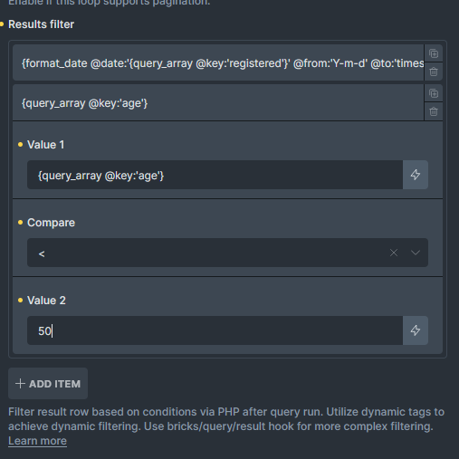


#### Example: Filter by Age

Imagine this is the array passed to the Array loop:

```php
[
  ['name' => 'John', 'age' => 30],
  ['name' => 'Alan', 'age' => 25],
  ['name' => 'Pony', 'age' => 66]
]

```

You only want to display people whose **age is less than 50**. You can configure a result filter like this:

| Field | Operator | Value |
| --- | --- | --- |
| `{query_array:raw @key:'age'}` | `<` | `50` |

This filter will exclude the last item (`Pony`, age 66) from rendering, so only `John` and `Alan` will appear in the loop output.

:::note
You can add multiple filter rules if needed—each rule will be evaluated with `AND` logic. Use `bricks/query/result` hook for more complex filtering.
:::

## Query loop hooks {#hooks}

- [bricks/query/run](/developer/hooks/filters/filter-bricks-query-run/) (filter)
- [bricks/terms/query_vars](/developer/hooks/filters/filter-bricks-terms-query_vars/) (filter)
- [bricks/users/query_vars](/developer/hooks/filters/filter-bricks-users-query_vars/) (filter)
- [bricks/posts/merge_query](/developer/hooks/filters/filter-bricks-posts-merge_query/) (filter)
- [bricks/posts/query_vars](/developer/hooks/filters/filter-bricks-posts-query_vars/) (filter)
- [bricks/query/loop_object](/developer/hooks/filters/filter-bricks-query-loop_object/) (filter)
- [bricks/query/loop_object_id](/developer/hooks/filters/filter-bricks-query-loop_object_id/) (filter)
- [bricks/query/loop_object_type](/developer/hooks/filters/filter-bricks-query-loop_object_type/) (filter)
- [bricks/query/no_results_content](/developer/hooks/filters/filter-bricks-query-no_results_content/) (filter)
- [bricks/query/before_loop](/developer/hooks/actions/action-bricks-query-before_loop/) (action)
- [bricks/query/after_loop](/developer/hooks/actions/action-bricks-query-after_loop/) (action)
- [bricks/query/result](/developer/hooks/filters/filter-bricks-query-result/) (filter)
- [bricks/query/result_count](/developer/hooks/filters/filter-bricks-query-result_count/) (filter)
- [bricks/query/result_max_num_pages](/developer/hooks/filters/filter-bricks-query-result_max_num_pages/) (filter)
- [bricks/query/init_loop_index](/developer/hooks/filters/filter-bricks-query-init_loop_index/) (filter)
