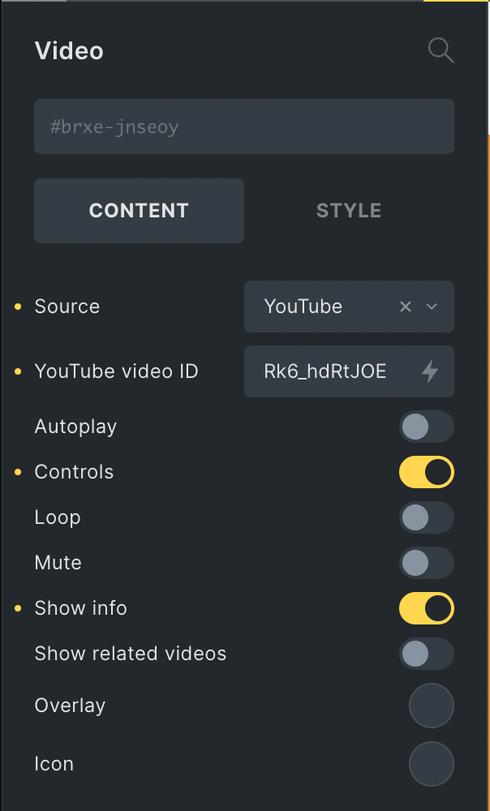

The Video element embeds YouTube, Vimeo, or self-hosted videos with support for custom players, preview images, and overlay icons.



Source dropdown options:

- YouTube
- Vimeo
- Media
- File URL
- Dynamic Data

## Settings

### Source

- **Source** (select) - The video source type. Options: `youtube`, `vimeo`, `media` (media library), `file` (file URL), `meta` (dynamic data). Default: `youtube`.

- **Iframe title** (text) - Accessible title for the video iframe. Available for YouTube and Vimeo sources.

### YouTube Settings

Available when source is set to "youtube":

- **YouTube video ID/URL** (text) - Enter the YouTube video ID or full URL. Default: `5DGo0AYOJ7s`.

- **Autoplay** (checkbox) - Automatically play the video on page load. Not supported on mobile devices. Not available when preview image is enabled.

- **Controls** (checkbox) - Show video player controls. Default: enabled.

- **Loop** (checkbox) - Loop the video playback.

- **Mute** (checkbox) - Mute the video audio.

- **Related videos from other channels** (checkbox) - Allow YouTube to show related videos from other channels.

- **Do not track** (checkbox) - Use YouTube's privacy-enhanced mode (youtube-nocookie.com).

### Vimeo Settings

Available when source is set to "vimeo":

- **Vimeo video ID/URL** (text) - Enter the Vimeo video ID or full URL.

- **Vimeo privacy hash** (text) - Required for unlisted Vimeo videos.

- **Autoplay** (checkbox) - Automatically play the video on page load. Not available when preview image is enabled.

- **Loop** (checkbox) - Loop the video playback.

- **Mute** (checkbox) - Mute the video audio.

- **Byline** (checkbox) - Show the video byline. Default: enabled.

- **Title** (checkbox) - Show the video title. Default: enabled.

- **User portrait** (checkbox) - Show the user portrait. Default: enabled.

- **Do not track** (checkbox) - Enable Vimeo's Do Not Track feature.

- **Color** (color) - Custom color for Vimeo player controls.

### Preview Image

Available when source is set to "youtube" or "vimeo":

- **Preview image** (select) - Choose preview image source. Options: `default` (API), `custom`. The video iframe is lazy loaded after clicking the preview image.

- **Custom preview image** (image) - Upload/select custom preview image. Only available when preview image is set to "custom".

- **Image size** (select) - YouTube preview image size. Options: `default` (120x90), `medium` (320x180), `high` (480x360), `standard` (640x480), `maximum` (1280x720). Only available for YouTube with default preview image.

### Media/File Settings

Available when source is set to "media", "file", or "meta":

#### Media Source

- **Media** (video) - Upload or select video file from media library. Only available when source is set to "media".

#### File Source

- **Video file URL** (text) - Enter direct URL to video file. Only available when source is set to "file".

#### Dynamic Data Source

- **Dynamic data** (text) - Select dynamic data for video source. Only available when source is set to "meta".

#### Video Controls

- **Preload** (select) - Video preload behavior. Options: `metadata`, `auto`, `none`.

- **Autoplay** (checkbox) - Automatically play the video on page load.

- **Loop** (checkbox) - Loop the video playback.

- **Mute** (checkbox) - Mute the video audio.

- **Play inline** (checkbox) - Play video inline instead of fullscreen on mobile.

- **Controls** (checkbox) - Show video player controls. Default: enabled.

- **Disable download** (checkbox) - Remove download button from controls. Firefox: Not supported.

- **Disable fullscreen** (checkbox) - Remove fullscreen button from controls. Firefox: Not supported.

- **Disable remote playback** (checkbox) - Remove remote playback button from controls. Firefox: Not supported.

- **Poster** (image) - Set poster image for video SEO. Used as preview image for YouTube/Vimeo sources.

### Overlay / Icon

- **Overlay** (background) - Background styling for the video overlay.

- **Icon** (icon) - Select icon to display on the video overlay.

- **aria-label** (text) - Accessibility label for the icon or overlay.

- **Icon typography** (typography) - Typography settings for the icon (size, color).

- **Icon padding** (spacing) - Padding around the icon.

- **Icon background color** (color) - Background color for the icon.

- **Icon border** (border) - Border styling for the icon.

- **Icon box shadow** (box-shadow) - Box shadow for the icon.

## Known Issues

### Perfmatters Plugin Compatibility

Enabling the "YouTube Preview Thumbnails" setting of the Perfmatters plugin might result in an empty space above the YouTube videos. A possible fix is adding the following CSS:

```css
.brxe-video .perfmatters-lazy-youtube {
    margin-top: -56.25%;
}
```

:::tip[Developer reference]
See the [Video Schema](/developer/schema/elements/video/) for the full JSON schema of this element's settings and controls.
:::
