Breadcrumbs are an essential part of website navigation, providing users with a clear path to navigate through the site hierarchy. They improve the overall user experience by helping users know their location within the site and easily navigate back to previous pages.

The Breadcrumbs element generates different breadcrumb items depending on the type of page being viewed.

It supports various page types, including single posts or pages (`is_singular()`), the homepage (`is_home()`), categories (`is_category()`), taxonomies (`is_tax()`), post type archives (`is_post_type_archive()`), tags (`is_tag()`), date archives (`is_date()`), author pages (`is_author()`), search results (`is_search()`), and error pages (`is_404()`).

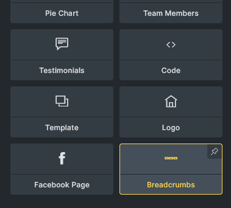

## Settings

- **Gap** (number with units) - Gap between breadcrumb items. Controls `gap` property.

### Structure

This section allows you to customize the structure of breadcrumb items. Currently it supports single pages and the date archive.

#### Date archive structure

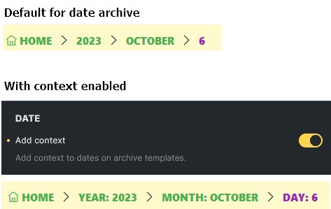

#### Single page structure

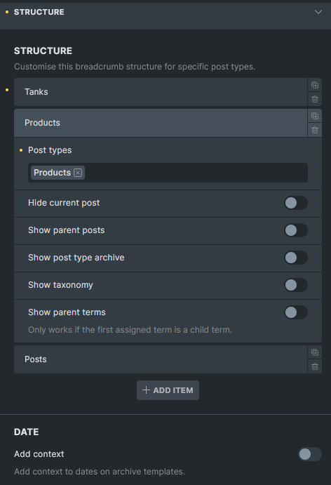

By default, Bricks displays breadcrumb items as follows:

For posts:  
`Home` > `Parent categories (if any)` > `Category (if any)` > `Post parents (if any)` > `Current post`

For other post types:  
`Home` > `Post archives` > `Post parents (if any)` > `Current post`  
  
You can customize the breadcrumb structure for different post types. You can also group multiple post types together if you want them to share the same structure. Any post type not specifically defined in your custom structures will automatically use the default structure.

**Example 1:**  
For the Tanks post type singular page, I want to display the post type archive and the custom taxonomy as breadcrumb items.

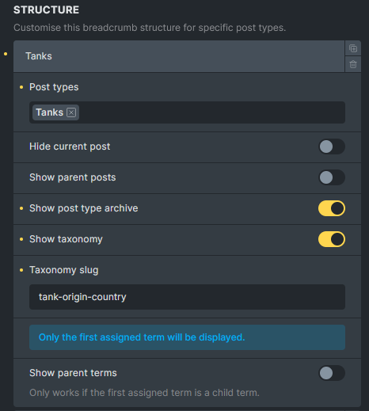

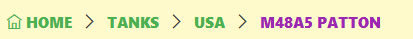

**Example 2:**  
For the products singular page, I want to display custom taxonomy as breadcrumb items.

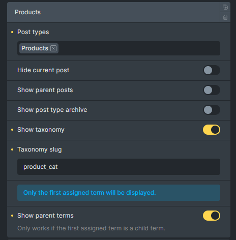

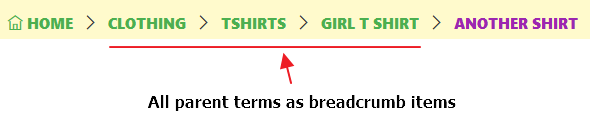

- **Post types** (repeater) - Define custom breadcrumb structures for specific post types.
  - **Post types** (select, multiple) - Select post types to apply this structure to. Options: registered post types. Default: Posts.
  - **Hide current post** (checkbox) - Hide the current post from breadcrumbs.
  - **Show parent posts** (checkbox) - Show parent posts in hierarchy.
  - **Show post type archive** (checkbox) - Show post type archive link.
  - **Show taxonomy** (checkbox) - Show taxonomy in breadcrumbs.
  - **Taxonomy slug** (text) - Taxonomy slug to display. Required when Show taxonomy is enabled. Default: "category".
  - **Taxonomy info** (info) - Only the first assigned term will be displayed. Only shown when Show taxonomy is enabled.
  - **Show parent terms** (checkbox) - Show parent terms in hierarchy. Only works if the first assigned term is a child term.

- **Date** (separator) - Date-related breadcrumb settings.

- **Add context** (checkbox) - Add context to dates on archive templates.

### Home

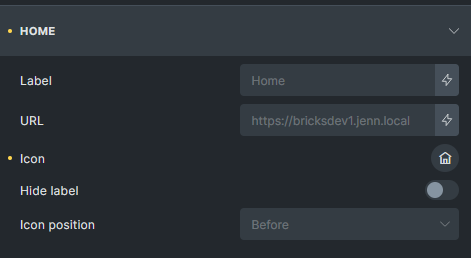

In this section, you can customize the root item (home) of the breadcrumb trail. Adjust the URL, change the label text, select an icon, and determine the icon's position.

- **URL** (text) - Custom URL for home link. Default: home URL.

- **Text** (text) - Label for home link. Default: "Home".

- **Icon** (icon) - Icon for home link.

- **Icon: Gap** (number with units) - Gap between home icon and label. Controls `gap` property for `.item:has(> svg), .item:has(> i)` selector. Only available when Icon is set.

- **Icon: Position** (select) - Position of home icon. Options: Before, After. Default: Before. Only available when Icon is set.

- **Hide label** (checkbox) - Hide home label when icon is present. Only available when Icon is set.

### Separator

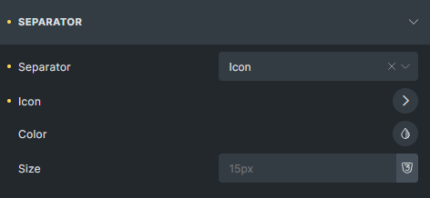

Here, you can modify the appearance and behavior of the separators between breadcrumb links, adjusting both display mode and styling.

- **Separator** (select) - Separator type. Options: Text, Icon, None. Default: Text.

- **Separator** (text) - Separator text. Default: "/". Only available when Separator is Text or empty.

- **Icon** (icon) - Separator icon. Only available when Separator is Icon.

- **Color** (color) - Separator color. Controls `color` property for `.separator` selector.

- **Size** (number with units) - Separator size. Controls `font-size` property for `.separator` selector.

### Item

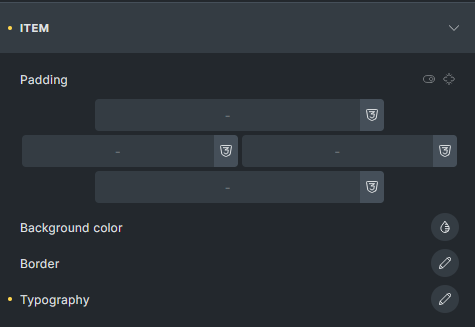

This section allows you to style each breadcrumb link.

- **Padding** (spacing) - Padding for breadcrumb items. Controls `padding` property for `.item` selector.

- **Background color** (color) - Background color for breadcrumb items. Controls `background-color` property for `.item` selector.

- **Border** (border) - Border settings for breadcrumb items. Controls `border` property for `.item` selector.

- **Typography** (typography) - Typography for breadcrumb items. Controls `font` property for `.item` selector.

### Current

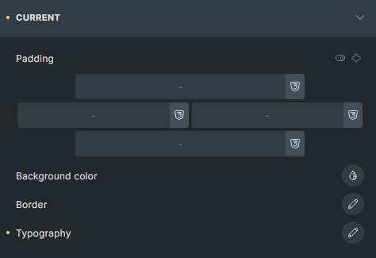

Use these settings to style the last item in the breadcrumb trail, which represents the current page or post.

- **Padding** (spacing) - Padding for current page item. Controls `padding` property for `.item[aria-current="page"]` selector.

- **Background color** (color) - Background color for current page item. Controls `background-color` property for `.item[aria-current="page"]` selector.

- **Border** (border) - Border settings for current page item. Controls `border` property for `.item[aria-current="page"]` selector.

- **Typography** (typography) - Typography for current page item. Controls `font` property for `.item[aria-current="page"]` selector.

:::tip[Developer reference]
See the [Breadcrumbs Schema](/developer/schema/elements/breadcrumbs/) for the full JSON schema of this element's settings and controls.
:::
