The Form element lets you build custom forms with the following form field types:

- Email
- Text
- Textarea
- Telephone
- Number
- URL
- Image (media library)
- Gallery (media library)
- Checkbox
- Select (dropdown)
- Radio
- Password
- Remember me
- Datepicker
- File upload
- Hidden

You can define **actions** triggered by form submissions like sending an email notification, redirecting to a certain page, communicating to SendGrid or Mailchimp servers, or user login/registration. If this is not enough, you can also develop your own actions.

The form element also integrates with [Google reCaptcha V3](#spam), [hCaptcha](https://www.hcaptcha.com/), and [Cloudflare Turnstile](https://www.cloudflare.com/products/turnstile/) to protect your sites from fraudulent activities, spam, and abuse. Supports dynamic data, and [form validation](#form-validation) through a new action hook.

## Actions {#actions}

Form actions run after the form has been submitted successfully.

You may set one or multiple actions for your form. Action run in the sequence they have been selected, except for the "Redirect" action, which always runs at the very end.

For each selected action, a separate control group appears.


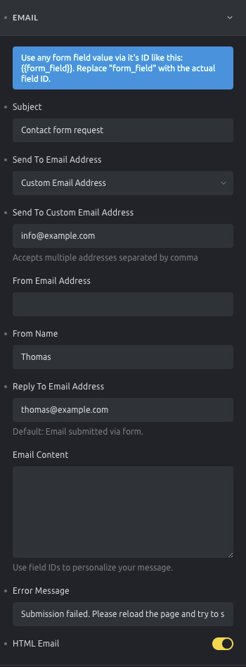

<figcaption>

Form element: email action settings

</figcaption>


### Email {#email}

The email form action sends one email on form submission. By default, it is configured to send the email to the site administrator email containing all the form fields content.

You may customize the form email action with the following settings:

- **Subject**: The email subject
- **Send to email address**: Fill in the email recipients. You may choose to send the email to the website administrator or to a custom email address (it accepts multiple email addresses, separated by a comma)
- **From email address**: The email address that shows as the sender
- **From name**: The name that shows as the sender
- **Reply to email address**: In case the recipient replies to the email, this email will be used instead of the "From email address"
- **Email content**: In case you want to personalize the email content message. For the default message containing all the fields, leave this field empty.
- **Error message**: The message that will be presented to the site's user if the email fails for some reason.
- **HTML email**: Enable to send HTML formatted emails. Leave disabled to send a plain text email.

### Confirmation email {#confirmation-email}

Let the person who submitted a form know that you have received their email by automatically sending out a custom confirmation email whenever the form is submitted.

We highly recommend properly setting up SMTP to ensure the best possible email delivery from your website. There are plenty of free WordPress plugins available that let you configure this within a few minutes. A search for "WordPress SMTP" should bring up countless articles & plugins for it.

If the "From name" & "From email address" you have set under the "Confirmation Email" settings inside the Form element aren't used, you have to check if any plugin and/or custom code is overwriting/forcing another name & email address.

### Form dynamic fields {#dynamic-fields}


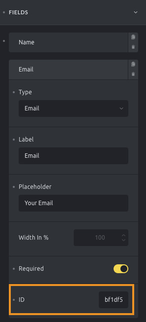

<figcaption>

Field ID

</figcaption>


In certain scenarios, it could be useful to get some of the submitted form fields' content to populate the email action settings.

To use the submitted data in your form settings, you have copy & paste the unique field ID (which you'll find at the end of every form field) and wrap it in two curly brackets like this: `{{form_field_id}}`

Use those dynamic fields in the "Subject", "Email address", "Email content", "From name", and "From email" settings.

Use the `{{referrer_url}}` in the above fields to insert the URL of the page where the form was submitted.

To render all submitted fields in the "Email content" use the `{{all_fields}}` placeholder.

### User Login, Registration, Lost Password, and Reset Password {#login-registration}

These four actions allow you to build custom authentication forms without coding.

When selecting one of these actions, you have to map the form fields appropriately:

- **User login**: Map the form fields to "Login", "Password", and optionally the new "Remember me" checkbox.
- **User registration**: Map the form fields to "Email", "Password", "Username", and optionally "First/Last name". If you want to customize the default WordPress emails sent to the admin or new user upon registration, use the following hooks:
  - [`wp_new_user_notification_email`](https://developer.wordpress.org/reference/hooks/wp_new_user_notification_email/): Modify the email sent to the user.
  - [`wp_new_user_notification_email_admin`](https://developer.wordpress.org/reference/hooks/wp_new_user_notification_email_admin/): Modify the email sent to the site admin.
- **Lost password**: Map the form field to "Email" or "Username" to send reset instructions. If you want to customize the email content for password reset instructions, use the [`retrieve_password_message`](https://developer.wordpress.org/reference/hooks/retrieve_password_message/) filter.
- **Reset password**: Map the form field "password".

:::note
When using **Lost password** or **Reset password** actions, you **do not need to configure an Email Action**. WordPress automatically handles sending the necessary emails using its default methods.
:::

For detailed instructions on configuring custom authentication pages using the Form element, please visit the [Authentication Pages](/builder/features/custom-authentication-pages/) article.

### Redirect {#redirect}

This form action redirects the user from the form page to a different page on your site. You may set the redirection to the admin area or to a custom URL and set the redirection to happen only after a specific period of time.

The Redirect form action is only triggered after all the other actions run successfully.

Since 1.10, Custom redirect URL field is supporting [Form dynamic field](#dynamic-fields) tag.

### Unlock password protection {#unlock-password-protection}

This form action is used to grant access to content protected by Bricks' password protection feature. You can map the relevant form field to “Password”, but if no field is mapped, the first password field in the form will be used by default.

For more detailed instructions on setting up password protection with forms, please refer to the [Password Protection article](https://academy.bricksbuilder.io/password-protection).

### Webhook (@since 2.0) {#webhook}

The **Webhook** form action, available since version 2.0, sends submitted form data to one or more external URLs.

Typical use cases include:

- Sending leads to CRMs like **Zoho**, **Hubspot**, or **Salesforce**
- Triggering **Zapier** or **Make** scenarios
- Storing form data in **Google Sheets** or external databases
- Notifying internal tools via a **custom API or Slack bot**

A webhook is simply an HTTP request sent when the form is submitted. You can control what data is sent, how it’s formatted, and whether errors should stop the form.

#### Setting: Endpoints

You can set up multiple webhook endpoints. Each has these options:

- **Name**: Label for this webhook (for your reference only)
- **Endpoint URL**: The URL to send form data to
- **Data format**: Choose how the data is sent:
`JSON` or `Form data` (x-www-form-urlencoded)
- **Data**: Optional payload template using dynamic field tags
Leave empty to send all form fields. Example:

```php
{ "name": "{{43f295}}", "email": "{{a5c626}}" }
```

**Headers**: Optional custom headers in JSON format. Example:

```php
{ "Authorization": "Bearer token" }
```

#### Setting: Max payload size (KB)

Set the max size of the request payload.
Default: `1024` (1 MB)

#### Setting: Rate limiting

- **Rate limiting**
Enable to limit requests per hour
- **Max requests per hour**
Set the limit (default: `60`)

#### Setting: Error handling

- **Continue on error**
If enabled, form submission succeeds even if the webhook fails
- **Error message**
Message shown if the webhook fails and "Continue on error" is off

**Example: Zapier**

To trigger a Zap from a form submission, follow these steps:

1. In [Zapier](https://zapier.com/), create a new Zap
2. Choose **Webhooks by Zapier** as the trigger
3. Select **Catch Hook**
4. Copy the webhook URL Zapier gives you

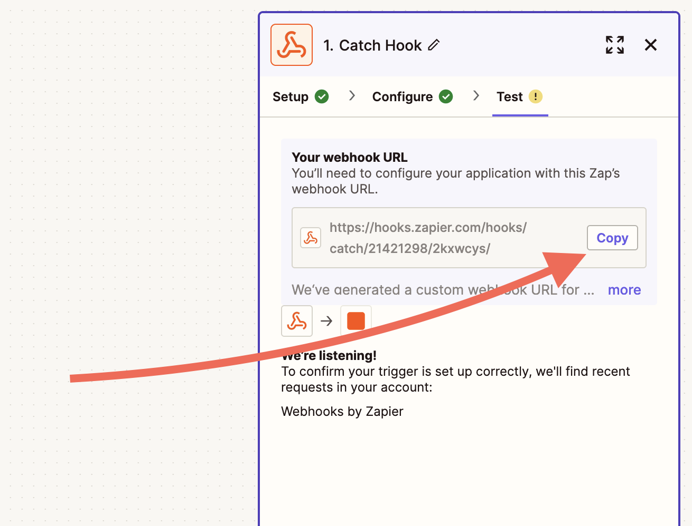

1. In Bricks, edit your form and add a **Webhook** action
2. Paste the Zapier URL into the **Endpoint URL** field

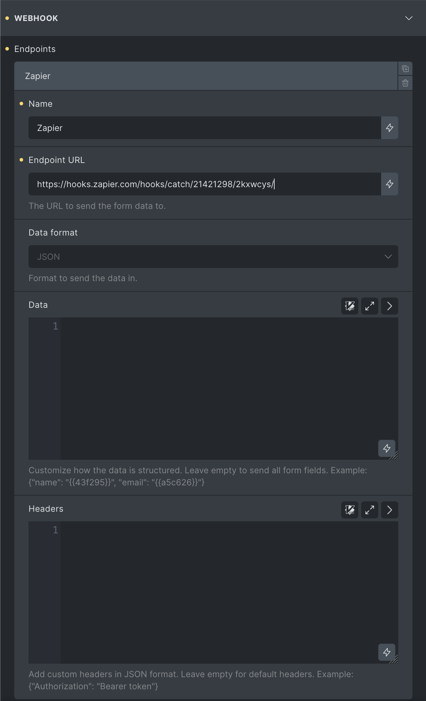

1. Set the **Data format** to `JSON` (recommended)
2. Optionally define the payload or leave it empty to send all fields
3. Save and test your form

For full setup instructions, see [Zapier’s webhook guide](https://help.zapier.com/hc/en-us/articles/8496288690317-Trigger-Zaps-from-webhooks).

### Create & update posts (@since 2.1)

It is also possible to create powerful frontend forms with Bricks using the "Create post" and "Update post" actions.

More information and examples can be found at [/builder/features/create-update-posts-on-the-frontend/](/builder/features/create-update-posts-on-the-frontend/)

### Custom {#custom-action}

The custom action will allow you to hook into the action `bricks/form/custom_action` and run your custom code.

Please ensure you have included the **Custom** in the "Actions after successful form submit" field on your form element when using this hook.

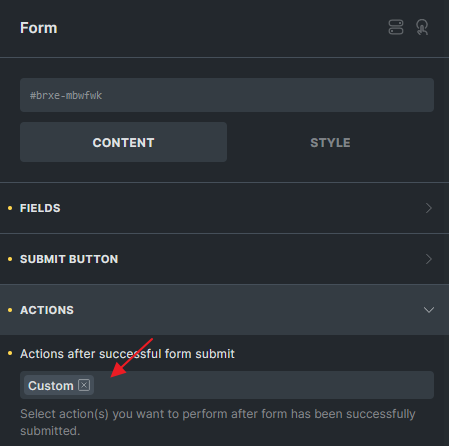

The action callback will receive the `$form` object which exposes the following methods to get the form settings, the form fields, and the form uploaded files (if needed):

**Settings**: `**$form->get_settings()**`

This method exposes an associative array with the form settings (fields and actions settings) similar to this:

```php
Array
(
    [fields] => Array
        (
            [0] => Array
                (
                    [type] => text
                    [label] => Name
                    [placeholder] => Your Name
                    [id] => 15bc57
                )

            [1] => Array
                (
                    [type] => email
                    [label] => Email
                    [placeholder] => Your Email
                    [required] => 1
                    [id] => 3db633
                )

            [2] => Array
                (
                    [type] => textarea
                    [label] => Message
                    [placeholder] => Your Message
                    [required] => 1
                    [id] => f65f2c
                )
            ...

        )

    [submitButtonStyle] => primary
    [actions] => Array
        (
            [0] => email
            ...
        )

    [successMessage] => Message successfully sent. We will get back to you as soon as possible.
    [emailSubject] => Contact form request
    [emailTo] => admin_email
    [fromName] => bricks
    [emailErrorMessage] => Submission failed. Please reload the page and try to submit the form again.
    [htmlEmail] => 1
    [mailchimpPendingMessage] => Please check your email to confirm your subscription.
    [mailchimpErrorMessage] => Sorry, but we could not subscribe you.
    [sendgridErrorMessage] => Sorry, but we could not subscribe you.
    ...
)

```

**Fields values**: `**$form->get_fields()**`

This method exposes an associative array with the submitted values for each form field, together with the post Id and the form Id:

```php
Array
(
    [form-field-15bc57] => John Doe
    [form-field-3db633] => john.doe@example.com
    [form-field-f65f2c] => Thank you for using Bricks!
    ...
    [postId] => 167
    [formId] => yrnkmt
    ...
    [referrer] => https://example.com/contact
)
```

**Submitted files**: `**$form->get_uploaded_files()**`

This method exposes an associative array with the properties of the submitted files, grouped by the form field Id:

:::note
['file'] => Physical saved location
['url'] => Might not be accessible if not save to media or save to custom directory.
:::

```php
Array
(
    [form-field-sajbjc] => Array
        (
            [0] => Array
                (
                    [file] => /.../public/wp-content/uploads/2022/03/my-uploaded-file.png
                    [url] => https://example.com/wp-content/uploads/2022/03/my-uploaded-file.png
                    [type] => image/png
                )

            [1] => Array
                (
                    [file] => /.../public/wp-content/uploads/2022/03/my-other-file.png
                    [url] => https://example.com/wp-content/uploads/2022/03/my-other-file.png
                    [type] => image/png
                )
            ...

        )

)
```

**Example #1** Basic setup

```php
<?php
function my_form_custom_action( $form ) {
  // $fields = $form->get_fields();
  // $formId = $fields['formId'];
  // $postId = $fields['postId'];
  // $settings = $form->get_settings();
  // $files = $form->get_uploaded_files();

  // Perform some logic here...

  // Set result in case it fails
  $form->set_result([
    'action' => 'my_custom_action',
    'type'    => 'success', // or 'error' or 'info'
    'message' => esc_html__('Oh my custom action failed', 'bricks'),
  ]);
}
add_action( 'bricks/form/custom_action', 'my_form_custom_action', 10, 1 );
```

**Example #2** Trigger a second email after the form is submitted.

With the current Bricks version, you can only set one email notification. With this code snippet, you may trigger a second one.

```php
<?php
function my_form_custom_action_sending_email( $form ) {
  $fields = $form->get_fields();
  // $formId = $fields['formId'];
  // $postId = $fields['postId'];
  $settings = $form->get_settings();
  // $files = $form->get_uploaded_files();


  $to = 'recipient@example.com'; // Replace this
  $from = 'sender@example.com'; // Replace this
  $subject = 'Your Subject'; // Replace this

  if ( ! empty( $settings['emailContent'] ) ) {
    $message = $form->render_data( $settings['emailContent'] );
    $message = isset( $settings['htmlEmail'] ) ? nl2br( $message ) : $message;
  } else {
    $email = new Bricks\Integrations\Form\Actions\Email('email');
    $message = $email->get_default_message( $settings, $fields );
  }


  $headers[] = 'From: Your Name <'.$from.'>';
  $headers[] = 'Reply-to: '. $from;
  if ( isset( $settings['htmlEmail'] ) ) {
    $headers[] = 'Content-Type: text/html; charset=UTF-8' . "\r\n";
  }

  $result = wp_mail( $to, $subject, $message, $headers );

  // $form->set_result([
  //  'action' => 'my_custom_action',
  //  'type'    => 'success', // or 'error' or 'info'
  //  'message' => esc_html__('Oh my custom action failed', 'bricks'),
  // ]);
}
add_action( 'bricks/form/custom_action', 'my_form_custom_action_sending_email', 10, 1 );
```


<span id="custom-redirect-to-hidden-field"></span>

**Example #3** Custom redirect to a hidden field URL

In certain cases, you would like to redirect user to a page based on certain URL parameter values. In such scenario, you are not able to use `{url_parameter:key:raw}` on the Custom redirect URL field. This is because the form was submitted in AJAX and the current page URL param will not be sent along the AJAX call.

**Method 1**
Since 1.10, Ridirect action is supporting dynamic form field. You can choose Redirect action and configure like this.

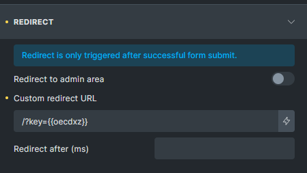

**Method 2**
You can use Custom action with some PHP code for more complicated logic. You can first place the url parameter into a hidden field.


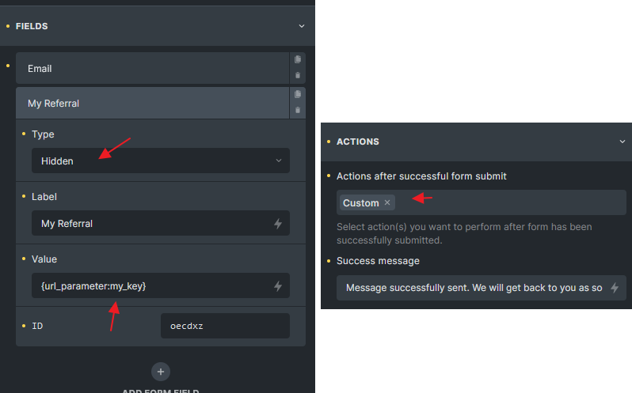

<figcaption>

Store url parameter into hidden key, and choose Custom action

</figcaption>


Then choose Custom action, and follow below code as an example

```php
<?php
add_action( 'bricks/form/custom_action', 'redirect_to_my_key', 10, 1 );

function redirect_to_my_key( $form ) {
  $form_fields   = $form->get_fields();
  $form_id       = $form_fields['formId'];

  // Check if the form id is the one you want
  if( $form_id !== 'cyrozb' ) return;

  // oeckxw is the hidden field Id where I placed the {url_parameter:my_key:raw}
  $my_key = isset( $form_fields['form-field-oecdxz'] ) ? $form_fields['form-field-oecdxz'] : '';

  if( $my_key ) {
    // Now you get the hidden field value and redirect to the page you want, for example:
    $redirect_to = get_site_url() . '/?key=' . $my_key;

    // If the hidden field value is a URL, just redirect to it instead of following my code
    // $redirect_to = $my_key;

    $form->set_result(
      [
        'action'          => 'my_custom_redirect', // This is the action name, you can set it to anything you want
        'type'            => 'redirect', // Must be set to 'redirect'
        'redirectTo'      => $redirect_to,
        'redirectTimeout' => 0 // Need to delay ? Set a timeout in milliseconds
      ]
    );
  }
}
```

### Custom form actions {#custom-form-actions}

Since Bricks 1.12.2, you can extend the functionality of Bricks forms by adding multiple **custom form actions**. This allows seamless integration with external services like CRMs, email marketing providers, notification systems, or any custom workflows you require.

To create custom actions, you use three key filters:

- **[`bricks/elements/{element_name}/controls`](/developer/hooks/filters/filter-bricks-elements-element_name-controls/)**: Add new actions and their settings to the form builder.
- **[`bricks/elements/{element_name}/control_groups`](/developer/hooks/filters/filter-bricks-elements-element_name-control_groups/)**: Group settings for better organization in the builder.
- **[`bricks/form/action/{form_action}`](/developer/hooks/filters/filter-bricks-form-action-form_action/)**: Handle the logic for the custom action when the form is submitted.

These filters give you complete control over how custom actions are configured and executed.

#### Example: Creating a custom Slack notification action

**1 - Add the action to form actions setting:**

```php
add_filter(
    'bricks/elements/form/controls',
    function( $controls ) {
        $controls['actions']['options']['slack-notification'] = esc_html__( 'Send to Slack', 'bricks' );

        $controls['slackFields'] = [
            'group'       => 'slack',
            'label'       => esc_html__( 'Fields to include', 'bricks' ),
            'type'        => 'select',
            'multiple'    => true,
            'options'     => [], // Auto-populated with form fields with 'map_fields' => true
            'map_fields'  => true,
            'description' => esc_html__( 'Select which form fields to include in the Slack notification', 'bricks' ),
        ];

        return $controls;
    }
);
```

**2 - Add a new control group:**

```php
add_filter(
    'bricks/elements/form/control_groups',
    function( $control_groups ) {
        $control_groups['slack'] = [
            'title' => esc_html__( 'Slack notification', 'bricks' ),
            'required' => [ 'actions', '=', 'slack-notification' ],
        ];

        return $control_groups;
    }
);
```

1.

**3 - Handle the action logic on form submission:**

```php
add_action(
    'bricks/form/action/slack-notification',
    function ( $form ) {
        $settings = $form->get_settings();
        $fields   = $form->get_fields();

        // Custom Slack notification implementation
    }
);
```

## Form validation {#form-validation}

Bricks 1.7.1 provides a new filter named `bricks/form/validate` that allows you to validate every form submission and return error messages if your custom validation fails. The first `$errors` param is an array with each item being an error message. And the second `$form` param is the instance of the form that has been submitted.

The following code example validates the submitted email address for the form field ID `7e30aa`.

If no user account with this email address exists on this site, the validation fails, an error message is displayed, and no email will be sent.

```php
add_filter( 'bricks/form/validate', function( $errors, $form ) {
  $form_settings = $form->get_settings();
  $form_fields   = $form->get_fields();
  $form_id       = $form_fields['formId'];

  // Skip validation: Form ID is not 'kfbqso'
  if ( $form_id !== 'kfbqso' ) {
    // Early return the $errors array if it's not target form
    return $errors;
  }

  // Get submitted field value of form field ID '7e30aa'
  $email_address = $form->get_field_value( '7e30aa' );

  // Error: Email from registered user (show error message, and don't send email)
  if ( ! email_exists( $email_address ) ) {
    // Add error message to the $errors message array
    $errors[] = esc_html__( 'This email address is not in our system, sorry.', 'bricks' );
  }

  // Make sure to always return the $errors array
  return $errors;
}, 10, 2 );.
```

## Immediate input validation {#input-validation}


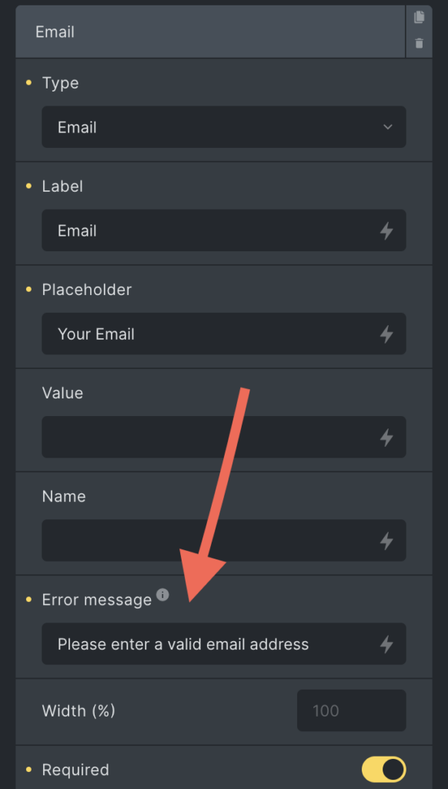

<figcaption>

Form field: Error message

</figcaption>


Bricks has enhanced the form user experience by introducing the ability to display error messages immediately as soon as a field loses focus.

To utilize this feature:

1. Add an "Error Message" to a specific form field.
2. Upon losing focus, the form will evaluate the user input to determine if the "Error Message" should be displayed based on the following criteria:
  - **Required:** Checks if mandatory fields have data.
  - **Min/Max number:** Ensures entered numbers fall within a defined range.
  - **Email:** Confirms the correctness of the email format.
  - **URL:** Validates the structure of inputted URLs.

### Disabling immediate input validation

Sometimes, we don’t want error messages to appear immediately. Instead, we may want to display them only on specific events. This is now possible (@since 1.12) with the new **"Disable Form Validation"** control.

You can choose to disable validation on input, on blur, or both. However, the form will still be validated upon submission.

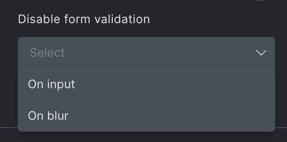

## Pattern attribute validation {#pattern-validation}

With the new `pattern` attribute (`@since 2.0.2`), you can now validate form input natively before submission. Combined with the `title` attribute (also `@since 2.0.2`), you can display custom error messages directly from the browser.

The `pattern` attribute works with the following field types: `text`, `tel`, `email`, `url`, and `password`.

**Example:**
To require a simple phone number in the `###-###-###` format, you can use the pattern `^\d{3}-\d{3}-\d{3}$`.
Additionally, you can use the `title` attribute to guide users or show a helpful message if the input doesn’t match the pattern:

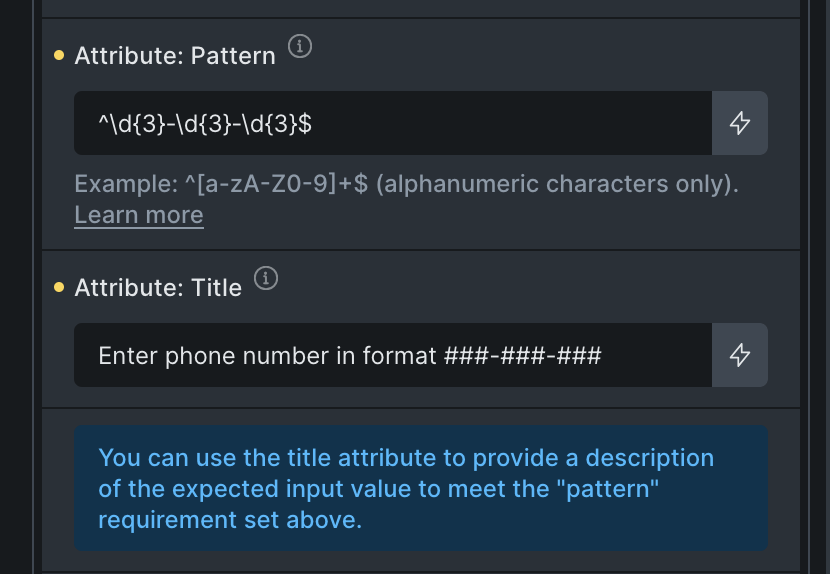

## Spam protection (Google reCaptcha V3) {#spam}

The Bricks form element supports the latest [Google reCaptcha V3](https://developers.google.com/recaptcha/docs/v3) mechanism. To enable it, first, [create](https://g.co/recaptcha/v3) a site key and a site secret key and then add both in your admin area under "Bricks > Settings > API keys".

After adding the keys, enable the reCaptcha setting when editing the Form element in the builder under the "Spam Protection" control group.

If you still get a lot of spam, you might need to tweak the score threshold level. The threshold is configured to 0.5 by default. Google reCaptcha V3 API returns a value between 0.0 and 1.0, where 0.0 is very likely a bot, and 1.0 is very likely a human interaction. To increase the Bricks threshold, please use the following PHP snippet:

```php
add_filter( 'bricks/form/recaptcha_score_threshold', function( $score ) {
    // Bricks default is 0.5
    $score = 0.8;
    return $score;
}, 10, 1 );
```

Setting the threshold to 0.8 means Bricks will only accept form submissions with higher scores (more likely to be human interactions).

## Spam protection (hCaptcha) {#hcaptcha}

Bricks integrates with hCaptcha. To utilize it, add your hCaptcha Sitekey and hCaptcha Secret Key under "Bricks > Settings > API keys".

After adding the keys, enable the reCaptcha setting when editing the Form element in the builder under the "Spam Protection" control group. You'll find options to select either "Invisible" or "Visible" hCaptcha. For the "Visible" hCaptcha:

- **Theme:** Choose between a `dark` or `light` theme.
- **Size:** Pick from `compact` or `normal`.

For detailed setup instructions, refer to the [hCaptcha documentation](https://docs.hcaptcha.com/switch/#get-your-hcaptcha-sitekey-and-secret-key).

## Spam Protection (Cloudflare Turnstile) {#turnstile}

Beginning with version 1.9.2, Bricks has introduced support for Cloudflare Turnstile. To leverage its capabilities, first, add your Cloudflare Turnstile site key & secret key under "Bricks > Settings > API keys".

After registering the necessary details, go to the Form element in the builder and look for the “Spam Protection” control group. Here, you can toggle the Cloudflare Turnstile setting on or off.

Once enabled, you will have the ability to customize the following:

- **Theme:** Select between a "dark", "light", or the default "auto" theme.
- **Size:** Opt for either "compact" or "normal".

For more details about getting your site key and secret key, refer to the [Cloudflare Turnstile documentation](https://developers.cloudflare.com/turnstile/get-started/).

## Honeypot {#honeypot}

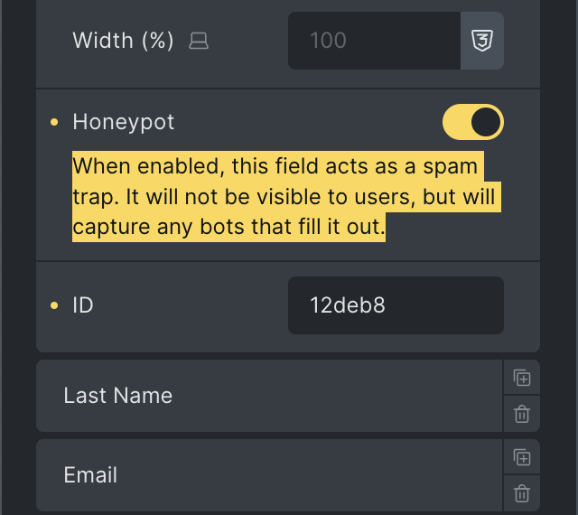

Another spam protection layer, available since Bricks 1.12.2 is the ability to turn any form field (except "Files", "Remember me", "HTML" and "Hidden") into a honeypot field. This won't affect or interrupt actual website visitors, but it'll prevent bot form submissions if they fill out any of your honeypot fields.

## Customize the date picker field {#datepicker}

Bricks (1.5+) uses the [Flatpickr](https://flatpickr.js.org/) datetime picker javascript library, which can be extended, localized, or customized according to the [available options](https://flatpickr.js.org/options/).

To change the library initialization options, use the `bricks/element/form/datepicker_options` filter, like so:

```php
add_filter( 'bricks/element/form/datepicker_options', function( $options, $element ) {
    $options['locale'] = [
        'firstDayOfWeek' => 1 // Set Monday as the first week day
    ];

    return $options;
}, 10, 2 );
```

The filter callback function accepts two arguments:

- $options - an array of [Flatpickr options](https://flatpickr.js.org/options/)
- $element - the Bricks element object

### Localize the date picker strings {#datepicker-l10n}

Flatpickr supports [l10n](https://flatpickr.js.org/localization/) for a variety of languages. You would need to load the language package by placing the following instructions into the Bricks Settings > Custom Code > Body (footer) scripts:

```php
<script src="https://npmcdn.com/flatpickr/dist/l10n/XX.js"></script>

<script>
   window.flatpickr.localize(window.flatpickr.l10ns.XX)
</script>
```

Replace the XX with the language code you need (e.g. **de** for German, **pt** for Portuguese, ...).

If you need to adjust the language on a specific form, you would need to load the language package as explained in the first line of the code above but then you may use the Bricks filter to load the language for a specific form element

```php
add_filter( 'bricks/element/form/datepicker_options', function( $options, $element ) {
    if ( $element->id === 'abcdef' ) {
      // localize the form "abcdef" element
      $options['locale'] = 'XX';
    }

    return $options;
}, 10, 2 );
```

## Define options value & label {#options}

Starting at Bricks 1.10.2 you can define the value & label for the checkbox, radio, and select field types by separating the option through a colon (:) like this:

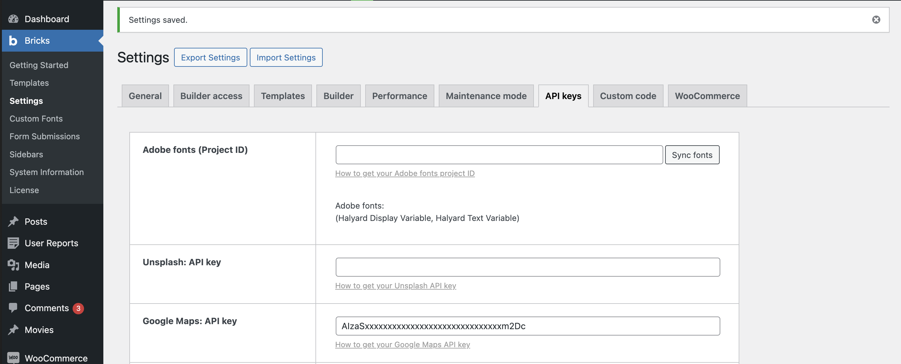

## Integrations {#integrations}

The Form element integrates with Mailchimp & Sendgrid. Allowing you to add new contacts to your email lists. Make sure you've added your Mailchimp/Sendgrid API keys as described below.

When editing your form element, you have to select Mailchimp or Sendgrid under "Actions" so the form knows to add the submitted email address to your list.

Once you've selected the proper action, a new "Mailchimp" or "Sendgrid" control group should appear. There you have to select the list you want to add this new contact to and the "Email field" of your form that contains the email address.

### Mailchimp {#mailchimp}

The Mailchimp form action allows you to automatically communicate your form data (email, first name, and last name) to a Mailchimp list and group.

To use the Mailchimp action, you need to create a Mailchimp account and then [get an API key](https://mailchimp.com/help/about-api-keys/).

To use this form action, add the API key under "Bricks > Settings > API keys > Mailchimp API key".

### SendGrid {#sendgrid}

The SendGrid form action allows you to automatically communicate your form data (email, first name, and last name) to a SendGrid list.

To use the SendGrid action, you need to create a SendGrid account and then [get an API key](https://docs.sendgrid.com/ui/account-and-settings/api-keys#creating-an-api-key).

To use this form action, add the API key under "Bricks > Settings > API keys > SendGrid API key".

## How to create a multi-column form {#multi-column}

To create a multi-column form, we first need to set the "Width" of the form fields in percentage.

**Example: Two-column layout**

Creating a two-column form is as simple as setting the width of the individual form fields to 50%.

To add some spacing between our form fields, let's set the "Width" of the first two form fields in our example to 49%. Those fields now take up 98% of the horizontal width. Creating a 2% gap between our columns. Set the bottom "Spacing" value to "2%" to apply the same spacing in all directions.

Lastly, set the "Alignment" to "space-between" to ensure our fields horizontally align with the outer edges of our form.


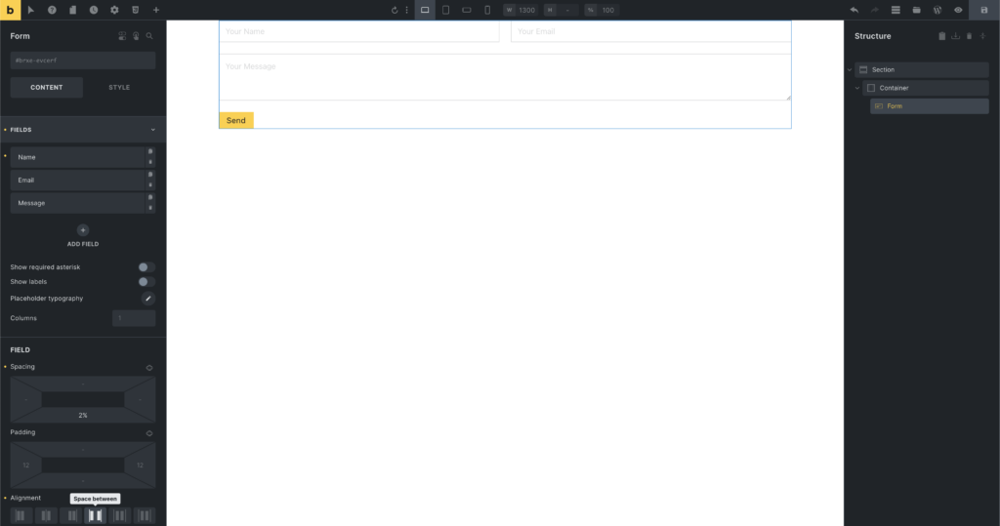

<figcaption>

Two-column form layout

</figcaption>
