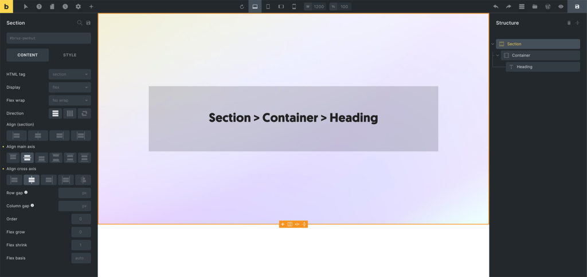

The Section element allows you to structure/divide your page into self-containing areas (think: one topic per section).

The [Understanding the Layout](/builder/styling/layout/) article covers in more detail how to best use the layout elements in Bricks.

The Section element is the outermost building block for structuring and dividing your page. Use sections to separate and space out individual parts of your page, such as hero sections, content areas, or footers.

The Section element has a default width of 100%, uses the `section` tag, and flexbox. Sections take up 100% of the available width and adjust in height according to their content. They are stacked vertically on top of each other.

It should be used at the root level to structure your page into self-containing areas. When adding a Section to the canvas, a Container element is added inside of the Section automatically. You can delete this Container if not needed. It's just the default behaviour to speed up your site creation process.

<figure>

<figcaption>

Example: Section > Container > Heading

</figcaption>

</figure>

**Tip:** Use sections as the root level elements in your page structure. They work great for creating distinct page sections with different backgrounds, spacing, and layouts.

## Settings

- **Grid column** (text) - CSS grid column span when parent uses grid layout. Controls `grid-column` property.

- **Grid row** (text) - CSS grid row span when parent uses grid layout. Controls `grid-row` property.

- **Query loop** - Enable query loop functionality for dynamic content. Available for Container, Block, Div, and Section elements.

- **Link** (link) - Link settings when using anchor tag. Required when HTML tag is set to 'a'.

- **HTML tag** (select) - HTML tag for the section element. Options: div, section, a [Link], article, nav, ol, ul, li, aside, address, figure, custom. Default: section.

- **Custom tag** (text) - Custom HTML tag when "custom" is selected. Without attributes. Required when HTML tag is 'custom'.

- **Display** (select) - CSS display property. Options: flex, grid, block, inline-block, inline, none. Default: flex.

### Grid Layout (when Display is grid)

- **Gap** (number with units) - Gap between grid items. Controls `grid-gap` property.

- **Grid template columns** (text) - CSS grid template columns. Supports dynamic data and variables.

- **Grid template rows** (text) - CSS grid template rows. Supports dynamic data and variables.

- **Grid auto columns** (text) - Grid auto columns size. Supports dynamic data and variables.

- **Grid auto rows** (text) - Grid auto rows size. Supports dynamic data and variables.

- **Grid auto flow** (select) - Grid auto flow direction. Options: row, column, dense.

- **Justify items** (justify-content) - Grid justify items alignment.

- **Align items** (align-items) - Grid align items alignment.

- **Justify content** (justify-content) - Grid justify content alignment.

- **Align content** (align-items) - Grid align content alignment.

### Flex Layout (when Display is flex)

- **Flex wrap** (select) - Flexbox wrapping behavior. Options: No wrap, Wrap, Wrap reverse.

- **Direction** (direction) - Flexbox direction (row/column). Controls `flex-direction` property.

- **Align self** (align-items) - Align self for this flex item. Controls `align-self` property with `!important`.

- **Align main axis** (justify-content) - Justify content alignment. Controls `justify-content` property.

- **Align cross axis** (align-items) - Align items alignment. Controls `align-items` property.

- **Column gap** (number with units) - Gap between flex columns. Controls `column-gap` property.

- **Row gap** (number with units) - Gap between flex rows. Controls `row-gap` property.

- **Flex grow** (number) - Flex grow factor. Minimum: 0. Controls `flex-grow` property. Default placeholder: 0.

- **Flex shrink** (number) - Flex shrink factor. Minimum: 0. Controls `flex-shrink` property. Default placeholder: 1.

- **Flex basis** (text) - Flex basis value. Supports dynamic data and variables. Controls `flex-basis` property. Default placeholder: auto.

### Order

- **Order** (number) - Flexbox order. Minimum: -999. Controls `order` property. Default placeholder: 0. Available when display is not 'none'.

### Style

These controls can be accessed under the **Style** tab in the element settings.

### Masonry

- **Masonry layout** (checkbox) - Enable masonry layout for child elements.
- **Columns** (number) - Number of masonry columns. Default: 3. Controls `--columns` CSS property.
- **Spacing** (number with units) - Spacing between masonry items. Default: 10px. Controls `--gutter` CSS property.
- **Horizontal order** (checkbox) - Enable horizontal ordering in masonry layout.
- **Transition: Duration** (number with units) - Animation duration for masonry transitions. Default: 0.4s. Set to "0" to disable default animations.
- **Reveal animation** (select) - Animation type for masonry items. Options: Scale, Fade, Slide from left, Slide from right, Skew. Default: Scale. Only applies to new items added to the DOM.

## Theme Style: Element – Section

You can change the section `width`, `min-width`, `max-width`, `margin`, and `padding` in your theme styles under the "Elements > Section" group.

:::tip[Developer reference]
See the [Section Schema](/developer/schema/elements/section/) for the full JSON schema of this element's settings and controls.
:::
