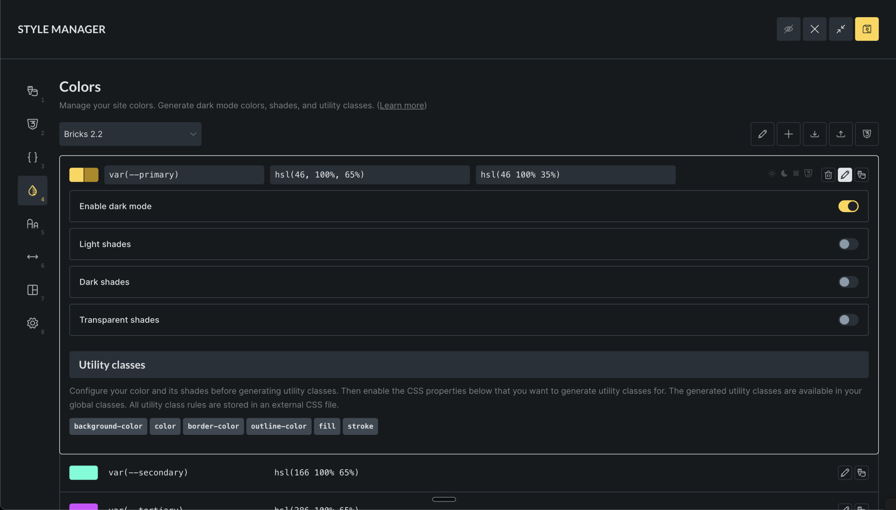
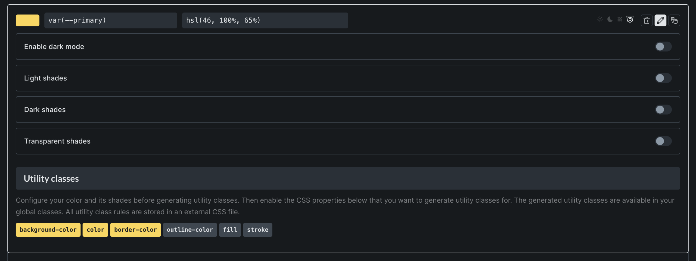

The Color Manager lets you define and maintain color tokens for your site. Each color is stored as a CSS variable and can optionally support dark mode, shades, harmonies, and utility classes.

It is designed to help you build a predictable color system instead of setting isolated and impossible to maintainable hex values across your elements.

## Getting started

To access the Color Manager:

1. Open the builder
2. Click the "Gear" icon on the left-hand site of the builder toolbar
3. Open the "Colors" tab to access the Color Manager

If you don't have any palettes yet, you'll see a prompt to create your first one from scratch or to import an existing color palette (JSON file).

## Creating and managing palettes

### Creating a new palette

1. Click the **Add Palette** button (plus icon)
2. Enter a name for your palette (e.g., "Brand Colors" or "Website Theme")
3. Click **Create**

### Switching between palettes

Use the dropdown at the top to select different palettes

### Renaming or deleting palettes

1. Click the **Edit** button (pencil icon) in the toolbar
2. To rename: Click in the palette name field and type a new name
3. To delete: Click the **Delete** button (trash icon) and confirm

## Adding colors to your palette

### Adding a new color

1. Scroll to the bottom of the color list
2. Enter a variable name (like "primary" or "brand-blue")
3. Pick a color using the color picker or type in a color value
4. Click **Add color**

### Editing existing colors

Click on any color's name or value to edit it

## Using dark mode

Dark mode lets you define different colors for light and dark themes:

1. Click the "Edit" icon on any color
2. Check the "Enable dark mode" box
3. Set a separate color for dark mode using the color picker
4. The color swatch will show both light and dark versions

## Creating color shades

Shades are variations of your base colors with different lightness or transparency:

1. Click the "Edit" icon on any color
2. Enable the shade type you want to create

- **Light shades**: Brighter versions of your color
- **Dark shades**: Darker versions
- **Transparent shades**: Semi-transparent versions

## Generating color harmonies

Color harmonies create matching color combinations automatically:

1. Select a base color
2. Click the **Harmony** button (design palette icon)
3. Choose a harmony type:

- **Analogous**: Colors next to each other on the color wheel
- **Monochromatic**: Different shades of the same color
- **Complementary**: Colors opposite each other
- **Split Complementary**: One complementary color split into two
- **Triadic**: Three colors evenly spaced
- **Tetradic**: Four colors in a rectangle pattern

1. Preview the generated colors
2. Click **Generate colors** to add them to your palette

## Setting up utility classes

Utility classes let you quickly apply colors to elements without custom CSS:

1. Edit a color
2. Scroll down to "Utility classes"
3. Check the boxes for the properties you want:

- **Background**: For background colors
- **Text**: For text colors
- **Border**: For border colors
- **Outline**: For outline colors
- **Fill**: For SVG fill colors
- **Stroke**: For SVG stroke colors

Once enabled, you'll have classes like `bg-primary`, `text-primary`, etc available to you when editing elements.

## Importing and exporting palettes

### Importing palettes

1. Click the **Import** button (download icon)
2. Drag and drop a JSON file or click to browse
3. The system will validate and import your colors
4. You'll see success or error messages for each imported palette

### Exporting palettes

There are two ways to export your colors:

1. Click the **Export** button (upload icon) to export as JSON (to import into other Bricks sites)
2. Click the "Generated CSS" button to copy the generated CSS
