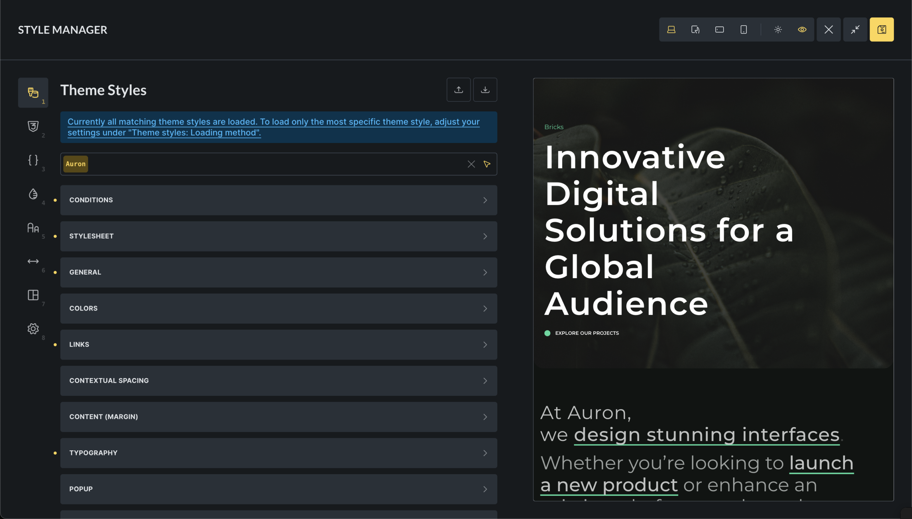
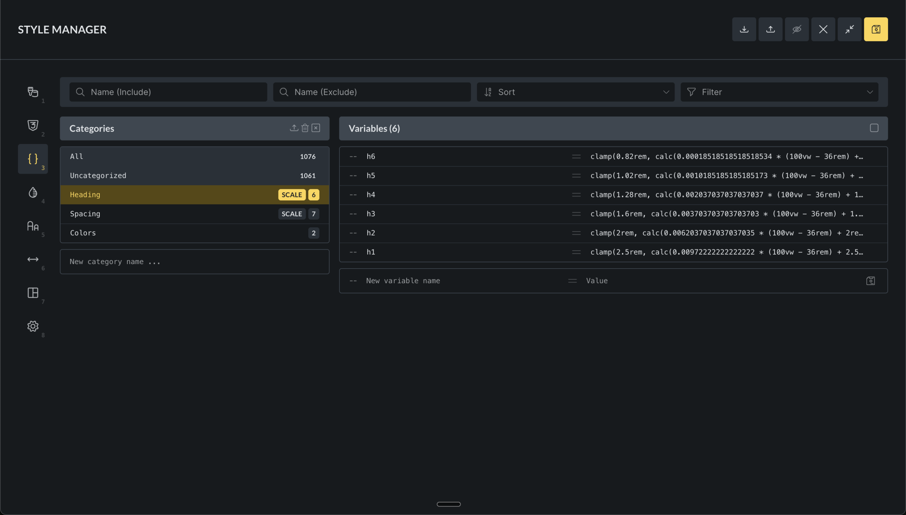
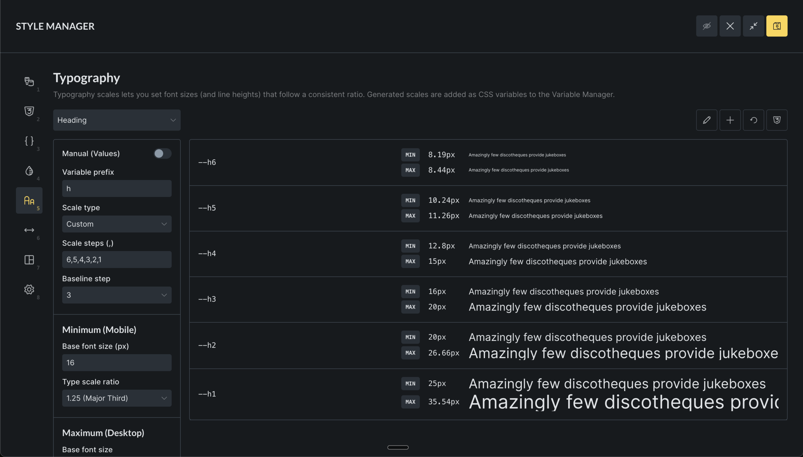
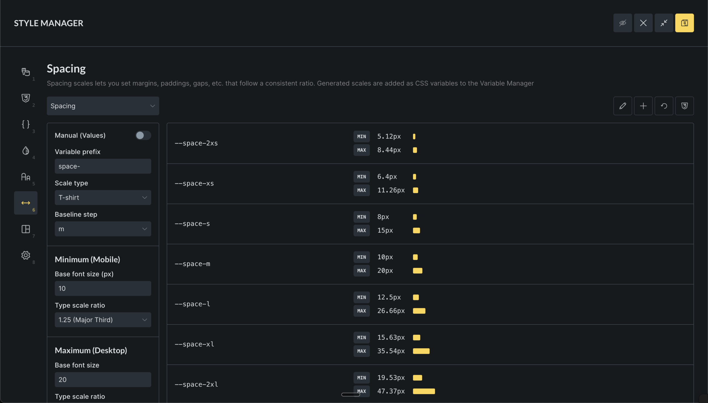
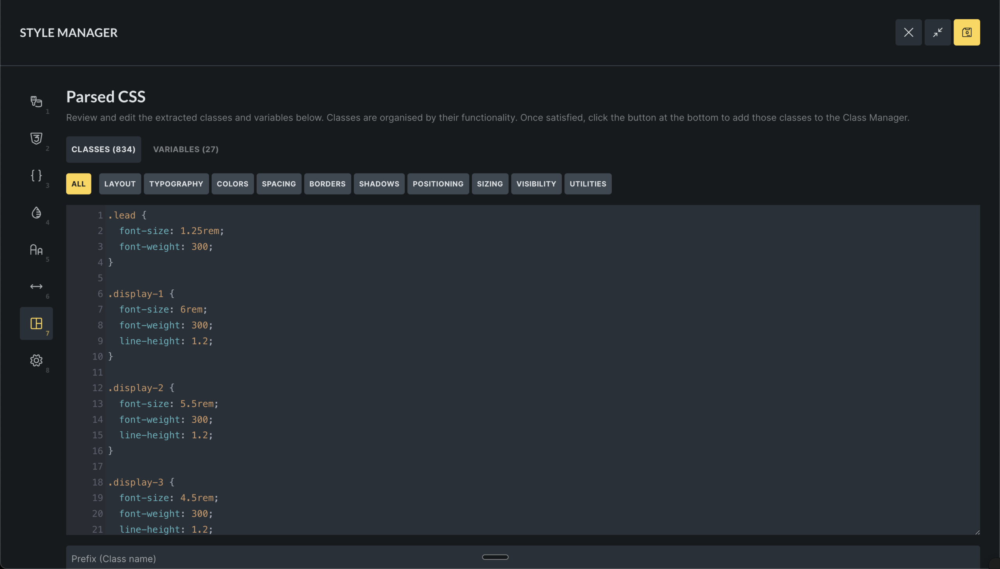
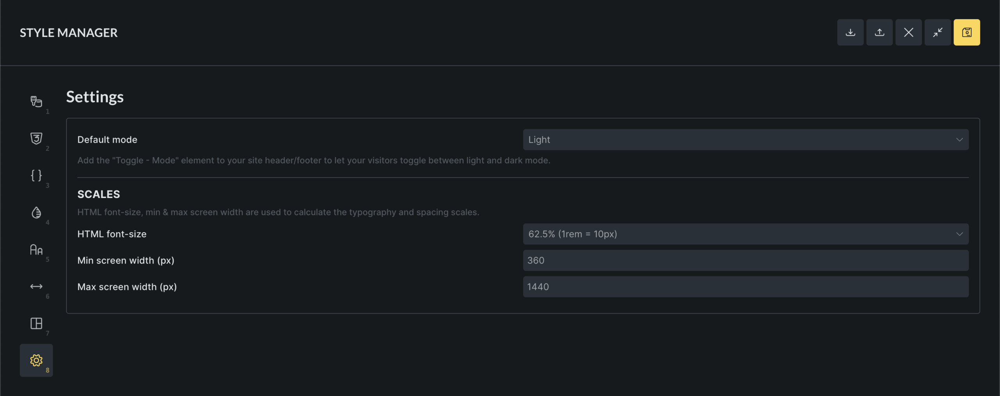

The Style Manager is the central place in Bricks for managing design system primitives and reusable styling tools. It brings together theme styles, classes, variables, colors, scales, and imported CSS into a single interface inside the builder.

Its purpose is to centralize styling decisions so you can change colors, spacing, typography, and layout rules in one place without hunting through different panels.

## What the style manager contains

The Style Manager is organized into eight tabs:

1. Theme styles
2. Classes
3. Variables
4. Colors
5. Typography
6. Spacing
7. Framework
8. Settings

---

## Theme styles

Theme Styles define global default styles for HTML elements and Bricks elements.

Typical use cases include:

- Base typography for headings and body text
- Default button and form styles
- Global colors and spacing
- Responsive defaults
- Global hover and focus states

Theme Styles are condition-based. You can apply them to the entire site, specific templates, or specific pages. They support breakpoints and pseudo-classes, which makes them suitable for defining interaction behavior centrally.

For more: [/builder/styling/theme-styles/](/builder/styling/theme-styles/)

## Classes

The Class Manager is used to create reusable CSS classes that can be applied to any element.

Use classes when:

- A style is reused across multiple elements
- The style is not a global default
- You want consistent reuse instead of copying values

Classes can be organized into categories, locked, and filtered by usage and status.

Theme Styles define defaults. Classes opt elements into specific behavior.

For more: [/builder/styling/global-class-manager/](/builder/styling/global-class-manager/)

## Variables

The Variable Manager is where you define CSS custom properties that act as design tokens.

Variables are commonly used for:

- Colors
- Spacing values
- Font sizes
- Layout dimensions
- Reusable numeric values

Instead of repeating numbers, you reference variables using `var(--variable-name)`. Updating a variable updates every place where it is used.

Variables can be imported from CSS or JSON, grouped into categories, and renamed.

For more: [/builder/styling/global-variables-manager/](/builder/styling/global-variables-manager/)

## Colors

The Color Manager builds structured color systems on top of CSS variables.

Each color is stored as a variable and can optionally:

- Have light and dark mode values
- Generate shade and transparency variants
- Generate utility classes

For more: [/builder/features/color-manager/](/builder/features/color-manager/)

## Typography

The Typography tab generates fluid type scales using CSS variables and `clamp()`.

Instead of manually setting font sizes, you define:

- A base size
- A scale ratio
- Minimum and maximum viewport widths

From this, Bricks generates a set of variables that scale smoothly between mobile and desktop.

Typography scales are useful when you want:

- Consistent hierarchy
- Responsive sizing without manual breakpoints
- Fewer arbitrary font-size decisions

You can use t-shirt sizing, numeric steps, or custom names. Generated variables can be used directly or via utility classes.

Manual mode allows overriding calculated values when precise control is required.

## Spacing

The Spacing tab generates fluid spacing values for margins, padding, and gaps using the same scale-based system as typography.

This helps enforce consistent layout rhythm across pages.

You can generate utility classes such as `gap-m` or `p-l`, but only generate what you actually use.

## Framework

The Framework tab imports external CSS and converts it into Bricks classes & variables.

It can:

- Parse class rules
- Extract variables from `:root`
- Categorize styles by intent
- Apply prefixes to avoid conflicts

This is mainly useful for:

- Migrating or importing CSS frameworks
- Importing existing custom CSS stylesheets

All imports can be manually reviewed before being added.

## Settings

The Settings tab controls how typography and spacing scales are generated, and which color mode is used by default.

### Color mode

- Light: always start in light mode
- Dark: always start in dark mode
- Auto: follow system preference

### Scale configuration

These settings affect typography and spacing:

- HTML font-size for rem calculations
- Minimum and maximum viewport widths

---

## Interface controls and preview

The Style Manager header includes a full-screen button and a toggle to show or hide the canvas preview per tab.

The canvas preview shows the currently edited page and updates in real time as you make changes. It responds to breakpoint switching and can be resized.

---

## Keyboard shortcuts

You can switch between Style Manager tabs using number keys based on their position.

You can also open and close the Style Manager popup using:

`CMD + .` (macOS)
`CTRL + .` (Windows/Linux)
