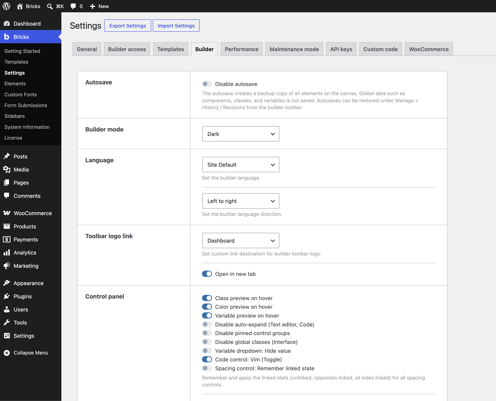

The Bricks settings screen (**Bricks > Settings**) is where you configure global options for your entire installation. Every setting documented here maps directly to what you see in the admin screen.

Settings are split across tabs: **General**, **Builder access**, **Templates**, **Builder**, **Performance**, **Maintenance mode**, **API keys**, **Custom code**, and **WooCommerce** (only visible when WooCommerce is active).

At the top of the page you'll find two buttons:

- **Export settings**: Downloads your current Bricks settings as a JSON file. Security-sensitive settings (builder access capabilities, SVG upload permissions, code execution) are excluded from exports and must be configured manually after each import.
- **Import settings**: Uploads a previously exported JSON file to restore or transfer settings between installations.

---

## General

### Post types

Select which WordPress post types can be edited with Bricks. Pages are enabled by default. For post types where every post shares the same layout (e.g. Products, Properties), you typically don't need to enable them here. Create a Bricks template with appropriate conditions instead.

### Block editor

Controls how Bricks interacts with WordPress block editor (Gutenberg) data.

- **Load Block editor data into Bricks**: When editing a page that has existing block editor content, Bricks will attempt to convert and load that content into the builder.
- **Save Bricks data as Block editor data**: Each time you save in Bricks, Bricks will attempt to write a Gutenberg-compatible copy of your content so it's visible in the standard WordPress editor. Not all elements are supported.

See the [Gutenberg integration](/integrations/gutenberg) article for more details.

#### Bricks components in the block editor experimental

Introduced in Bricks 2.1. Determines how Bricks components are made available as Gutenberg blocks.

- **Disabled (default)**: Components are not exposed in the block editor.
- **Enable individual components manually**: Each component must be explicitly enabled for block editor use.
- **Enable all components automatically**: All components are registered as block editor blocks automatically.

### SVG uploads

WordPress disables SVG uploads by default because SVG files are XML-based and can contain malicious scripts. This setting lets you enable SVG uploads per user role for roles with at least the `edit_posts` capability. All uploaded SVGs are automatically sanitized. Enable only for roles you trust.

See the [SVG uploads](/builder/features/svg-uploads) article for more details.

### Miscellaneous

- **Disable global class manager**: Removes the global class manager panel from the builder interface.
- **Disable CSS variables manager**: Removes the CSS variables manager panel from the builder interface.
- **Disable Bricks Open Graph meta tags**: Stops Bricks from outputting its own Open Graph meta tags. Use this when another plugin like Yoast SEO or RankMath handles these.
- **Disable Bricks SEO meta tags**: Stops Bricks from outputting its own SEO meta tags. Use when an external SEO plugin handles these.
- **Generate custom image sizes**: Tells WordPress to generate the custom image sizes registered by Bricks when images are uploaded.
- **Add element ID as needed**: By default, Bricks adds the element's unique ID and class attributes to every rendered element regardless of whether it has any styles applied. With this setting enabled, Bricks skips those attributes on elements that have no CSS settings, producing slightly leaner HTML. Always added in the builder regardless of this setting.
- **Disable "Skip links"**: Removes the accessibility skip-navigation links Bricks injects at the top of each page (e.g. "Skip to main content"). Only disable if your theme handles skip links separately.
- **Smooth scroll**: Adds `scroll-behavior: smooth` globally via CSS, enabling smooth scrolling for anchor link navigation.
- **Enable "Delete Bricks data" button**: Reveals a "Delete Bricks data" button in the post/page edit screen that removes all stored Bricks data for that post. Requires explicit enabling to prevent accidental data loss.
- **Query Bricks data in search results**: Extends WordPress search to also query the post meta tables where Bricks stores page content. Text placed inside Bricks elements becomes searchable through WordPress native search.

### Theme styles: Loading method

Controls which theme styles are applied when multiple theme styles have conditions that match the current page.

- **Most specific (default)**: Only the single highest-scoring theme style is loaded, where score is based on condition specificity.
- **Load all matching theme styles**: All theme styles whose conditions match the current context are loaded and merged. More specific styles take precedence.

### Duplicate content

Controls who can use the "Duplicate" feature on posts and pages. By default, any user with the `edit_post` capability can duplicate content.

- **Enable (default)**: Duplication is available to all users with `edit_post` capability.
- **Disable globally**: Removes the duplicate option for all users.
- **Disable for WordPress data**: Disables duplication of WordPress core data (post title, content, etc.) while still allowing Bricks data duplication.

For advanced rules, use the [`bricks/use_duplicate_content`](/developer/hooks/filters/filter-bricks-use_duplicate_content) filter.

### Form submissions

- **Save form submissions in database**: Enables the built-in form submission storage system. Submissions from the Bricks Form element are stored in a custom database table and accessible under **Bricks > Form submissions**.
- **Form submission access**: Select which user roles can view stored form submissions. Administrators always have access. Individual user access can also be set via the user profile edit page.
- **Reset database table**: Clears all stored form submission records while keeping the table structure.
- **Delete database table**: Drops the custom form submissions database table entirely. Only visible when form submissions are enabled.

### Query filters

Enables the query sort, filter, and live search system for Post, Term, and User query loops. Powers the Filter element.

- **Enable query sort / filter / live search**: Activates the query filter system and creates the required database index table.
- **Custom fields integration**: Enables ACF and Meta Box field integration with query filters, so you can filter results by custom field values. See the [query filters](/builder/dynamic-content/query-filters#custom-fields-integration) article.

When enabled, an indexer manages a background database index used for filtering:

- **Regenerate filter index**: Rebuilds the filter index for the entire site. Run this after enabling filters or after major content changes.
- **Continue index job**: Immediately runs any queued index jobs without waiting for the next WP cron execution.
- **Fix corrupted database**: Appears when database corruption is detected. Repairs the filter index tables.
- **Remove all index jobs**: Clears all queued indexer jobs. Use this if the indexer gets stuck, then regenerate the index afterwards.

If your indexer makes no progress, see the [known issues: indexer no progress](/builder/setup/known-issues#query-filter-indexer-no-progress) article.

Avoid using query filters in combination with third-party filter plugins.

### Custom breakpoints

Enables custom breakpoints beyond Bricks' default set. Configure these before you start designing your site.

See [responsive editing](/builder/interface/responsive-editing#custom-breakpoints) for details.

- **Regenerate CSS files**: When using external CSS file loading, regenerates all CSS files to reflect the current breakpoint configuration.

### Custom authentication pages

Replaces WordPress' default `wp-login.php` authentication pages with your own Bricks-built pages.

See [custom authentication pages](/builder/features/custom-authentication-pages) for setup instructions.

- **Login**: Select the page to use as the custom login page.
- **Registration**: Select the page to use as the custom registration page.
- **Lost password**: Select the page to use as the custom lost password page.
- **Reset password**: Select the page to use as the custom reset password page.

#### WordPress authentication page access

Determines what happens when a visitor goes directly to a default WordPress authentication URL (e.g. `wp-login.php`). Only applies when custom pages above have been set.

- **Redirect to custom authentication page (default)**: Sends the visitor to the appropriate custom page set above.
- **Error page**: Returns a 404 error page.
- **Home URL**: Redirects to the homepage.
- **Redirect to specific page**: Redirects to any page you select from a dropdown.

**Disable custom authentication page bypass**: By default, anyone can access the original WordPress auth pages by appending `?brx_use_wp_login` to the URL. Enable this to remove that bypass and enforce your custom authentication pages in all cases.

### User activation

When enabled, newly registered users receive an email with an activation link they must click to activate their account. Applies to all new user registrations site-wide, not only those submitted through the Bricks Form element.

- **User activation**: Enables the email verification flow.
- **Auto login after activation**: Automatically logs the user in after they click the activation link.
- **Verification success page**: The page users are sent to after successful activation.
- **Verification failure page**: The page users are sent to if activation fails or the link is invalid.

An **Activation status** column appears under **Users** so you can manually set users as active/inactive and resend activation emails.

#### User activation: Email

Configure the activation email sent to new users. Only visible when user activation is enabled.

- **From email address**: Sender email address. Falls back to the WordPress default.
- **From name**: Sender display name. Falls back to `WordPress`.
- **Subject**: Email subject line. Default: "Activate your account".
- **Email content**: Body of the activation email. Supports template parameters for site name, site URL, username, user email, and an activation link or raw activation URL.
- **HTML email**: Send the email as HTML instead of plain text.

### Password protection

Enables the password protection system for pages and templates. Password protection restricts frontend access only and does not affect the REST API or other access methods. For sensitive data, use more restrictive security controls.

See the [password protection](/builder/features/password-protection) article for details on applying protection to individual pages.

### Orphaned elements

Orphaned elements are elements whose parent no longer exists in the data, which can cause layout issues.

- **Check for orphaned elements on builder save**: Runs a scan for orphaned elements every time you save in the builder. Bricks always checks on load regardless of this setting. You can also trigger a check manually by adding `?check=orphaned` to the builder URL.
- **Start: Orphaned elements review**: Scans your entire site for orphaned elements and reports them. Results appear in-place after clicking the button.

See [known issues: orphaned elements](/builder/setup/known-issues#orphaned-elements) for more information.

---

## Builder access

Configure who can open the Bricks builder and what they can do inside it. See the [builder access](/builder/interface/builder-access) article for a full overview.

### Builder capabilities experimental

Bricks ships with three predefined capability levels:

- **Full access**: Grants access to all builder features.
- **Edit content**: Content editing only. Layout, styling, and structural controls are disabled.
- **No access**: Blocks builder entry completely.

You can create **custom capabilities** with granular permission control by clicking **Add new capability**. Custom capabilities can be named, given a description, and configured with only the permissions you want to grant. Once created, they appear in the builder access dropdowns alongside the defaults.

Administrators always have full access and cannot be restricted.

### Builder access

Assign a builder capability to each WordPress user role. Select from the predefined capabilities or any custom capability you've created.

To set access for a specific individual user, edit that user's WordPress profile directly.

Note: Any user role with the `manage_options` WordPress capability has full builder access regardless of this setting.

---

## Templates

### My templates

Settings for your locally created Bricks templates.

- **Template screenshots**: Bricks automatically generates a screenshot of each template on every builder save. Screenshots appear in the template manager thumbnail and can also be bulk-generated from the template manager. A "Delete screenshots" button appears once screenshots exist.
- **Template manager thumbnail height**: Maximum height in px for template thumbnails in the builder's template manager. Templates taller than this auto-scroll on mouseover.
- **Template thumbnail column**: Shows a thumbnail column in the **Bricks > Templates** admin list, displaying the featured image or screenshot.
  - **Template thumbnail column: Width**: Column thumbnail width in px. Default: 60.
  - **Template thumbnail column: Height**: Column thumbnail height in px. Default: 60.
- **Disable default templates**: By default, if a published Bricks template exists with no conditions set, Bricks renders it on the frontend. Enable this to disable that fallback behavior and require explicit conditions on all templates.
- **Public templates**: When enabled, your templates can be viewed by anyone. When disabled, only logged-in users can view templates.
- **My templates access**: Allows other Bricks installations to browse and import your templates from their own template library. Restrict access using the whitelist and password settings below.
- **Whitelist URLs**: Limits remote template access to specific site URLs. Enter one URL per line. Leave blank to allow any site.
- **Password protection**: Adds a password that remote sites must enter to access your templates.
- **Exclude templates**: Select specific templates to exclude from remote access even when access is otherwise enabled.

### Remote templates

Configure remote Bricks installations to pull templates from in your local template library. You can add multiple remote sources.

For each remote source:

- **Name**: Label shown in the template source dropdown instead of the URL.
- **URL**: Full URL of the remote Bricks installation. The remote site must have "My templates access" enabled.
- **Password**: The password set on the remote site under "My templates access: Password protection."

See the [remote templates](/builder/features/remote-templates) article for setup instructions.

### Miscellaneous

- **Convert templates**: When importing or inserting a template built with the old `Container` element structure, Bricks automatically converts it to the current layout structure (Section > Container > Block / Div). See the [layout](/builder/styling/layout) article for the current element hierarchy.

---

## Builder

### Autosave

- **Disable autosave**: Turns off automatic background saving. The autosave creates a recovery copy of all canvas elements. Global data (components, classes, variables) is not included. Autosaves can be restored from **Manage > History / Revisions** in the builder toolbar.
- **Autosave interval**: How often the autosave runs, in seconds. Default: 60. Minimum: 15.

### Builder mode

Sets the visual theme of the builder UI.

- **Dark (default)**: Dark background builder interface.
- **Light**: Light background builder interface.
- **Custom**: Define your own builder color scheme using CSS variables. See [builder mode](/builder/interface/builder-mode) for available CSS variables.

When "Custom" is selected, a code editor appears for entering your CSS variable overrides.

### Language

- **Builder language**: Sets the language for the builder UI, independent of the WordPress site language. Defaults to the site language.
- **Builder language direction**: Overrides the text direction in the builder.
  - **Auto (default)**: Determined by the selected language.
  - **Left to right**
  - **Right to left**

### Toolbar logo link

Sets what happens when you click the Bricks logo in the builder toolbar.

- **View on frontend (default)**: Opens the frontend view of the currently edited page.
- **Home page**: Links to the site homepage.
- **Dashboard**: Links to the WordPress admin dashboard.
- **Post type**: Links to the post type list in WordPress admin.
- **Edit in WordPress**: Opens the standard WordPress editor for the current post.
- **Custom URL**: Links to any URL you specify.
- **No link**: Removes the link from the logo.

**Open in new tab**: Opens the logo link destination in a new browser tab.

### Control panel

Fine-tune the behavior of the builder's settings panel.

- **Class preview on hover**: When hovering over a global class name in the classes field, shows a preview of the styles defined in that class.
- **Color preview on hover**: Shows a color swatch when hovering over color values in the control panel.
- **Variable preview on hover**: Shows the resolved value of a CSS variable when hovering over it in dropdowns or input fields.
- **Disable auto-expand**: Prevents text editor and code controls from automatically expanding when you focus them.
- **Disable pinned control groups**: Disables the ability to pin frequently used control groups to keep them open.
- **Disable global classes (interface)**: Hides the global classes UI in the control panel. Global classes can still be used programmatically. This is distinct from disabling the global class manager under General.
- **Variable dropdown: Hide value**: In the CSS variable picker dropdown, hides the resolved value shown next to variable names.
- **Code control: Vim toggle**: Enables Vim keybindings in CodeMirror code editors within the builder.
- **Spacing control: Remember linked state**: Persists the linked/unlinked state of spacing controls (margin, padding, border-radius) across all elements. When enabled, if you set one element's padding to "all sides linked," subsequent spacing controls open in that same state.

#### Element breadcrumbs

Shows a breadcrumb trail above the element in the control panel indicating where you are in the element hierarchy.

- **Disabled (default)**
- **Show default element names**: Uses Bricks' built-in element type names (e.g. "Section > Container > Text").
- **Show custom element names**: Uses the custom names you've assigned to elements.

#### Responsive control indicator

Controls when an indicator icon appears on controls that support per-breakpoint values.

- **Show if any value exists (default)**: Shown when any value (including base/desktop) is set.
- **Show if non-base breakpoint value exists**: Shown only when a tablet or mobile override exists.
- **Show on all responsive controls**: Always visible on every control that supports responsive values.
- **Disable**: Never shown.

#### Control group visibility

- **Hide if not open (default)**: Control groups are collapsed until clicked.
- **Always show**: All control groups are expanded at all times.

#### Font family options

- **Show all fonts (default)**: All available fonts appear in the font family dropdown.
- **Show favorites only**: Only fonts you've marked as favorites appear.

### Canvas

- **Disable element spacing**: Removes the visual margin and padding indicators on elements when selected in the builder canvas.
- **Auto scroll element into view**: When you select an element in the structure panel, the canvas scrolls to bring it into view. Set the scroll offset as a percentage (e.g. `50%` centers the element) or `off` to disable. Default: `0`.

### Structure panel

- **Element actions: Duplicate**: Adds a "Duplicate" button to each element row in the structure panel.
- **Element actions: Delete**: Adds a "Delete" button to each element row in the structure panel.
- **Collapse on page load**: The structure panel opens with all element groups collapsed when you first open the builder.
- **Expand active element & scroll into view**: When you select an element on the canvas, the structure panel automatically expands its parent groups and scrolls to show it.

### Element actions

#### Wrap element

Sets the default wrapper element used when wrapping an element (via keyboard shortcut or right-click context menu).

- **Block (default)**
- **Div**
- **Container**

#### Insert element

Sets the default element type inserted via the "+" icon or right-click context menu.

- **Block (default)**
- **Div**
- **Container**

#### Insert layout

Sets the element type used when inserting a layout via the "Layout" action icon.

- **Block (default)**
- **Div**
- **Container**

#### Import pasted images/SVGs

When pasting elements from a different site, images and SVGs are represented as placeholders by default because source URLs may not be accessible. Enable this to have Bricks download and import those assets from the source site into the local media library.

Only applies to Image, Image Gallery, and SVG elements. Images with a custom URL or dynamic data tag as their source are not imported.

### WP polyfill

Loads `wp-polyfill.min.js` in the builder to improve compatibility with older browsers. Not recommended for modern browsers due to the performance overhead.

### Cloudflare Rocket Loader experimental

Enable if the builder fails to load when Cloudflare Rocket Loader is active. Rocket Loader defers JavaScript loading and can interfere with the builder's initialization.

### Query loop

- **Max results**: Limits the number of results displayed per query loop in the builder canvas. Useful for keeping the builder fast when queries return large result sets. Applies to Bricks-native queries only. Minimum: 2.
- **Show query loop type**: Shows the underlying object type key in the query loop type dropdown (e.g. `acf_related_writers`, `mb_page-to-user`). Useful for developers working with custom query integrations.

### Dynamic data

- **Render dynamic data text on canvas**: Bricks evaluates and renders dynamic data tags live on the builder canvas so you see real content instead of tag placeholders.
- **Disable WordPress custom fields in dropdown**: Hides WordPress custom fields from the dynamic data tag dropdown. Can noticeably improve builder performance on sites with many custom fields. You can still use these fields by typing tags like `{cf_my_field}` directly.
- **Dropdown: Show dynamic data key**: Shows the tag key (e.g. `{post_title}`) alongside the label in the dynamic data dropdown.
- **Dropdown: Hide dynamic data label**: Hides the human-readable label and shows only the tag key in the dropdown.
- **Dropdown: Expand panel when dropdown is visible**: Widens the control panel when the dynamic data dropdown is open so more items are visible.

### Global data sync experimental

When multiple people work in the builder at the same time, saves can overwrite each other's global class changes. Enabling this syncs global classes on every builder save across all open builder instances.

### Global class import manager

Controls when the global class import manager dialog appears when pasting elements, importing classes, or inserting templates that contain classes.

- **Show for class conflicts (default)**: Opens when an imported class conflicts with an existing one (same name, different styles).
- **Show for new classes**: Opens when imported content contains classes not yet in your library.
- **Show for new & conflicting classes**: Opens for both new and conflicting classes.
- **Never**: Applies imported classes silently without the dialog.

### Render

- **Disable WP REST API render**: By default, the builder uses the WP REST API to render elements on the canvas. Enable this to fall back to AJAX rendering. Only use if you experience rendering issues such as when the REST API is blocked on your server.

### Instant navigation experimental

Switch between pages and templates in the builder without a full page reload. Useful when working across multiple pages in sequence.

---

## Performance

### Disable emojis

Removes WordPress' emoji conversion script and CSS (`wp-emoji-release.min.js`). Recommended if you don't use emojis in your content, as it removes an unnecessary HTTP request.

### Disable embed

Removes WordPress' oEmbed scripts and the ability to paste URLs to auto-embed content. Recommended if you don't embed external content like YouTube videos or tweets.

### Disable Google Fonts

Stops Bricks from loading Google Fonts from Google's CDN. Enable if you don't use any Google Fonts, or if you've uploaded and self-host your Google Fonts as custom fonts.

### Disable lazy loading

Bricks applies native lazy loading to images by default. Disable if lazy loading causes display problems on your site.

- **Lazy load offset**: How many pixels before an image enters the viewport for it to start loading. Default: 300px.

### Disable jQuery migrate

Removes the `jquery-migrate.min.js` script WordPress includes for backward compatibility with older jQuery code. Safe to disable if you're not running any jQuery older than version 1.9.

### Cache query loops

Caches query loop results using WordPress' object cache. The cache key includes the element ID, query vars, and parent loop context, so different queries produce separate cache entries. Works best when query arguments stay relatively stable between requests.

For caching that persists across page loads, a server-level object cache (Redis, Memcached) must be in place. Disable this if you see unexpected or stale query results.

### Disable class chaining

By default, when an element has a global class applied, Bricks generates CSS selectors that chain the global class with the element type class (e.g. `.my-class.brxe-button`). This raises selector specificity. Enabling this removes that chaining so the selector becomes just `.my-class`. Useful in edge cases where the higher specificity conflicts with third-party CSS.

### CSS loading method

Controls how Bricks outputs page-specific CSS.

- **Inline styles (default)**: CSS is included in `<style>` tags directly in the HTML. Always current, no caching.
- **External files**: Bricks generates `.css` files in the `wp-content/uploads/bricks/css/` directory and loads them as external stylesheets. Enables browser and CDN caching. The uploads directory must be writable.

When external files are selected, a **Regenerate CSS files** button appears. The date and Bricks version of the last regeneration is also shown.

See the [asset loading](/developer/guides/asset-loading) article for a detailed comparison.

### Webfont loading method

Only visible when Google Fonts are not disabled.

- **Stylesheets (default)**: Fonts are loaded via a `<link>` stylesheet. Can cause a Flash of Unstyled Text (FOUT) before fonts load.
- **Webfont Loader (JS)**: Uses the Webfont Loader library to manage font loading. Hides site content until fonts have loaded, preventing FOUT.

### Preload custom fonts

When using self-hosted custom fonts, enabling this adds `<link rel="preload">` tags for those font files in the `<head>`, so the browser fetches them earlier and avoids FOUT. Added in Bricks 2.0.

### Cascade layer legacy

Bricks uses a CSS cascade layer system to manage style specificity and prevent unintended overrides. Disabling it reverts to the older behavior without cascade layers.

Strongly discouraged. Leave this off unless you have a specific compatibility reason for doing so. See the [Bricks cascade layer system](/builder/styling/cascade-layer) for details.

---

## Maintenance mode

### Mode

Activates a site-wide maintenance or coming soon page.

- **Disabled (default)**: Site is fully accessible.
- **Maintenance**: Returns HTTP status code 503, indicating temporary unavailability. Search engines treat this as "check back later."
- **Coming soon**: Returns HTTP status code 200. The site is accessible to search engine indexing while showing the maintenance page.

### Template

Select a Bricks template (type: Single) to display as the maintenance or coming soon page. The template must be published.

- **Render header**: Include your header template on the maintenance page.
- **Render footer**: Include your footer template on the maintenance page.
- **Render popups**: Include popup templates on the maintenance page.

### Bypass maintenance

Controls which logged-in users can bypass maintenance mode and see the real site.

- **Logged-in users (default)**: All logged-in users bypass the maintenance page.
- **Logged-in users with role**: Only users with the selected roles bypass maintenance. Administrators always bypass.

Individual user bypass can also be granted via the user's profile page.

### Exclude posts/pages

Select specific pages or posts that stay publicly accessible while maintenance mode is active.

---

## API keys

Paste third-party service credentials here. Keys are partially obfuscated on screen for security.

- **Adobe Fonts (Project ID)**: Your Adobe Fonts (Typekit) project ID. After saving, click **Sync fonts** to pull the font list from the Typekit API. See [Adobe fonts](/builder/styling/adobe-fonts) for setup instructions.
- **Unsplash: API key**: Enables the Unsplash image search integration in the media picker. See [Unsplash](/integrations/unsplash) for setup instructions.
- **Google Maps: API key**: Required for the Google Maps element. See the [Google Maps API documentation](https://developers.google.com/maps/documentation/javascript/get-api-key) for how to obtain a key.
- **Google reCAPTCHA v3: Site key**: Public site key for reCAPTCHA v3 integration with Bricks forms.
- **Google reCAPTCHA v3: Secret key**: Private secret key for server-side reCAPTCHA v3 verification. See [Google reCAPTCHA v3 documentation](https://developers.google.com/recaptcha/docs/v3).
- **hCaptcha: Site key**: Public site key for hCaptcha integration.
- **hCaptcha: Secret key**: Private secret key for hCaptcha server-side verification. See [hCaptcha documentation](https://docs.hcaptcha.com/switch/#get-your-hcaptcha-sitekey-and-secret-key).
- **Cloudflare Turnstile: Site key**: Public site key for Cloudflare Turnstile CAPTCHA integration.
- **Cloudflare Turnstile: Secret key**: Private secret key for Turnstile verification. See [Cloudflare Turnstile documentation](https://developers.cloudflare.com/turnstile/get-started/).
- **MailChimp: API key**: Connects to the MailChimp API to power the MailChimp form action in Bricks forms. Save settings to sync your audience lists. See [MailChimp API keys](https://mailchimp.com/help/about-api-keys/).
- **SendGrid: API key**: Connects to SendGrid to power the SendGrid email action in Bricks forms. Save settings to sync lists. See [SendGrid API keys](https://sendgrid.com/docs/ui/account-and-settings/api-keys/#creating-an-api-key).
- **Facebook App ID**: Required for Facebook-powered features. See [Facebook App registration](https://developers.facebook.com/docs/apps#register).
- **Instagram Access Token**: Required for the Instagram feed element. See [Instagram access token](/integrations/instagram-access-token) for how to generate a token.

---

## Custom code

### Code review

A site-wide audit tool that scans for all Code elements (PHP & HTML), SVG elements with inline code, query editor instances, and `{echo:}` dynamic data tags.

Click **Start: Code review** to generate a full report. Results show which page or template contains each code instance, the element type, and the code content. Use the filter dropdown to narrow results by type (Code, SVG, Query editor, Echo tags).

Code instances are tagged with their signature status:

- **No signature**: Code has never been signed.
- **Invalid**: Code has been modified since it was last signed.
- **Valid**: Code is signed and unmodified.

When Echo tags are detected, a code snippet is shown at the bottom of the results ready to copy into your child theme to whitelist those functions via the [`bricks/code/echo_function_names`](/developer/hooks/filters/filter-bricks-code-echo_function_names) filter.

### Code execution

Controls the ability to execute PHP code via Code elements, SVG element code, Query editors, and `{echo:}` dynamic data tags.

- **Enable code execution**: Globally enables code execution. Off by default.

When enabled, you must also grant the execute code capability to specific roles or individual users:

- **User roles with code execution capability**: Checkboxes for each role with at least `edit_posts` capability.
- **Individual users with code execution capability**: Lists users who have been individually granted code execution via their user profile. Edit a user profile directly to grant or revoke access.

> Grant code execution only to trusted users, and prefer per-user grants over role-based grants where possible.

Function names used in `{echo:}` tags must be whitelisted separately via the [`bricks/code/echo_function_names`](/developer/hooks/filters/filter-bricks-code-echo_function_names) filter.

The `bricks/code/disable_execution` filter can forcibly disable code execution regardless of these settings. When active, an info notice appears here.

### Code signatures

Code signatures cryptographically sign code content. Signed code that has been modified since signing is treated as invalid and will not execute.

- **Regenerate code signatures**: Signs all Code elements, SVG elements, and Query editors site-wide. Always create a full-site backup and run the code review above before generating signatures globally.

Signatures must be regenerated whenever your WordPress secret keys (salts) change, as the signatures are derived from them.

### Custom CSS

Global CSS applied to every page on your site. Output as an inline `<style>` block in the `<head>`. Use this for global overrides, utility classes, or styles that need to apply everywhere.

For page-specific CSS, use the Custom CSS control in the page settings panel inside the builder. See the [custom code](/builder/features/custom-code) article.

### Header scripts

Scripts (and other HTML) injected right before the closing `</head>` tag on every page. Wrap scripts in `<script>` tags. Common uses: analytics tracking tags, tag manager snippets, preconnect hints.

### Body (header) scripts

Scripts injected immediately after the opening `<body>` tag on every page. Wrap scripts in `<script>` tags. Common uses: Google Tag Manager `<noscript>` fallback, chat widgets.

### Body (footer) scripts

Scripts injected right before the closing `</body>` tag on every page. Wrap scripts in `<script>` tags. Common uses: analytics event scripts, deferred third-party libraries.

---

## WooCommerce

This tab is only visible when WooCommerce is installed and active.

### Miscellaneous

- **Disable WooCommerce builder**: Disables all Bricks WooCommerce-specific elements and features, reverting to default WooCommerce output.
- **Enable Bricks WooCommerce "Notice" element**: All native WooCommerce notices are removed when this is enabled. You must manually add the Bricks "Notice" element wherever notices should appear (cart page, checkout page, etc.).
- **Enable Bricks WooCommerce "Checkout coupon" element**: Removes the native WooCommerce checkout coupon form. You must manually add the Bricks "Checkout coupon" element to your checkout page. Requires "Enable the use of coupon codes" to be active in WooCommerce > General.
- **Enable Bricks WooCommerce "Checkout login" element**: Removes the native WooCommerce checkout login form. You must manually add the Bricks "Checkout login" element to your checkout page. Requires "Enable log-in during checkout" in WooCommerce > Accounts & Privacy.
- **Show quantity input field in product loop**: Adds a quantity input field next to the add-to-cart button in product loops. Applies to purchasable simple products that are in stock only.
- **Enable product variation swatches**: Converts product variation attribute dropdowns to visual swatches (color, image, or label) on the add-to-cart element for variable products.

### Products

- **Product badge "Sale"**: Controls the content of the sale badge on sale products.
  - **None (default)**: No sale badge.
  - **Text**: Shows the word "Sale".
  - **Percentage**: Shows the discount percentage (e.g. "25% off").
- **Product badge "New"**: Shows a "New" badge on products published within the specified number of days. Leave blank to disable.

### Single product

- **Disable product gallery zoom**: Disables the zoom-on-hover behavior on single product gallery images.
- **Disable product gallery lightbox**: Disables the lightbox that opens when clicking product gallery images.

### AJAX add to cart

Enables asynchronous add-to-cart on product archives and loops without requiring a page reload.

- **Enable AJAX add to cart**: Overrides WooCommerce's native AJAX add to cart on archive pages. Only simple products within query loops benefit from this. Requires "Enable AJAX add to cart buttons on archives" to be active in WooCommerce > Products settings.

**Adding state:**

- **Button text: Adding**: Text shown on the button while the add-to-cart request is in progress. Default: "Adding".

**Added state:**

- **Button text: Added**: Text shown on the button after the item is successfully added. Default: "Added".
- **Reset text after .. seconds**: How many seconds before the button text reverts to the original label. Default: 3.
- **Hide "View cart" button**: Hides the "View cart" link WooCommerce shows after an item is added.
- **Show notice**: Displays a WooCommerce notice when the item is successfully added.
- **Scroll to notice**: Scrolls the page to the notice after a successful add-to-cart.

**Error handling:**

- **Action on error**: What happens when an add-to-cart error occurs (e.g. a variable product that requires attribute selection).
  - **Redirect to product page (default)**: Sends the user to the product's single page.
  - **Show notice**: Displays an inline error notice.
- **Scroll to notice on error**: Scrolls to the error notice. Only visible when "Show notice" is selected as the error action.
