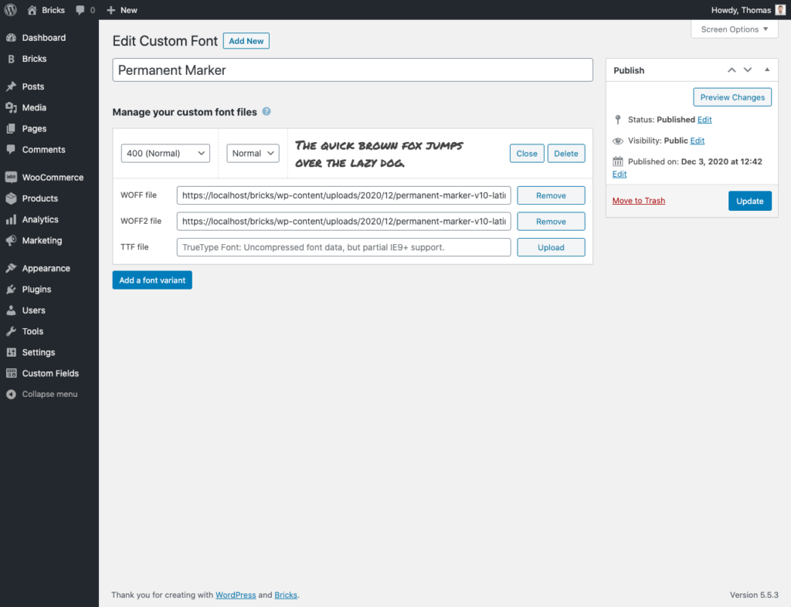
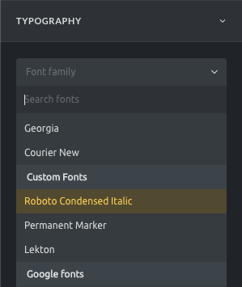

Your website typography has a huge impact on how your site is perceived, and it'll pay off to spend some time to get this aspect right.

Bricks allows you to add any font you want. From web-safe fonts to Google fonts, and of course, uploading your own custom fonts in your WordPress dashboard under **Bricks > Custom Fonts**. The latter which we are going to have a more in-depth look at now.

:::note
**Bricks 2.0 introduces a brand-new "[Font  Manager](/builder/styling/font-manager/)" for uploading and managing your Custom Fonts right from within the builder. Download Google Fonts locally, etc.**
:::

## How To Create & Upload Custom Fonts

https://youtu.be/Zu2RZFl6eAE

To create a new custom font go to **Bricks > Custom Fonts** in your WordPress dashboard, and click **Add New**.

First, let's give your custom font a title. This title shows in the *font-family* dropdown control when editing the typography in the builder.

Now your can start uploading your font files for all the font variants (*font-weight* and *font-style*) you plan to use on your site:




<figcaption>

Editing your custom font and managing all its font files and variant.

</figcaption>


You can see in the example above that we've uploaded a .WOFF and .WOFF2 font file for the standard font-weight (400) and a "Normal" font style.

If we'd have font files for font-weight 700 (bold) and font-style "Italic" we'd click the "Add a font variant" button. Select the font-weight value "700" and the font-style "Italic", and then upload the correct font files for this variant.

Once you've created all relevant font variants and uploaded all font files accordingly, you can save your fonts. Your new custom font is now available in the builder.

You can also see a font preview when editing your font or on the "Custom Fonts" page.

:::note
If your custom fonts are not showing correctly, please check your [WordPress URL settings](/builder/setup/known-issues/#custom-fonts).
:::

## Supported Font Formats

The following font formats are enabled by default:

- **WOFF (Web Open Font Format)**: This is the recommend font format used by all modern browsers. Font data is compressed and therefore loads faster than the same font provided via TrueType or OpenType files. Full support for IE9+.
- **WOFF2 (Web Open Font Format 2.0)**: TrueType/OpenType font with even better compression than WOFF 1.0. No IE browser support.
- **TTF (TrueType Font)**: Uncompressed font data, but partial IE9+ support.

The recommended font format is WOFF, with a current [browser](https://caniuse.com/woff)[support of 98.26%](https://caniuse.com/woff), and full support for IE9+.

## How To Enable More Font Formats

If you need to support IE8 you can programatically enable the EOT font format (or any other font format) by adding the following code to your Bricks child theme:

```php
add_filter( 'bricks/custom_fonts/mime_types', function( $mime_types ) {
  // Enable EOT font format for <IE9 browser support
  array_unshift( $mime_types, ['eot' => 'font/eot'] );

  return $mime_types;
} );
```

Once you've created at least one custom font a "Custom Fonts" section with all your custom fonts will show underneath the "Standard Fonts" in any "font-family" control:



#### Pro Tip: How To Become GDPR Compliant By Hosting Google Fonts Yourself {#google-fonts}

When using a Google Font on your website, you have to get consent from your website visitors before displaying the font.

You can avoid this whole issue by downloading all relevant font variants for the Google Fonts you want to use on your site, and then upload them as "Custom fonts" in Bricks.

:::note
The "[Google Webfonts Helper](https://gwfh.mranftl.com/fonts)" project is a great resource to directly download all `.eot`, `.woff`, `.woff2`, `.svg`, `.ttf` files of a Google font.
:::

Bricks 1.4 allows you to “Disable Google Fonts” altogether via the Bricks settings under “Performance”:


<figcaption>

Bricks > Settings > Performance: Disable Google Fonts

</figcaption>


### Free Fonts Resources

- [fontsquirrel.com](https://www.fontsquirrel.com)
- [reedesignresources.net/category/free-fonts](https://freedesignresources.net/category/free-fonts)
- [awwwards.com/awwwards/collections/free-fonts](https://www.awwwards.com/awwwards/collections/free-fonts)
