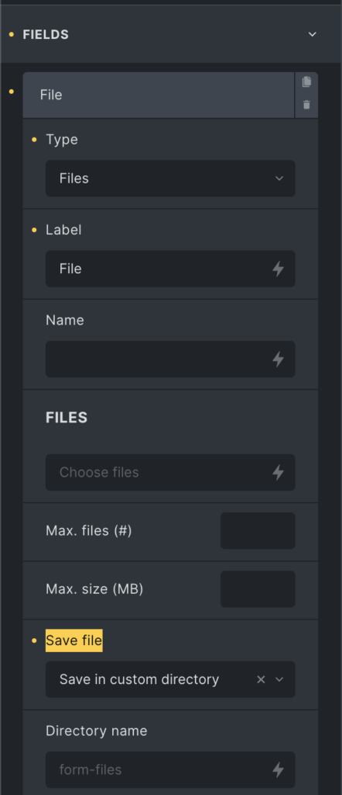

This filter allows you to modify the directory where your uploaded form files are stored when the `Save File` setting is "Save in custom directory".




By default, the folder is always located in WordPress "uploads" if you configure it via the `Direction name` in the setting below `Save file`.

You can change the final file storage location by utilizing the `bricks/form/file_directory` filter.

:::note
Bricks will automatically create the directory if it doesn't already exist.
:::

```php
add_filter( 'bricks/form/file_directory', function( $directory_path, $form, $input_name ){
  $form_fields   = $form->get_fields();
  $form_id       = $form_fields['formId'];

  // Return: Target form ID is not 'exbedq' OR field name is not 'form-field-vfkfev'
  // if ( $form_id !== 'exbedq' || $input_name !== 'form-field-vfkfev' ) {
    // return $directory_path;
  // }

  // Get uploads directory
  $wp_upload_dir = wp_upload_dir();

  // Store form files under /uploads/form-files
  $directory_path = $wp_upload_dir['basedir'] . '/form-files';

  return $directory_path;
}, 10, 3);
```
