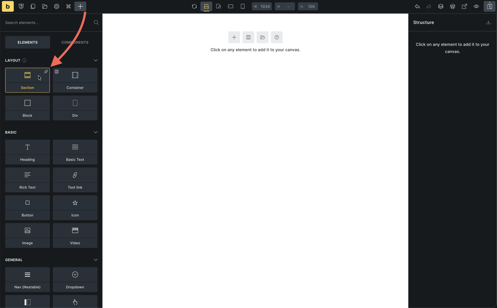
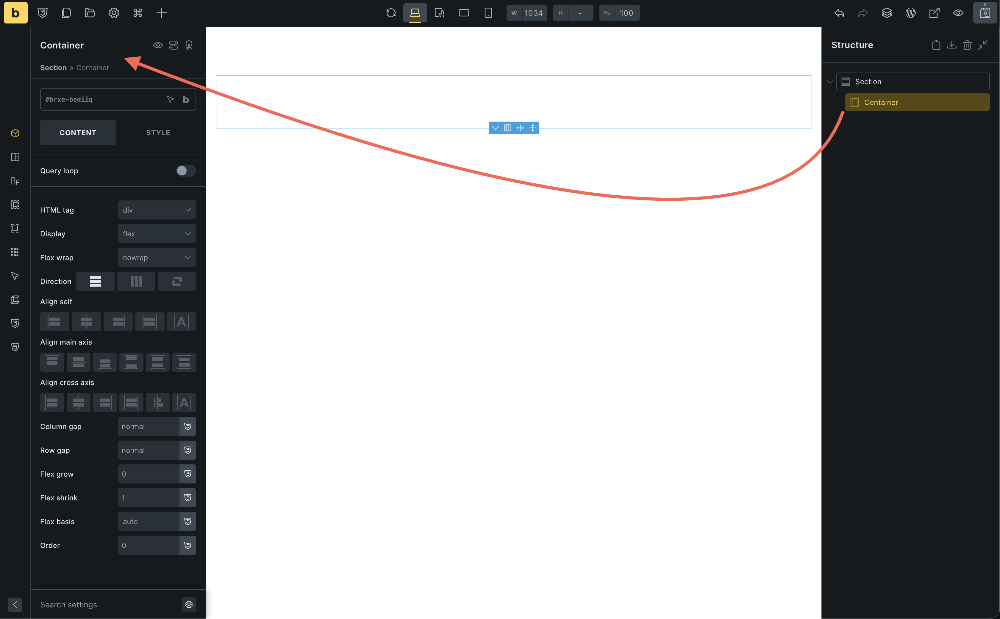
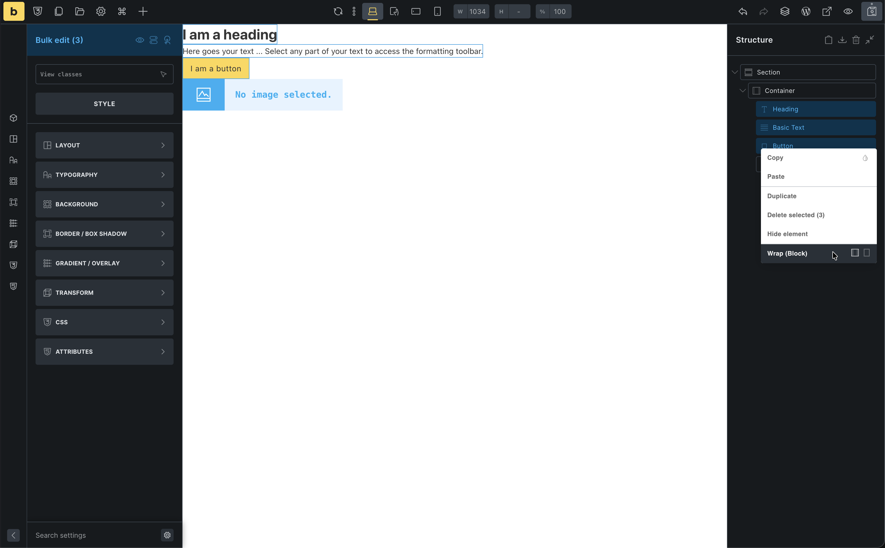
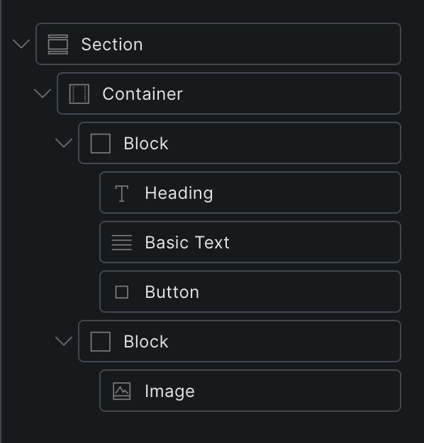
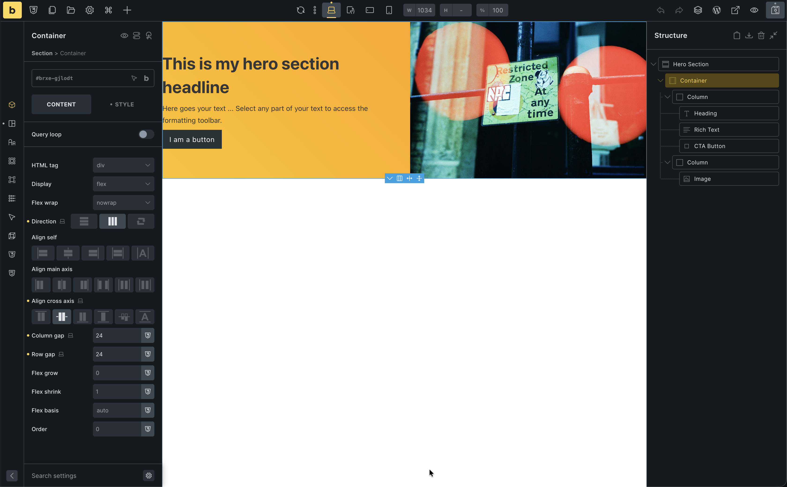

Time to build. We will start your homepage by creating the hero section. This is where you'll learn the core workflow and understand how layout elements work. We will add more sections (like a latest posts grid) later in the series.

## Open your Home page

In the previous article you already created a **Home** page and opened it in the builder.

If the builder is not open anymore:

1. In your WordPress dashboard, go to **Pages > All Pages**
2. Find the page titled **Home**
3. Hover it and click **Edit with Bricks**

The builder opens with your Home page ready to work on. If you do not have a Home page yet, quickly create one now and open it with Bricks.

## Set this page as your homepage

Before we build, tell WordPress to use **Home** as the static front page:

1. In the WordPress dashboard, go to **Settings > Reading**
2. Under **Your homepage displays**, select **A static page**
3. Set **Homepage** to your **Home** page
4. Optionally set **Posts page** to a page named **Blog** (or leave default for now)
5. Click **Save Changes**

## How most web pages are structured

Before we touch anything, notice how most websites are laid out when you scroll:

- A **header** at the very top (logo and navigation, usually global)
- A **hero** section that introduces the page
- One or more **content sections** (features, testimonials, blog posts, contact)
- A **footer** at the bottom

Visually, the page is a vertical stack of horizontal bands. In Bricks, we build those bands with the **Section** element.

Under the hood, each section is just a semantic HTML box. Inside that box we place more boxes, and inside those we place content.

## Layout elements in Bricks

To build those bands and columns, Bricks gives you four layout elements. You will use them to hold all other elements.

**Section** → **Container** → **Block / Div** → **Elements**

- **Section**: The root band. Spans the full width of the screen. Used to separate major parts of your page (header, hero, features, footer).
- **Container**: Sits inside the section. Keeps your content centered and bounded (width 1100px by default).
- **Block**: A layout box that uses flexbox and takes up 100 percent width by default. Great for columns and cards inside a section or container.
- **Div**: A plain, unstyled `div` that grows with its content. Use it as a lightweight wrapper when you want full control.
- **Elements**: The actual content (headings, images, buttons) that live inside those layout boxes.

### When to use each layout element

You can think of these layout elements as different kinds of wrappers for your content.

- **Section**: Use when you want a new horizontal band on the page. A typical page is one section for hero, one for features, one for testimonials, one for contact, and so on.
- **Container**: Use when you want the content of a section to have a fixed maximum width and be centered. Most sections have exactly one container.
- **Block**: Use when you want to divide a container into columns or repeated boxes. For example, in a hero section, one Block for text and another for the image. In a features section, one Block per feature card.
- **Div**: Use when you just need a simple box inside other layout elements. For example, to group a heading and an icon, or to wrap part of a card without affecting the overall layout.

Where you apply styles matters:

- Background colors and borders on the **Section** affect the full width band.
- Styles on the **Container** affect the centered content area.
- Styles on a **Block** or **Div** affect just that column or card.

If you inspect your page in the browser later and hover over these elements in the dev tools, you will see colored overlays showing content, padding, and margin for each box. That is the box model in action.

These layout elements are just wrappers. Where you place them determines width, positioning, and which parts of your design share the same background or border.

We will keep coming back to them as you build more pages and templates.

## Build the hero section

For this first hero we will create a very common pattern:

- Text and button on the left  
- Image on the right  
- Both aligned nicely in the middle of the screen

### 1. Add a section

1. In the Settings Panel (left), click **Section** (under Layout)
2. A **Section** with a **Container** inside is automatically added to your canvas

### 2. Add your hero content

We will first add all the content, then turn it into two columns.

1. Select the **Container** from the structure panel or by clicking on the canvas

2. Add a **Heading** element
3. Add a **Rich Text** element below the heading
4. Add a **Button** element below the text
5. Add an **Image** element below the button

Right now everything is in one column (stacked). We will group elements into columns next.

### 3. Group content into columns with Blocks

Blocks are perfect for columns. Instead of adding them empty and dragging elements in, we will wrap existing elements in Blocks.

**Left column (text + button):**

1. Open the **Structure Panel** on the right
2. In the Container, click the **Heading**
3. Hold **Shift** and click the **Button**  
   → This selects the Heading, Rich Text, and Button together  
   (Optionally, hold `Cmd/Ctrl` and click items one by one to select them)
4. Right-click on the selection and choose **Wrap → Block**

Bricks wraps those three elements in a new Block. This Block will be your left column.

**Right column (image):**

1. In the Structure Panel, select the **Image**
2. Right-click it and choose **Wrap → Block**

You now have a Container with **two Blocks** inside: one for text/button, one for the image. Next we will tell Bricks to lay those Blocks out as columns.

### 4. Layout the columns

Now let's make them sit side-by-side using Flexbox.

1. Select the **Container**
2. Go to **Content > Layout**
3. Set **Direction** to `Row` (horizontal)
4. Set **Align cross axis** to `Center` (vertically centers content)
5. Set **Column gap** to `24` (adds space between first column and second column)
6. Set a background color from the "Styles" tab > "Background" 

### A quick note on flexbox

In CSS, the `display` property controls how elements are laid out. By default, many elements are `block` (stacked vertically) or `inline` (flow with text).

**Flexbox** is a layout mode that makes it easy to arrange children of a container in a row or a column. In Bricks, Section, Container, and Block all use flexbox by default.

When you set **Direction** to `Row`, you tell the container to line up its children horizontally. If you changed it to `Column`, they would stack vertically.

A simple way to think about the main controls:

- **Direction**: chooses the main axis (row = side by side, column = stacked).
- **Gap**: spaces out the children along that main axis (the white space between our text Block and Image).
- **Align items**: lines up the children along the cross axis (here: vertically) so both columns share the same vertical center.

Flexbox is perfect for one dimensional layouts like our two column hero. If you want to go deeper into flexbox itself, you can read the [Flexbox basics guide on MDN](https://developer.mozilla.org/en-US/docs/Web/CSS/CSS_Flexible_Box_Layout/Basic_Concepts_of_Flexbox). We will stay focused on using it visually in Bricks.

### 5. Style the content

**Left column Block:**
1. Select the **Block**
2. Set **Row gap** to `8` (adds space between heading, text, and button)

**Heading:**
1. Change text to: "Welcome to Bricks"
2. Set **Tag** to `H1`

**Image:**
1. Select the Image element
2. Choose a photo from the media library

## See the HTML Bricks generates

You might have heard that Bricks outputs clean, semantic, non-bloated markup. Let's take a quick look at what that actually means.

1. Click **Preview** in the toolbar to open your Home page on the front end  
2. In your browser, right-click somewhere in your hero section and choose **Inspect** (or use the browser's developer tools shortcut)  
3. Look for the `<main>` element and expand it

You should see something very close to:

- A `<section>` for the hero
- A `
` (Container) inside it
- Inside that, your content boxes and elements (heading, text, button, image)

There are no mysterious extra wrapper divs, no huge chains of nested containers you did not create.

Even if you're not familiar with HTML yet, the important idea is:

- What you add in the builder is what you get in the markup  
- Bricks keeps the structure lean so you have full control over layout and performance

## The spacing problem

Your section looks good, but it's hugging the top and bottom of the screen. We need padding.

You *could* select the Section and add `80px` padding manually. But then you'd have to do that for every single section on your site. That's tedious and hard to maintain.

**The solution?** Theme Styles.

Instead of styling each section individually, we'll set a global rule: "All sections should have 80px padding."

Let's do that in the next article.

:::note[Help improve this lesson]
Bricks Academy is new. If a step in this lesson felt confusing, incomplete, or out of date, use the feedback box in the right sidebar and tell us what to improve.
:::
