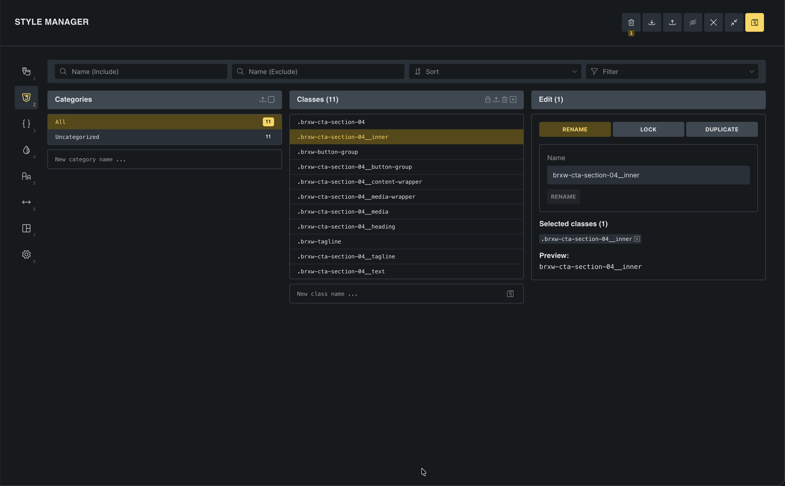

Theme Styles handle element defaults beautifully. But what about reusable utility styles you want to apply on demand? Things like centering text, adding shadows, or creating button variations?

This article goes a bit deeper than some earlier ones. If you're in a hurry, you can skim now, get a feel for what global classes are, and come back later when your projects start to feel repetitive.

That's where global classes excel. They're your custom CSS class library, built visually in Bricks and reusable anywhere with a click.

## What are global classes?

A CSS class is a collection of styles you can apply to any element. Instead of styling each element individually, you create a class once and apply it wherever needed.

**Example**: You create a class called `.shadow-large` that adds a drop shadow. Now you can apply that shadow to buttons, images, cards, or any element instantly, without redefining the shadow styles each time.

Global classes are vital for building scalable, maintainable sites. They ensure consistency and speed up your workflow dramatically.

## Why global classes matter

Imagine you have 20 buttons across your site. Without classes, you'd style each button individually (20 times). If your client wants to change the button style, you'd update each one manually. That's tedious and error-prone.

With a global class:
1. You create `.btn-primary` once
2. You apply it to all 20 buttons
3. When styles need to change, you edit the class once
4. All 20 buttons update automatically

This is how professionals build sites that scale.

## The problem global classes solve

Let's demonstrate with a real example. Say you want two headings on different pages to have the same blue color and bold weight.

**Without classes:**
1. Style the first heading (color: blue, weight: 700)
2. Navigate to the second page
3. Style that heading the same way
4. Repeat for every similar heading

If you decide blue should be purple later, you hunt down every heading and change it manually.

**With global classes:**
1. Create a class `.heading-blue` (color: blue, weight: 700)
2. Apply it to both headings with one click
3. Later, edit `.heading-blue` to be purple
4. Every heading using that class updates instantly

This is the efficiency gain. You style once, apply everywhere.

## Creating your first global class

Let's create a utility class to demonstrate the workflow.

### Set up the example

1. Create a new page or open an existing one
2. Add two Heading elements on the page

Right now, if you want both headings to look identical, you'd style each one individually. Let's use a global class instead.

### Create the class

1. Select the first heading
2. Look at the panel on the left. At the top, you'll see the element name and an ID field below it (shows something like `#brxe-abc123`)
3. Click that ID field
4. In the input that appears, type: `heading-feature`
5. Press Enter or click the **Save** (floppy disk) icon

Notice the field now shows `.heading-feature` (with a dot, indicating it's a class, not an ID).

**You've just created a global class.** Now every style you apply to this heading gets added to the `.heading-feature` class, not just this specific element.

### Style the class

With the heading still selected and the class applied:

1. Under **Typography**, set **Font size** to `32`
2. Set **Font weight** to `700`
3. Set **Color** to a vibrant blue (`#0066ff`)
4. Under **Spacing**, add **Margin bottom** of `20`

These styles are now stored in the `.heading-feature` class.

### Apply the class to another element

Now let's apply this class to the second heading:

1. Select the second heading
2. Click the ID field at the top of the panel
3. Start typing `heading-feature`
4. You'll see it appear in the autocomplete dropdown
5. Select it or press Enter

The second heading instantly matches the first. Same font size, weight, color, and spacing. You didn't retype any settings. You just applied the class.

**Change the class, update everything:**

1. Select either heading (both use the class)
2. Change the color to purple (`#9333ea`)
3. Both headings update immediately

This is the power of global classes. Style once, apply everywhere, update globally.

## Understanding the difference: ID vs. class styles

By default, when you select an element and apply styles, they're added to that element's unique ID. Those styles only affect that one element.

When you create and apply a global class, styles go into the class instead. Now every element using that class inherits those styles.

**Important**: ID styles override class styles (CSS specificity). If you apply a class to an element but then add individual styles to that same element, the individual styles win.

**Best practice**: Use global classes for shared styles. Use element-specific (ID) styles only for unique, one-off adjustments.

## Building a utility class system

Now that you understand the concept, let's build some useful utility classes. These are small, single-purpose classes you can combine for maximum flexibility.

### Text alignment classes

Create these three classes:

**.text-center**
1. Create a Heading element
2. Add the class `text-center`
3. Under **Typography**, set **Text align** to `Center`
4. Delete the heading (we only needed it to create the class)

**.text-left**
- Same process, set **Text align** to `Left`

**.text-right**
- Same process, set **Text align** to `Right`

Now you can center any text element instantly by applying `.text-center`.

### Spacing utility classes

Create a set of margin classes for consistent spacing:

**.mb-sm** (margin bottom small)
- Set **Margin bottom** to `16`

**.mb-md** (margin bottom medium)
- Set **Margin bottom** to `32`

**.mb-lg** (margin bottom large)
- Set **Margin bottom** to `48`

Do the same for **margin top** (`.mt-sm`, `.mt-md`, `.mt-lg`) if you want.

These simple classes speed up spacing dramatically. Instead of typing margin values repeatedly, you apply a class.

### Button variation classes

Let's create button style variations:

**.btn-outline**
1. Add a Button element
2. Apply the class `btn-outline`
3. Under **Style**, remove the **Background color** (make it transparent)
4. Under **Border**, add a border: `2px` solid, color `#0066ff`
5. Set **Text color** to `#0066ff`
6. Add **Padding** of `12` top/bottom, `24` left/right
7. Set **Border radius** to `8`

**.btn-ghost**
1. Similar to outline, but with no border
2. Just text color and padding
3. Subtle hover effect (set `:hover` state to add background)

Now you can create button variations instantly by swapping classes.

## Managing global classes

As your class library grows, organization matters.

### View all classes

Press `Cmd/Ctrl + .` to open the **Style Manager** (or click the **Styles** icon in the toolbar). Navigate to the **Classes** tab.

Here you can:
- See all your global classes
- Edit, rename, or delete classes
- Search for specific classes
- See where classes are used
- Export/import classes

### Edit a class

In the Style Manager's **Classes** tab:
1. Find the class you want to edit
2. Click the **Edit** (pencil) icon
3. Modify styles in the panel
4. All elements using that class update immediately

### Delete unused classes

The manager shows which classes are used and where. If a class isn't used anywhere, you can safely delete it to keep your library clean.

## Real-world example: styling different elements the same way

Here's a common scenario that shows why global classes are essential.

### The problem

You're building a landing page. You want:
- Headings in the hero section
- Headings in the features section
- Headings in testimonials

All should be the same shade of blue with the same weight. That's three headings on one page, each needing identical styles.

**Without classes**: Style each heading individually (tedious, hard to maintain).

**With classes**: Create `.heading-accent`, apply it to all three headings. Done.

### The evolution

Later, the client asks: "Can we make those blue headings purple instead?"

**Without classes**: Hunt down all three headings, change each one individually, hope you didn't miss any.

**With classes**: Edit `.heading-accent`, change the color once. All three update. You're done in 10 seconds.

This example scales to hundreds of elements across dozens of pages. Global classes keep everything manageable.

## Combining classes

You can apply multiple classes to one element. This is powerful for composing styles.

**Example**: Apply both `.heading-feature` and `.text-center` to a heading. It gets the feature heading styles (color, weight, size) plus center alignment.

This modular approach gives you maximum flexibility with minimum duplication.

## Pseudo-selectors: hover states and more

Global classes support pseudo-selectors like `:hover`, `:focus`, `:active`, and more.

**Creating a hover effect:**

1. Create a class `.btn-primary`
2. Style the default state (background: blue, text: white)
3. Change **State** to `:hover`
4. Darken the background color
5. Add a subtle scale transform (under **Transform** in advanced controls)

Now every button with `.btn-primary` has that hover effect. You defined it once.

## Quick mention: advanced features for scaling

As you grow with Bricks, you'll discover features that complement global classes:

**[Variables](/builder/styling/global-variables-manager/)** - Also inside the Style Manager, the **Variables** tab lets you define CSS variables (colors, spacing scales, font sizes) that you can reference in your classes. Change a variable, update every class using it.

**[Components](/builder/features/components/)** - Turn entire layouts (not just styles) into reusable, synchronized blocks. Think of them as global classes for structure + content + styles.

These advanced features build on the same principle: define once, reuse everywhere, update globally. Master global classes first, then explore these when your projects demand more.

:::tip[Try it]
Create a global class called `.shadow-soft` that adds a subtle box shadow (`0 4px 16px rgba(0,0,0,0.1)`). Apply it to several different elements (images, cards, containers). Notice how one class adds consistent shadows everywhere. Then edit the class to make the shadow stronger. Watch all elements update together. This is the workflow that makes large projects manageable.
:::

## What you've learned

You can now:
- Create global classes and understand why they matter
- Apply classes to multiple elements for consistency
- Build utility classes for text alignment, spacing, and button styles
- Manage classes inside the Style Manager
- Use pseudo-selectors like `:hover` in classes
- Combine multiple classes on one element
- Understand the difference between ID-specific and class-based styling

Global classes are how you build sites that scale. They transform your workflow from repetitive styling to efficient system-building.
