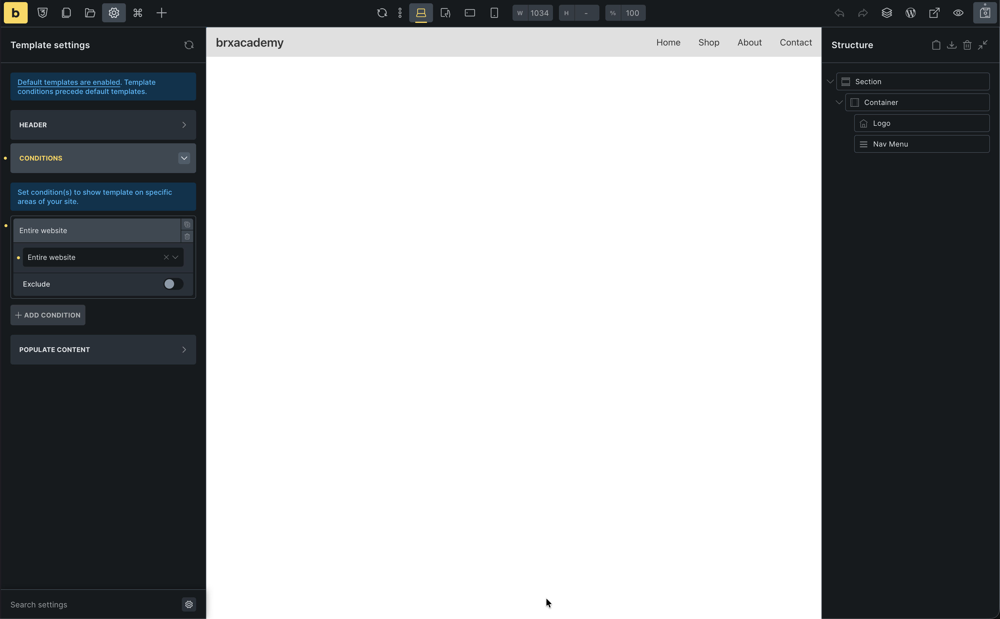

Let's build a global header with a logo and menu.

## Create the template

1. Go to **Bricks > Templates**
2. Add New: "Header"
3. Edit with Bricks

## Settings

1. **Settings (gear) > Template Settings**
2. **Type**: Header
3. **Conditions**: Entire Website

## Build the structure

1. Add a **Section**
2. Inside the **Container**:
   - Add a **Logo** element (or Image/Text)
   - Add a **Nav Menu** element (we'll use the standard WordPress menu)

## Style the layout

**Container:**
1. **Direction**: `Row` (horizontal)
2. **Justify content**: `Space between` (pushes logo and menu apart)
3. **Align items**: `Center` (vertically aligned)

**Section:**
1. **Background color**: Pick a light gray or your brand color
2. **Padding**: `12` top/bottom (this intentionally overrides our global 80px for this specific section)

Your header is part of the site chrome, not page content. It usually needs tighter spacing than regular sections, so it is a good place to make a deliberate exception to your global section padding.

## Create a WordPress menu (if you do not have one yet)

The Nav Menu element uses a normal WordPress menu. If **Appearance > Menus** is empty or you have never built a menu:

1. From the WordPress dashboard, go to **Appearance > Menus**
2. Enter a **Menu name** (for example `Main`) and click **Create Menu**
3. Add a few items from the left (**Pages**, **Custom links**, and so on), then click **Save Menu**

Then return to this template in the builder.

## Configure the menu

1. Select the **Nav Menu** element
2. Under **Menu**, choose the WordPress menu you created (for example **Main**)

## Save and verify

1. Save the template
2. Go to your **Pages** panel (top bar) -> **Home**
3. You should see your new header sitting perfectly atop your hero section!

