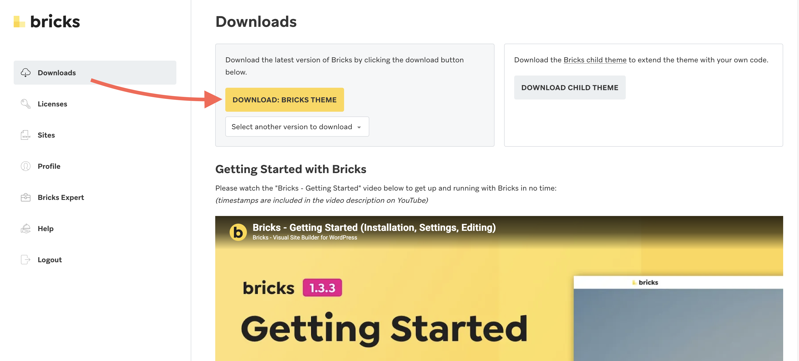
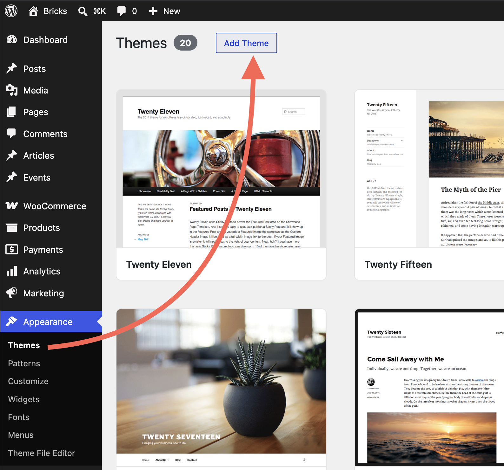
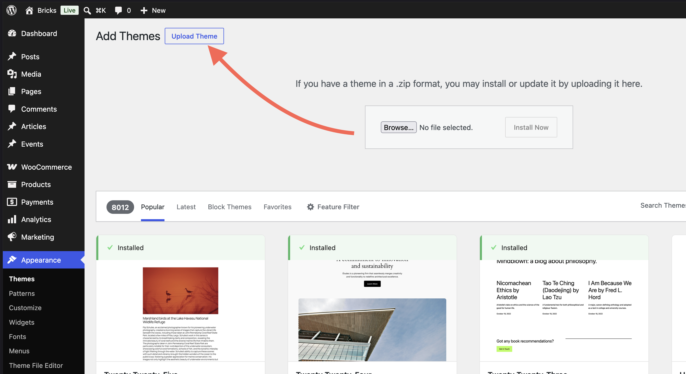
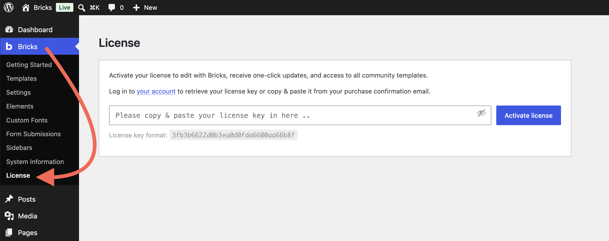

Let's get Bricks installed on your WordPress site.

Before you install, confirm your host meets [Bricks requirements](/builder/setup/requirements/) (PHP, database, memory, upload size, and a modern browser). Most hosting does; use that article if you need to raise limits or troubleshoot.

## Install the Bricks theme

Installing Bricks works exactly like any other WordPress theme. Use one place for everything account-related: [my.bricksbuilder.io](https://my.bricksbuilder.io/) (download the theme ZIP and find your license key there).

### Download Bricks

Log into [my.bricksbuilder.io](https://my.bricksbuilder.io/) and download the latest version as a ZIP file.

### Upload to WordPress

:::note[Theme, not plugin]
Install Bricks as a **theme** (**Appearance > Themes > Upload**), not under **Plugins**. Uploading the ZIP as a plugin will not work.
:::

1. In your WordPress dashboard, go to **Appearance > Themes**
2. Click **Add New**

3. Click **Upload Theme**

4. Select the `bricks.zip` file from your computer
5. Click **Install Now**
6. After the upload completes, click **Activate** (or go to **Appearance > Themes** and activate **Bricks**)

**If the upload fails**, it is usually because your WordPress site does not allow large enough uploads. See [Requirements](/builder/setup/requirements/) (max file upload size) or, as a last resort, unzip the file on your computer and upload the `bricks` folder via FTP to `/wp-content/themes/`.

## Activate your license

Once Bricks is installed, you'll see a new **Bricks** menu item in your WordPress dashboard, along with a notification prompting you to activate your license.

Click **Bricks > License** (or the notification link). This opens the license activation screen.

### Steps to activate

1. Copy your license key from [my.bricksbuilder.io](https://my.bricksbuilder.io/)
2. Paste it into the license field
3. Click **Activate License**

You should see a confirmation that your license is **active**.

That's it, Bricks is ready to use!

For license limits, staging URLs, managing activations, automatic updates, and updating safely, see [License, updates, and your account](/builder/license/license-and-updates/).

## What you've accomplished

You now have Bricks installed and licensed.
