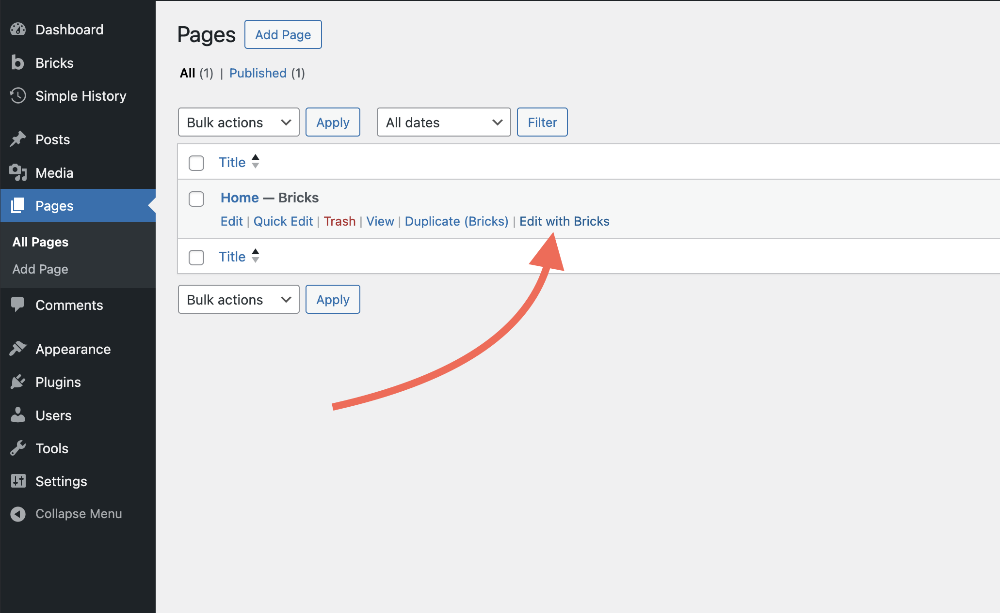
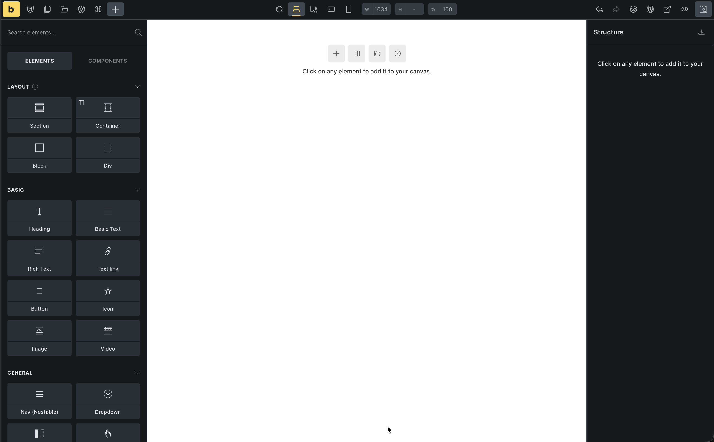

Before you start building, let's get oriented. This quick tour shows you where everything is in the Bricks builder interface.

## Open the builder

Let's create a Home page so you can follow along:

1. In your WordPress dashboard, go to **Pages > Add New**
2. Give it a title: "Home"
3. Click **Edit with Bricks**



The builder opens. This is where you'll build your site.



## The interface

The builder has four main areas: Toolbar (top), Settings Panel (left), Canvas (center), and Structure Panel (right).

A simple mental map:

- **Toolbar** = global tools and actions
- **Settings Panel** = what you can add or how you style what is selected
- **Canvas** = what you are currently designing (page or template)
- **Structure Panel** = the outline of your HTML structure

### Toolbar

The toolbar at the top is always visible. Here's what the main icons do:


- **Bricks logo** - Open the link configured in Bricks settings (defaults to the WordPress dashboard; you can change this later)
- **Styles** - Open the Style Manager, where you manage classes, variables, colors, typography scales, and spacing scales (`Cmd/Ctrl + .`)
- **Pages** - Switch between pages while staying in the builder
- **Templates** - Open the template library and your saved templates
- **Manage** - Access builder-related settings and tools
- **Command palette** - Search for elements and actions (`Cmd/Ctrl + K`)
- **Elements / Components** - Toggle the elements and components panel
- **Reload canvas** - Reload the preview if something looks out of sync
- **Breakpoints and preview size** - Switch between desktop, tablet, and mobile editing and adjust the preview width
- **Undo / Redo** - Step backward or forward through changes
- **Structure** - Toggle the Structure Panel on the right
- **Edit in WordPress** - Jump back to the WordPress editor for this page
- **View on front end** - Open the current page on the front end in a new tab
- **Preview mode** - Hide builder overlays so you can see a cleaner preview
- **Save** - Save your work

### Settings panel (left)

This panel changes based on what you're doing.

**By default**: Shows all available elements you can add (Layout, Basic, Media, WordPress, etc.)

**When element selected**: Shows that element's controls (typography, colors, spacing, etc.)

**When Theme Styles clicked**: Shows global design settings

**When Page settings clicked**: Shows page-specific settings

### Canvas (center)

Your visual workspace. This is where you build your page or template.

- Drag elements from the Settings Panel onto the canvas
- Click elements to select them
- Selected elements show a blue outline
- Changes update in real-time
- Right-click for quick actions (duplicate, delete, etc.)

**Important**: The canvas shows your design accurately, but always preview on the front end to see the final result.

### Structure panel (right)

Shows the hierarchy of everything on your current page as a nested tree.

```
Section
  └─ Container
      ├─ Heading
      ├─ Text
      └─ Button
```

**Why this is useful:**
- Click elements here instead of hunting for them on the canvas
- Drag to reorder elements or change hierarchy
- See your page structure at a glance

You can toggle it on/off with the tree icon in the toolbar, but most people keep it visible.

## What you've learned

You now know:
- Where the toolbar, settings panel, canvas, and structure panel are
- What each area shows

:::note[Help improve this lesson]
Bricks Academy is new. If anything in this lesson felt unclear or missing, use the feedback box in the right sidebar and leave us a quick note.
:::
