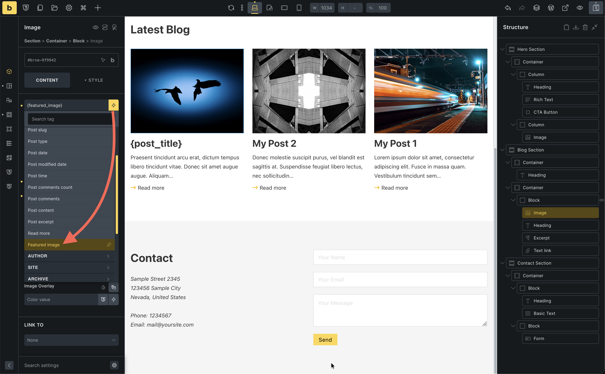
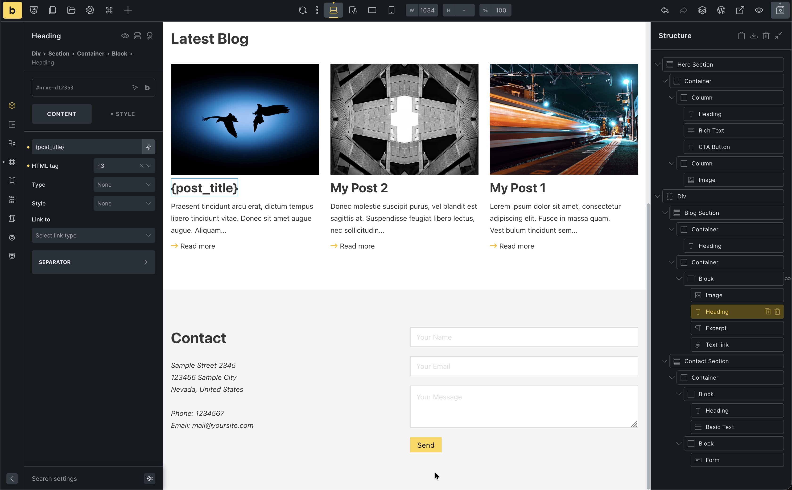
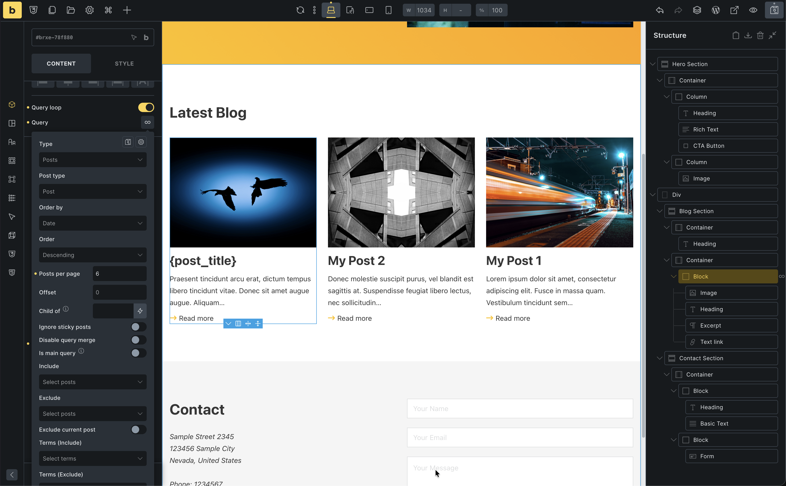

We're back on the homepage. Let's add a "Latest Posts" section below the hero.

## Before you begin: sample posts

This section needs **at least three published blog posts** so the query loop has something to show. If you skip this, the grid can look empty or broken even when you did everything right in Bricks.

**Create 3 test posts first:**

1. In the WordPress dashboard, go to **Posts > Add New**
2. Give each post a **title** and a short **excerpt** (use the excerpt field if your screen shows it, or add a couple of lines in the content and let WordPress generate one)
3. Set a **featured image** for each post (**Featured image** in the sidebar)
4. Click **Publish** and repeat until you have at least **3 published posts**

You can use the same steps later in the [Blog post template](/getting-started/blog-post-template/) article; the posts you create here are what that template will display.

Before we start clicking, we need two core ideas: **query loops** and **dynamic data**.

## What is a query loop?

In WordPress, a "query" is just a question like:

- "Give me the 3 latest posts"
- "Give me all posts in this category"

A **query loop** takes the answer to that question (the list of posts) and repeats a design once for each item.

You design a single **card** (image, title, excerpt, button). The loop runs through the posts and outputs one card per post. Change the query rules, and the same design shows different posts.

## What is dynamic data?

Until now, when you added a Heading or Text element, you typed the content manually. That is **static** text.

With **dynamic data**, you connect an element to a WordPress field instead:

- Heading pulls the **post title**
- Image pulls the **featured image**
- Text pulls the **post excerpt**

In a loop, each card shows the field values for the current post in the list.

You will see this as options like `{post_title}` or `{featured_image}` in Bricks. They are just visual placeholders for real WordPress fields.

## Prepare content

You should already have at least **3 published posts**, each with a **featured image** (see **Before you begin** above). Quick check: **Posts > All Posts** — you should see three or more posts with **Published** status.

## Build the section

1. Add a new **Section**
2. Inside the Container, add a **Heading** ("Latest Posts")
3. Add a **Block** element below the heading

## Configure the Grid

We want a 3-column grid for our posts.

Earlier in the series you used flexbox for a simple row layout (text on the left, image on the right). **CSS Grid** is the other famous layout system. It is ideal for two dimensional layouts where you care about rows and columns at the same time, like a grid of cards.

When you set a Block to use Grid, you tell the browser to place its children on a grid.

- The **Grid template columns** control describes how many columns you want and how wide they should be.  
  - `1fr 1fr 1fr` means “three equal columns”, each taking one fraction of the available width.
- The **Gap** control sets the space between both columns and rows, so your cards are evenly spaced in all directions.

As you add more cards, Grid automatically flows them into these columns, then wraps onto new rows as needed. You do not have to manually position each card.

1. Select the **Block**
2. **Display**: `Grid`
3. **Grid template columns**: `1fr 1fr 1fr` (three equal columns)
4. **Gap**: `24`

## Create the card (Loop item)

Inside the Grid Block, add another **Block** (this will be our repeating card).

Inside this Card Block, add:
1. **Image** (Featured Image)
2. **Heading** (Post Title, H3)
3. **Basic Text** (Post Excerpt)
4. **Text Link** ("Read more")

## Enable Query Loop

1. Select the **Card Block** (the inner one)
2. Toggle **Use query loop**
3. **Query settings**:
   - Post type: Posts
   - Posts per page: 3

You should now see 3 post cards!

## Connect dynamic data

1. **Image**: Select dynamic data -> `Featured Image`

2. **Heading**: Select dynamic data -> `Post Title`. Link to -> `Post URL`

3. **Excerpt**: Select dynamic data -> `Post Excerpt`
4. **Read more**: Link to -> `Post URL`

## Responsive check

1. Switch to **Mobile Landscape**
2. Select the **Grid Block**
3. Change **Grid template columns** to `1fr` (stacks cards vertically)

Done! You have a dynamic post grid.
