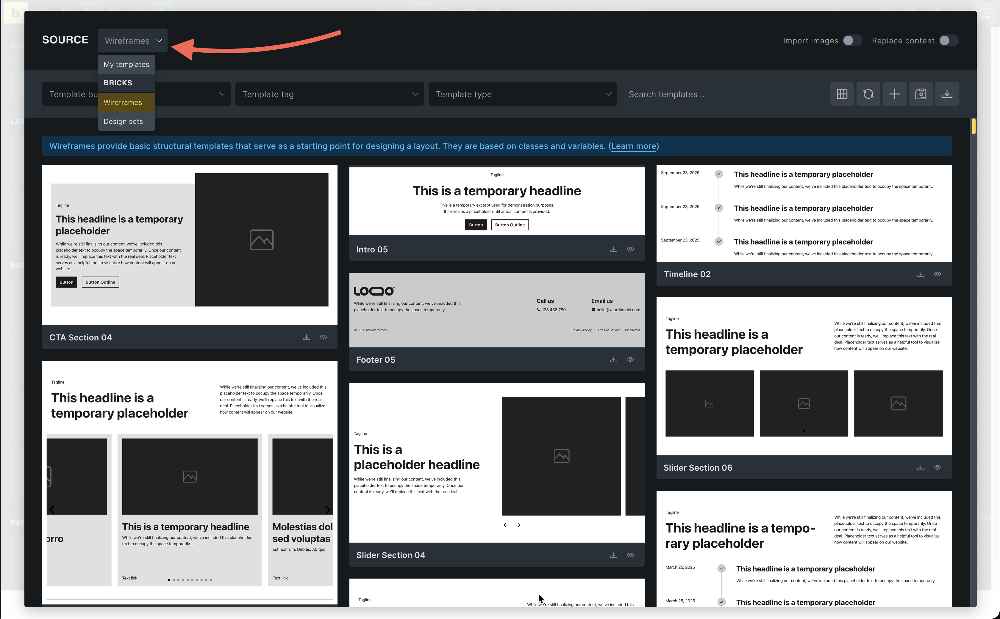

You've built a homepage with theme styles applied. But what about elements that appear on every page, like a header or footer? You don't want to rebuild those manually on each page. That's where templates come in.

## What are templates?

Templates are reusable layouts that automatically appear on multiple pages based on rules you set.

Think of them as layout blueprints that apply themselves.

In classic WordPress, you would create different PHP template files and let WordPress decide which one to use for a given URL. With Bricks, you design those templates visually and control the rules (conditions) without touching PHP.

**Common examples:**

- **Header template** - Logo and navigation that appears on every page
- **Footer template** - Copyright and footer links on every page
- **Single post template** - The layout all blog posts share
- **Archive template** - Layout for category pages, blog archives

Build a template once, set where it should appear, and Bricks handles the rest.

## Template types

Bricks has different template types for different purposes:

- **Header** - Site header (logo, menu)
- **Footer** - Site footer (copyright, links)
- **Single** - Individual post/page layouts
- **Section** - Reusable sections you manually insert
- **Archive** - Blog archives, category pages, author pages
- **Error Page** - 404 page
- **Search Results** - Search results page

The template type tells Bricks how to use it.

## How templates apply

Templates use **conditions** to determine where they appear.

**Example**: Set a Header template's condition to "Entire Website" and it shows on every page automatically.

Other condition options:
- All posts
- All pages
- Front page only
- Specific pages/posts
- Category archives
- Etc.

### Auto-loading templates

Some template types load automatically if published:

| Template type | Auto-loads? |
| --- | --- |
| Header | Yes (if no conditions set) |
| Footer | Yes (if no conditions set) |
| Archive | Yes |
| Search Results | Yes |
| Error Page | Yes |
| Single, Section | No (conditions required) |

Once you publish a Header template, it appears site-wide by default (unless you disable this in **Bricks > Settings**).

## Why templates matter

**Efficiency** - Build once, use everywhere. Update once, change everywhere.

**Consistency** - Every page uses the same header, footer, and post layout.

**Scalability** - Add 100 blog posts, they all use your single post template automatically.

**Maintenance** - Need to update your footer? Edit one template, not 50 pages.

This is how professionals build WordPress sites that are easy to manage.

## Managing templates

View all templates at **Bricks > Templates** in WordPress dashboard.

Here you can:
- See template types
- View where templates are applied (conditions)
- Edit, duplicate, or delete templates
- Export/import templates
- Organize with bundles and tags

## Template library

Bricks also includes pre-made templates:

Click **Templates** (folder icon) in the builder toolbar.

**Source dropdown**:
- **My Templates** - Your custom templates
- **Wireframes** - Simple, unstyled layouts you can insert and customize
- **Design Sets** - Fully designed templates
- **Remote Templates** - Connect to other Bricks installations as template sources. If you've added any, they show up here too. Learn more: [Remote Templates documentation](/builder/features/remote-templates/)

We'll use wireframes later to speed up building.

## What you've learned

You now understand:
- What templates are and why they matter
- Different template types and their purposes
- How template conditions work
- Which templates auto-load
- Where to manage templates
- The template library sources

In the next article, we'll put this into practice by building a header template.
