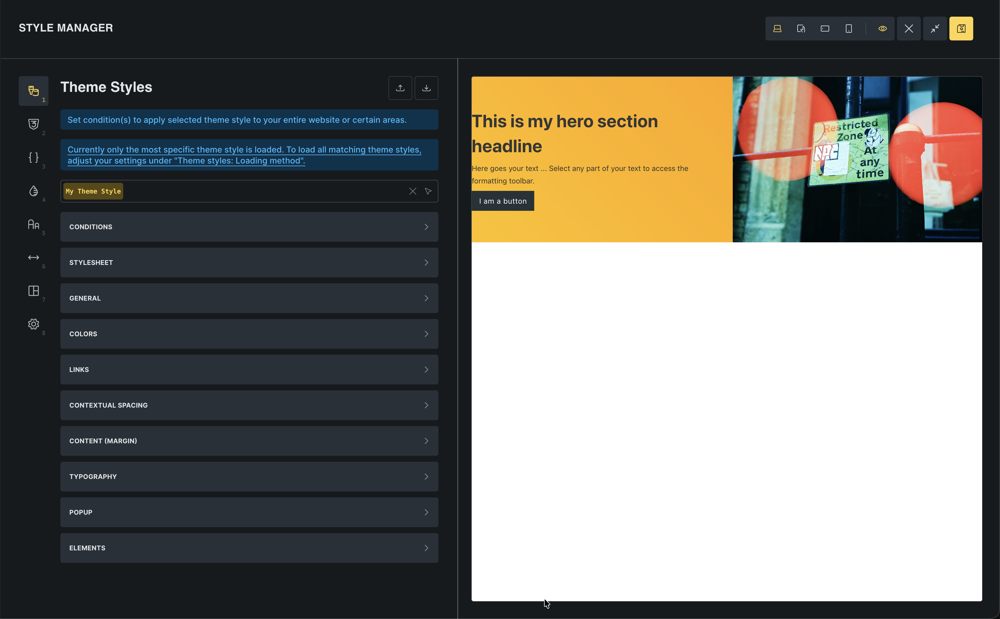
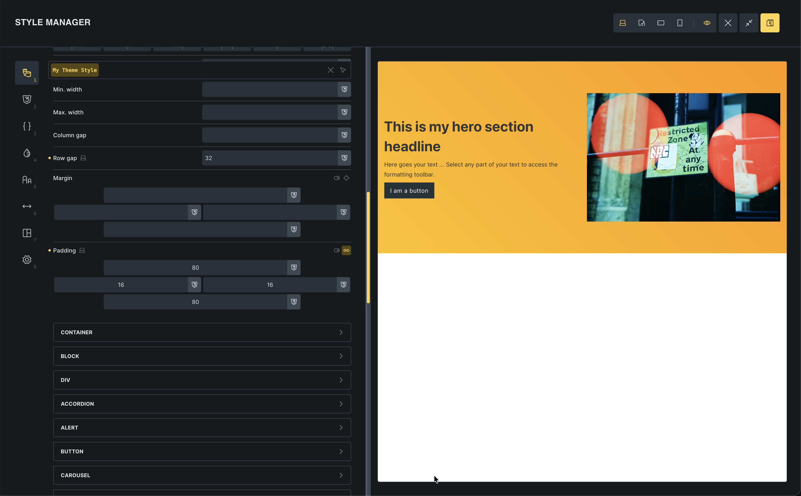
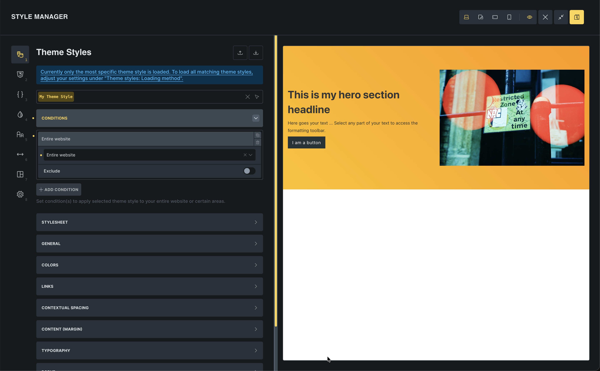

We just built a hero section, but it needs better spacing. Instead of adding padding manually to every section (slow and inconsistent), let's set a global rule using Theme Styles.

Theme Styles are your site-wide design system. They control the default look of every element. Under the hood, Bricks writes the CSS for you. Instead of hand-coding `section { padding: 80px 16px; }`, you set it visually once and it applies everywhere.

## Create a theme style

1. Click the **Styles** icon in the toolbar (or press `Cmd/Ctrl + .`)
2. Click the **Select: Theme Styles** dropdown and enter a name for the theme style
3. Click the "Create" icon

This opens the **Style Manager**. This is the central place in Bricks for managing your design system. You will notice it has several tabs: Theme Styles, Classes, Variables, Colors, Typography, Spacing, Framework, and Settings. We will focus on Theme Styles for now and come back to the others as you need them.

## Set global section spacing

We want every section to have consistent padding and spacing.

1. In the Theme Styles panel, go to **Element > Section**
2. Set **Padding**:
   - Top: `80`
   - Bottom: `80`
   - Left: `16`
   - Right: `16`
3. Set **Row gap** to `32`

**Watch the canvas**: Your hero section immediately updates with the new padding! You didn't touch the section itself; you just changed the global rule.

Now, every new section you add will automatically have this perfect spacing.

## Apply to entire website

Right now, this style is only visible in the builder. Let's make it live for the whole site.

1. In Theme Styles, go to **Conditions**
2. Click **Add Condition**
3. Select **Entire Website**
4. Click **Save** in the toolbar

## Why this is powerful

**Scalability**: If you decide later that sections need `100px` padding, you change it *once* in Theme Styles, and your entire site updates.

**Consistency**: You never have to remember "was it 60px or 80px?" Bricks handles it for you.

Think of it this way:

- **Theme Styles** define sensible **defaults** for your whole site.
- **Global classes** (later in the series) give you reusable patterns you can apply on demand.
- **One-off element styles** are for rare exceptions.

Most of your design decisions should live in Theme Styles and classes. That is how you keep sites predictable and easy to change.

## Next: templates

Now that our global styles are set, let's look at another powerful global feature: Templates. We'll use them to build a header that appears on every page.
